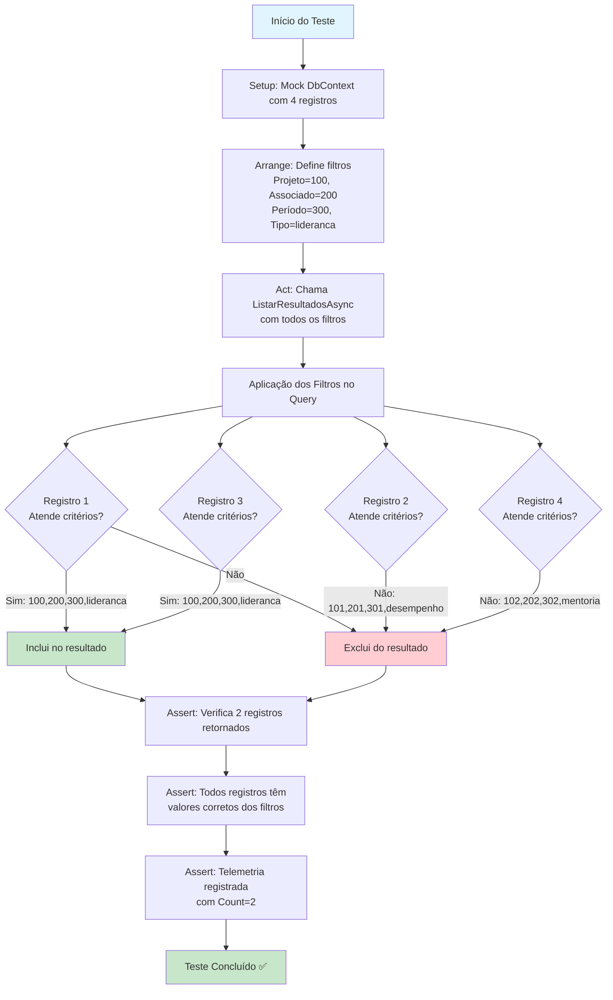

# Documentação do Teste: ListarResultadosAsync_FiltrosAplicados_RetornaResultadosFiltrados

## Visão Geral

Este teste unitário valida que o método `ListarResultadosAsync` do `ResultadoService` aplica corretamente todos os filtros fornecidos (`idProjeto`, `idAssociado`, `idPeriodo`, `tipoAvaliacao`) e retorna apenas os resultados que atendem a todos os critérios especificados.

## Objetivo do Teste

- **Validar Filtragem Correta**: Garantir que quando múltiplos filtros são aplicados simultaneamente, apenas os registros que atendem a TODOS os critérios são retornados
- **Verificar Telemetria**: Confirmar que os eventos de telemetria são registrados com os parâmetros corretos
- **Testar Lógica Condicional**: Validar que as condições `HasValue` e `Value > 0` funcionam adequadamente

## Cenário de Teste

### Dados de Entrada (Arrange)
- **idProjeto**: 100
- **idAssociado**: 200  
- **idPeriodo**: 300
- **tipoAvaliacao**: "lideranca"

### Dados de Teste (Mock)
O teste utiliza 4 registros fictícios:
1. Projeto=100, Associado=200, Período=300, Tipo="lideranca" ✅
2. Projeto=101, Associado=201, Período=301, Tipo="desempenho" ❌
3. Projeto=100, Associado=200, Período=300, Tipo="lideranca" ✅
4. Projeto=102, Associado=202, Período=302, Tipo="mentoria" ❌

### Resultado Esperado
- **2 registros** devem ser retornados (registros 1 e 3)
- Todos os registros retornados devem ter os valores exatos dos filtros aplicados
- Telemetria deve ser registrada com contagem "2"

## Diagrama de Fluxo do Teste

## Lógica de Filtragem Testada

O teste valida a seguinte lógica condicional do método:

csharp
var query = _db.ResultadoProjetos.AsQueryable();
if (idProjeto.HasValue && idProjeto.Value > 0)
    query = query.Where(r => r.IdProjeto == idProjeto.Value);
if (idAssociado.HasValue && idAssociado.Value > 0)
    query = query.Where(r => r.IdAssociado == idAssociado.Value);
if (idPeriodo.HasValue && idPeriodo.Value > 0)
    query = query.Where(r => r.IdPeriodo == idPeriodo.Value);
if (!string.IsNullOrEmpty(tipoAvaliacao))
    query = query.Where(r => r.TipoAvaliacao == tipoAvaliacao);

## Validações Realizadas

### 1. Validação de Resultado
- ✅ Resultado não é nulo
- ✅ Exatamente 2 registros retornados
- ✅ Todos registros têm IdProjeto = 100
- ✅ Todos registros têm IdAssociado = 200
- ✅ Todos registros têm IdPeriodo = 300
- ✅ Todos registros têm TipoAvaliacao = "lideranca"

### 2. Validação de Telemetria
- ✅ Método `TrackEvent` chamado uma vez
- ✅ Nome do evento: "ListarResultados"
- ✅ Parâmetros corretos registrados:
  - IdProjeto: "100"
  - IdAssociado: "200"
  - IdPeriodo: "300"
  - TipoAvaliacao: "lideranca"
  - Count: "2"

## Casos de Teste Complementares

Além do teste principal, foram implementados testes adicionais para cobrir:

- **Filtro Individual**: Teste com apenas um filtro aplicado
- **Sem Filtros**: Validação do retorno de todos os registros
- **Filtros com Valor Zero**: Confirmação de que valores zero não aplicam filtro
- **Sem Correspondência**: Teste com filtros que não retornam resultados

## Importância do Teste

Este teste é classificado como **Severo** porque:

1. **Funcionalidade Core**: A listagem de resultados é uma funcionalidade central do sistema
2. **Múltiplas Condições**: Testa a interação entre múltiplos filtros simultaneamente
3. **Integridade de Dados**: Garante que apenas dados corretos são retornados aos usuários
4. **Telemetria**: Valida o registro correto de métricas para monitoramento

O teste garante que a lógica de filtragem funciona corretamente em cenários reais onde múltiplos critérios de busca são aplicados simultaneamente, evitando bugs que poderiam resultar em dados incorretos sendo apresentados aos usuários finais.
