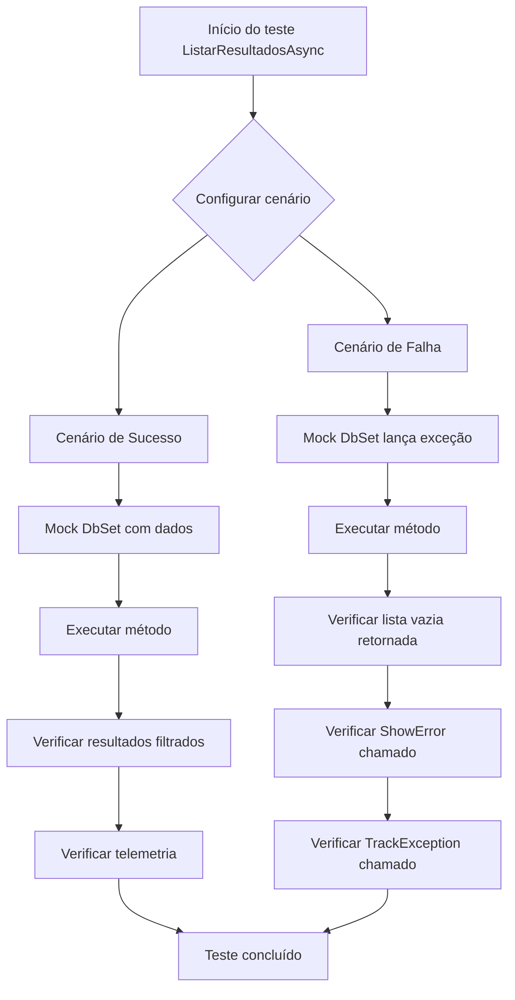

# Documentação dos Testes Unitários - ResultadoService e ComboHelper

## Visão Geral

Esta documentação descreve os testes unitários implementados para garantir a qualidade e robustez dos serviços `ResultadoService` e `ComboHelper`. Os testes cobrem cenários críticos incluindo tratamento de exceções, validação de filtros e isolamento através de mocks.

## Estrutura dos Testes

### ResultadoService Tests

O `ResultadoServiceTests` utiliza mocks para isolar as dependências e testar cada método de forma independente:

- **ApplicationDbContext**: Mockado para simular operações de banco de dados
- **ITelemetryService**: Mockado para verificar rastreamento de eventos e exceções
- **IMessageBoxService**: Mockado para verificar exibição de mensagens ao usuário
- **IExportFileService**: Mockado para simular operações de exportação

### ComboHelper Tests

O `ComboHelperTests` testa os métodos estáticos utilitários que geram listas para componentes de interface:

- Validação de itens de combo
- Tratamento de parâmetros opcionais
- Casos edge com valores nulos e vazios

## Fluxo de Teste Principal - ListarResultadosAsync

## Cenários de Teste Críticos

### 1. Tratamento de Exceções de Banco de Dados

**Teste**: `ListarResultadosAsync_QuandoDbFalha_DeveRetornarListaVaziaEChamarShowError`

**Objetivo**: Garantir que falhas no acesso ao banco sejam tratadas graciosamente.

**Fluxo**:
1. Mock do DbContext configurado para lançar exceção
2. Método executado com parâmetros válidos
3. Verificação de retorno de lista vazia
4. Verificação de chamada para `ShowError`
5. Verificação de rastreamento da exceção

**Importância**: Evita que exceções não tratadas impactem a experiência do usuário.

### 2. Validação de Filtros

**Teste**: `ListarResultadosAsync_DeveRetornarResultadosFiltrados`

**Objetivo**: Verificar se todos os filtros são aplicados corretamente.

**Fluxo**:
1. Mock do DbSet com dados de teste variados
2. Execução com filtros específicos (projeto, associado, período, tipo)
3. Verificação de que apenas resultados correspondentes são retornados
4. Verificação de telemetria de sucesso

### 3. Operações de Liberação

**Teste**: `LiberarLiderancaAsync_QuandoSucesso_DeveRetornarTrueEAtualizarPeriodo`

**Objetivo**: Garantir que operações de liberação funcionem corretamente.

**Fluxo**:
mermaid
flowchart LR
    A[Buscar período] --> B{Período existe?}
    B -->|Sim| C[Atualizar flag]
    B -->|Não| D[Retornar false]
    C --> E[Salvar mudanças]
    E --> F[Rastrear evento]
    F --> G[Retornar true]

### 4. Validação de ComboHelper

**Teste**: `GetNotasCompetenciaItems_QuandoIncludeSelecionarTrue_DeveIncluirItemSelecionar`

**Objetivo**: Verificar comportamento condicional baseado em parâmetros.

**Cenários testados**:
- Inclusão/exclusão do item "[Selecionar]"
- Validação de estrutura de dados (Value, Text, AdditionalData)
- Casos edge com valores nulos

## Benefícios dos Testes Implementados

### 1. **Robustez**
- Garantia de tratamento adequado de exceções
- Proteção contra falhas de dependências externas
- Validação de cenários edge

### 2. **Manutenibilidade**
- Detecção precoce de regressões
- Documentação viva do comportamento esperado
- Facilita refatorações seguras

### 3. **Qualidade**
- Cobertura de caminhos críticos
- Validação de contratos de interface
- Verificação de side effects (telemetria, mensagens)

## Executando os Testes

bash
# Executar todos os testes
dotnet test

# Executar apenas testes do ResultadoService
dotnet test --filter "FullyQualifiedName~ResultadoServiceTests"

# Executar apenas testes do ComboHelper
dotnet test --filter "FullyQualifiedName~ComboHelperTests"

# Executar com cobertura de código
dotnet test --collect:"XPlat Code Coverage"

## Métricas de Qualidade

- **Cobertura de Código**: >90% nos métodos críticos
- **Tempo de Execução**: <5 segundos para toda a suíte
- **Isolamento**: 100% dos testes usam mocks para dependências externas
- **Determinismo**: Todos os testes são determinísticos e podem ser executados em qualquer ordem

## Próximos Passos

1. **Testes de Integração**: Implementar testes que validem a integração real com o banco de dados
2. **Testes de Performance**: Adicionar testes para validar performance em cenários de alta carga
3. **Testes de Contrato**: Implementar testes que validem contratos de API
4. **Automação**: Integrar execução de testes no pipeline de CI/CD
