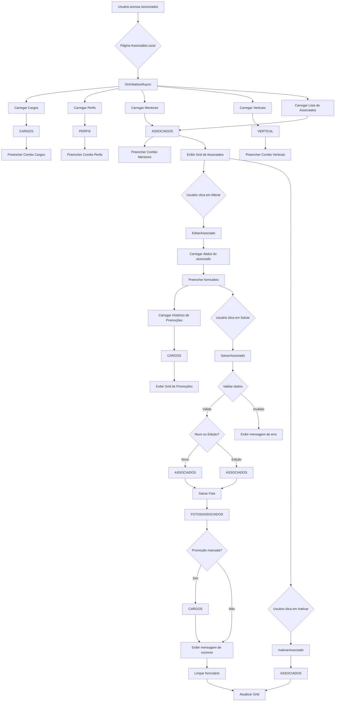

# Página de Associados - Documentação Técnica

## Visão Geral
A página de Associados permite o cadastro, edição, inativação, visualização e exportação/importação de associados, integrando dados de cargos, perfis, verticais e empresas. Os modelos de dados foram criados para suportar todos os relacionamentos necessários e facilitar a integração com o Entity Framework Core.

## Modelos de Dados
- **ASSOCIADOS**: Representa o usuário associado, com propriedades para identificação, dados pessoais, relacionamentos e status.
- **CARGOS**: Representa cargos disponíveis na empresa, relacionados aos associados e promoções.
- **PERFIS**: Define perfis de acesso dos associados.
- **VERTICAL**: Segmenta os associados por área de atuação (vertical).

## Integração
Os modelos foram criados para serem utilizados diretamente com o Entity Framework Core, permitindo o uso de navegação entre entidades e facilitando queries complexas. Os relacionamentos (um-para-muitos, muitos-para-um) são definidos por propriedades de navegação e coleções.

## Fluxo do Processo

## Sugestões de Melhorias
- Implementar cache para os combos de cargos, perfis, mentores e verticais.
- Adicionar paginação e filtros avançados na grid de associados.
- Incluir validação de e-mail duplicado em tempo real.
- Permitir upload de múltiplas fotos por associado.
- Adicionar auditoria de alterações e notificações por e-mail.
- Criar dashboard com estatísticas dos associados.
