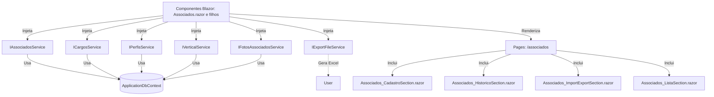

# Documentação: Serviços de Domínio - Associados (Blazor .NET 9)

## Visão Geral

Esta documentação descreve a arquitetura, funcionamento e integração dos serviços de domínio criados para a funcionalidade de Associados na nova aplicação Blazor .NET 9. Os serviços seguem o padrão de injeção de dependência, promovendo reutilização, testabilidade e desacoplamento entre UI e lógica de negócio.

### Serviços Criados

- `IAssociadosService` / `AssociadosService`: CRUD de associados e consulta por e-mail.
- `ICargosService` / `CargosService`: Operações de cargos e promoções (listar cargos, adicionar/alterar promoções, editar comentários).
- `IPerfisService` / `PerfisService`: Listagem de perfis de acesso.
- `IVerticalService` / `VerticalService`: Listagem de verticais.
- `IFotosAssociadosService` / `FotosAssociadosService`: Manipulação de fotos dos associados (obter, adicionar, atualizar).
- `IExportFileService` / `ExportFileService`: Exportação genérica de listas para Excel usando EPPlus.

Todos os serviços são registrados no container de DI e podem ser injetados em componentes Blazor ou outros serviços.

## Integração e Reutilização

- Os serviços são consumidos nos componentes Blazor responsáveis pelas páginas de Associados.
- Métodos assíncronos são utilizados para garantir performance e escalabilidade.
- O serviço de exportação é genérico e pode ser reutilizado para qualquer entidade.
- A separação em interfaces permite fácil substituição por mocks em testes ou versões alternativas.

## Fluxo do Processo (Mermaid)

## Estrutura de Páginas Relacionadas

- `/associados` (Associados.razor)
    - Cadastro de Associado (Associados_CadastroSection.razor)
    - Histórico de Promoções (Associados_HistoricoSection.razor)
    - Importação/Exportação (Associados_ImportExportSection.razor)
    - Lista de Associados (Associados_ListaSection.razor)

## Sugestões de Melhorias

- Implementar cache para consultas de dados estáticos (cargos, perfis, verticais).
- Adicionar validação mais robusta e mensagens de erro detalhadas nos serviços.
- Implementar logs detalhados de operações críticas.
- Permitir upload de fotos diretamente para storage externo (ex: Azure Blob Storage) para maior escalabilidade.
- Expandir o serviço de exportação para suportar outros formatos (CSV, PDF).
- Adicionar paginação e filtros avançados nos métodos de listagem.
- Implementar testes unitários e de integração para todos os serviços.
- Avaliar uso de SignalR para atualização em tempo real da lista de associados.
- Adicionar controle de permissões por perfil nos métodos dos serviços.

# Documentação da Migração: Página de Associados (Web Forms para Blazor Híbrido .NET 9)

## Funcionamento e Integração da String de Conexão

A string de conexão do banco de dados foi migrada do antigo Web.config para o arquivo `appsettings.json`, sob a seção `ConnectionStrings`. O Entity Framework Core utilizará essa string para conectar-se ao banco de dados SQL Server.

### Localização

- O arquivo `appsettings.json` está na raiz do projeto Blazor.
- A chave utilizada é `DefaultConnection`.
- Exemplo:

"ConnectionStrings": {
  "DefaultConnection": "Server=SEU_SERVIDOR;Database=SEU_BANCO;User Id=SEU_USUARIO;Password=SEU_PASSWORD;TrustServerCertificate=True;"
}

### Integração com o Código

No arquivo `Program.cs`, a configuração do Entity Framework Core utiliza essa string de conexão para registrar o `ApplicationDbContext`:

csharp
builder.Services.AddDbContext<ApplicationDbContext>(options =>
    options.UseSqlServer(builder.Configuration.GetConnectionString("DefaultConnection")));

Todos os serviços e repositórios que dependem do contexto de dados passam a utilizar a configuração centralizada e segura.

### Benefícios

- Centralização e padronização da configuração.
- Facilidade para troca de ambiente (dev/homolog/prod) usando arquivos de configuração específicos ou variáveis de ambiente.
- Melhoria de segurança: dados sensíveis podem ser protegidos via User Secrets ou Azure Key Vault.

## Fluxo do Processo (Mermaid)

mermaid
graph TD
    A[appsettings.json] --> B[ConnectionStrings:DefaultConnection]
    B --> C[Program.cs lê a string de conexão]
    C --> D[ApplicationDbContext configurado com UseSqlServer()]
    D --> E[Serviços usam ApplicationDbContext]
    E --> F[Componentes Blazor consomem serviços]

## Estrutura de Páginas/Componentes Envolvidos

Peers.Moderno/
├── appsettings.json (contém ConnectionStrings)
├── Program.cs (registra ApplicationDbContext)
├── Data/
│   └── ApplicationDbContext.cs
├── Services/
│   ├── AssociadosService.cs
│   ├── CargosService.cs
│   ├── ...
├── Components/
│   └── Pages/
│       └── Associados.razor
└── docs/
    └── Associados_Migracao.md

## Sugestões de Melhorias

- **User Secrets/Azure Key Vault:** Para ambientes de desenvolvimento e produção, utilize User Secrets ou Azure Key Vault para armazenar a string de conexão de forma segura, evitando expor senhas em arquivos de configuração.
- **Ambientes:** Utilize arquivos de configuração específicos por ambiente (`appsettings.Development.json`, `appsettings.Production.json`) para separar as strings de conexão.
- **Migrations Automatizadas:** Automatize o uso de migrations do Entity Framework Core para manter o banco sincronizado com as entidades do código.
- **Monitoramento:** Implemente Application Insights ou outra solução para monitorar falhas de conexão e performance do banco.
- **Auditoria:** Considere implementar logs de auditoria para operações críticas no banco de dados.
- **Pooling:** Ajuste as configurações de pooling de conexão para otimizar a performance em ambientes de alta concorrência.
- **Failover:** Considere configurar failover para alta disponibilidade do banco de dados.
