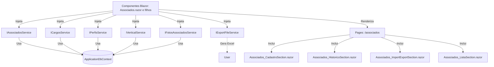

# Documentação: Serviços de Domínio - Associados (Blazor .NET 9)

## Visão Geral

Esta documentação descreve a arquitetura, funcionamento e integração dos serviços de domínio criados para a funcionalidade de Associados na nova aplicação Blazor .NET 9. Os serviços seguem o padrão de injeção de dependência, promovendo reutilização, testabilidade e desacoplamento entre UI e lógica de negócio.

### Serviços Criados

- `IAssociadosService` / `AssociadosService`: CRUD de associados e consulta por e-mail.
- `ICargosService` / `CargosService`: Operações de cargos e promoções (listar cargos, adicionar/alterar promoções, editar comentários).
- `IPerfisService` / `PerfisService`: Listagem de perfis de acesso.
- `IVerticalService` / `VerticalService`: Listagem de verticais.
- `IFotosAssociadosService` / `FotosAssociadosService`: Manipulação de fotos dos associados (obter, adicionar, atualizar).
- `IExportFileService` / `ExportFileService`: Exportação genérica de listas para Excel usando EPPlus.

Todos os serviços são registrados no container de DI e podem ser injetados em componentes Blazor ou outros serviços.

## Integração e Reutilização

- Os serviços são consumidos nos componentes Blazor responsáveis pelas páginas de Associados.
- Métodos assíncronos são utilizados para garantir performance e escalabilidade.
- O serviço de exportação é genérico e pode ser reutilizado para qualquer entidade.
- A separação em interfaces permite fácil substituição por mocks em testes ou versões alternativas.

## Fluxo do Processo (Mermaid)

## Estrutura de Páginas Relacionadas

- `/associados` (Associados.razor)
    - Cadastro de Associado (Associados_CadastroSection.razor)
    - Histórico de Promoções (Associados_HistoricoSection.razor)
    - Importação/Exportação (Associados_ImportExportSection.razor)
    - Lista de Associados (Associados_ListaSection.razor)

## Sugestões de Melhorias

- Implementar cache para consultas de dados estáticos (cargos, perfis, verticais).
- Adicionar validação mais robusta e mensagens de erro detalhadas nos serviços.
- Implementar logs detalhados de operações críticas.
- Permitir upload de fotos diretamente para storage externo (ex: Azure Blob Storage) para maior escalabilidade.
- Expandir o serviço de exportação para suportar outros formatos (CSV, PDF).
- Adicionar paginação e filtros avançados nos métodos de listagem.
- Implementar testes unitários e de integração para todos os serviços.
- Avaliar uso de SignalR para atualização em tempo real da lista de associados.
- Adicionar controle de permissões por perfil nos métodos dos serviços.

# Documentação Técnica: Migração da Página de Associados para Blazor (.NET 9)

## 1. Visão Geral

A página de Associados foi migrada do modelo Web Forms ASP.NET para o paradigma moderno de componentes Blazor, utilizando .NET 9. O novo fluxo é totalmente desacoplado, com serviços injetáveis, componentes reutilizáveis e integração facilitada para manutenção e evolução.

## 2. Componentes Criados/Modificados

- **MessageBox.razor**: Componente modal reutilizável para exibição de mensagens (info, warning, error).
- **DataTableComponent.razor**: Componente genérico para exibição de tabelas de dados, utilizado em várias seções.
- **FileUploadComponent.razor**: Componente reutilizável para upload de arquivos (imagens, Excel).
- **Associados.razor**: Página principal que integra todas as seções.
- **Associados_CadastroSection.razor**: Seção de cadastro/edição de associados.
- **Associados_HistoricoSection.razor**: Seção de histórico de promoções, com edição inline de comentários.
- **Associados_ImportExportSection.razor**: Seção para importação e exportação de dados de associados e promoções.
- **Associados_ListaSection.razor**: Seção de listagem de associados, com ações de alterar e inativar.

## 3. Integração e Funcionamento

- Todos os componentes utilizam injeção de dependência para acessar os serviços de dados.
- O fluxo de cadastro, edição, inativação, importação e exportação é realizado de forma assíncrona, garantindo responsividade.
- O componente MessageBox é utilizado para feedback ao usuário em todas as operações.
- O DataTableComponent é utilizado para renderizar listas de associados e promoções de forma padronizada.
- O FileUploadComponent permite upload de fotos e arquivos Excel, disparando eventos para os componentes pais.

## 4. Diagrama de Fluxo (Mermaid)

mermaid
graph TD
    A[Usuário acessa /associados] --> B{Página Associados.razor carregada}
    B --> C[Associados_CadastroSection.razor]
    B --> D[Associados_HistoricoSection.razor]
    B --> E[Associados_ImportExportSection.razor]
    B --> F[Associados_ListaSection.razor]
    
    C --> G[Usuário preenche formulário]
    G --> H{Clicar Cadastrar/Salvar}
    H --> I[Chama serviço AssociadosService]
    I --> J[Salva no banco via ApplicationDbContext]
    J --> K[Exibe MessageBox]
    K --> F
    
    F --> L[Usuário clica Alterar]
    L --> M[Carrega dados no cadastro]
    M --> C
    
    F --> N[Usuário clica Inativar]
    N --> O[Chama ExcluiAssociado]
    O --> P[Atualiza banco]
    P --> Q[Exibe MessageBox]
    Q --> F
    
    E --> R[Exportar Associados]
    R --> S[Gera Excel via ExportFileService]
    S --> T[Download do arquivo]
    
    E --> U[Importar Associados]
    U --> V[Lê arquivo Excel]
    V --> W[Chama ImportarAssociadosExcelAsync]
    W --> X[Atualiza banco]
    X --> Y[Exibe MessageBox]
    Y --> F
    
    D --> Z[Exibe histórico promoções]
    Z --> AA[Edição inline de comentário]
    AA --> AB[Chama AlterarPromocaoComentario]
    AB --> AC[Atualiza banco]

## 5. Estrutura de Páginas e Componentes

Peers.Moderno/
├── Components/
│   ├── Pages/
│   │   ├── Associados.razor
│   │   ├── Associados.razor.cs
│   │   ├── Associados_CadastroSection.razor
│   │   ├── Associados_CadastroSection.razor.cs
│   │   ├── Associados_HistoricoSection.razor
│   │   ├── Associados_HistoricoSection.razor.cs
│   │   ├── Associados_ImportExportSection.razor
│   │   ├── Associados_ImportExportSection.razor.cs
│   │   ├── Associados_ListaSection.razor
│   │   └── Associados_ListaSection.razor.cs
│   └── Shared/
│       ├── MessageBox.razor
│       ├── MessageBox.razor.cs
│       ├── DataTableComponent.razor
│       ├── DataTableComponent.razor.cs
│       ├── FileUploadComponent.razor
│       └── FileUploadComponent.razor.cs

## 6. Sugestões de Melhorias

- Implementar autenticação e autorização baseada em roles.
- Adicionar testes unitários e de integração para os serviços e componentes.
- Utilizar SignalR para atualização em tempo real das listas.
- Otimizar consultas e implementar cache para dados estáticos.
- Adicionar paginação e filtros avançados nos DataTables.
- Melhorar a experiência de upload de arquivos com barra de progresso.
- Internacionalizar os textos para múltiplos idiomas.
- Garantir acessibilidade (WCAG) e responsividade total.
- Adicionar logging e monitoramento detalhado.
- Evoluir para arquitetura API REST para integração com outros sistemas.
