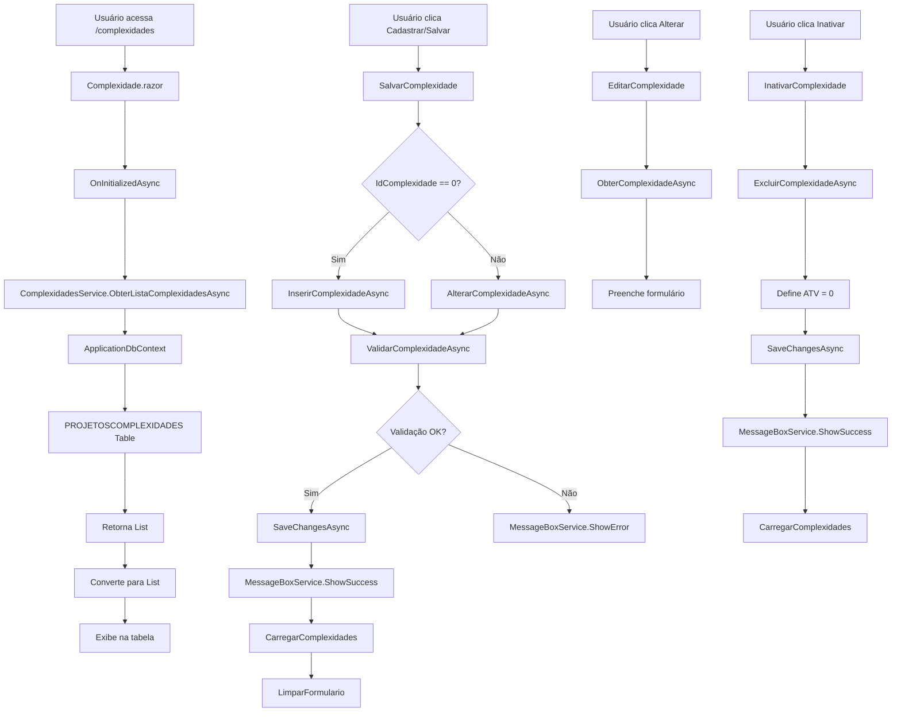

# Módulo Complexidades - Blazor .NET 9

## Visão Geral

Este módulo implementa o cadastro e gerenciamento de complexidades de projetos utilizando **Blazor Híbrido** com renderização automática e serviços injetáveis. A migração foi realizada a partir da página Web Forms `Complexidade.aspx` para uma arquitetura moderna baseada em componentes Blazor.

## Arquitetura

### Estrutura de Pastas

Peers.Moderno/
├── Components/
│   └── Pages/
│       ├── Complexidade.razor          # Componente Blazor principal
│       └── Complexidade.razor.cs       # Code-behind do componente
├── Services/
│   └── Complexidades/
│       ├── ComplexidadesService.cs     # Implementação do serviço
│       └── Common/
│           ├── IComplexidadeService.cs # Interface do serviço
│           └── ComplexidadeDto.cs      # DTO para transporte de dados
├── Models/
│   └── ProjetoComplexidade.cs          # Entidade Entity Framework
└── docs/
    └── Complexidades.md                # Esta documentação

### Componentes Principais

#### 1. **ComplexidadeDto** (`Services/Complexidades/Common/ComplexidadeDto.cs`)
- DTO (Data Transfer Object) para transportar dados entre camadas
- Contém propriedades calculadas como `StatusTexto` e `Ativo`
- Facilita a reutilização e desacoplamento entre UI e serviço

#### 2. **IComplexidadeService** (`Services/Complexidades/Common/IComplexidadeService.cs`)
- Interface que define o contrato do serviço
- Métodos assíncronos para CRUD e validação
- Localizada em `Common` para reutilização por outros módulos

#### 3. **ComplexidadesService** (`Services/Complexidades/ComplexidadesService.cs`)
- Implementação do serviço de negócio
- Utiliza Entity Framework Core para persistência
- Contém validações de negócio e tratamento de erros
- Migração completa da lógica do code-behind original

#### 4. **Complexidade.razor** (`Components/Pages/Complexidade.razor`)
- Componente Blazor com renderização automática (`@rendermode InteractiveAuto`)
- Formulário reativo com validação
- Tabela de listagem com ações de editar/inativar
- Integração com serviços via injeção de dependência

#### 5. **ProjetoComplexidade** (`Models/ProjetoComplexidade.cs`)
- Entidade Entity Framework mapeada para a tabela `PROJETOSCOMPLEXIDADES`
- Configurada no `ApplicationDbContext`
- Utiliza Data Annotations para validação e mapeamento

## Funcionalidades

### Cadastro e Edição
- Formulário reativo com validação em tempo real
- Campos: Complexidade, Status, Peso, Peso Ponderado, Ponderação, Faixas
- Validação de dados obrigatórios e regras de negócio
- Feedback visual durante operações assíncronas

### Listagem
- Tabela responsiva com dados das complexidades
- Exibição de status (Ativo/Inativo)
- Ações contextuais (Alterar/Inativar)
- Carregamento assíncrono dos dados

### Validações
- Campos obrigatórios
- Validação de faixas (inicial < final)
- Verificação de duplicatas
- Validação de valores numéricos positivos

## Integração

### Injeção de Dependência
O serviço é registrado no `Program.cs`:
csharp
builder.Services.AddScoped<IComplexidadeService, ComplexidadesService>();

### Entity Framework
A entidade é configurada no `ApplicationDbContext`:
csharp
public DbSet<ProjetoComplexidade> ProjetosComplexidades { get; set; }

### Mensagens
Utiliza o `IMessageBoxService` existente para exibir notificações:
- Sucesso: operações realizadas com êxito
- Erro: falhas de validação ou persistência
- Info: informações gerais ao usuário

## Configuração

As configurações específicas do módulo estão em `appsettings.json`:

"Complexidades": {
  "MaxComplexidadeLength": 500,
  "MaxCodigoLength": 100,
  "MinPeso": 0.01,
  "MaxPeso": 999.99,
  "MinPonderacao": 0.01,
  "MaxPonderacao": 100.00,
  "EnableValidacaoFaixas": true,
  "EnableDuplicateValidation": true,
  "DefaultStatus": 1,
  "CacheExpirationMinutes": 15
}

## Fluxo de Alto Nível

## Benefícios da Migração

### Performance
- **Blazor Híbrido**: Renderização otimizada (Server + WebAssembly)
- **Operações Assíncronas**: Não bloqueia a UI durante operações de banco
- **Entity Framework Core**: ORM moderno com otimizações automáticas

### Manutenibilidade
- **Separação de Responsabilidades**: UI, Serviço e Modelo separados
- **Injeção de Dependência**: Facilita testes e substituição de implementações
- **Código Reutilizável**: Interface e DTO em pasta `Common`

### Experiência do Usuário
- **Validação Reativa**: Feedback imediato ao usuário
- **Loading States**: Indicadores visuais durante operações
- **Responsividade**: Interface adaptável a diferentes dispositivos

### Escalabilidade
- **Cloud-Ready**: Preparado para deployment em nuvem
- **AOT Compilation**: Suporte a compilação antecipada
- **Microserviços**: Arquitetura permite extração futura para serviços independentes

## Próximos Passos

1. **Implementação de Fatores**: Desenvolver a funcionalidade de fatores de complexidade
2. **Testes Unitários**: Criar testes para o serviço e validações
3. **Cache**: Implementar cache para melhorar performance
4. **Auditoria**: Adicionar logs de auditoria para operações CRUD
5. **Exportação**: Implementar funcionalidade de exportação para Excel

## Considerações Técnicas

- O módulo utiliza o padrão **Repository/Service** para separação de responsabilidades
- A validação é feita tanto no cliente (Blazor) quanto no servidor (Service)
- O Entity Framework utiliza **AsNoTracking()** para consultas de leitura, melhorando performance
- As operações são **transacionais** e utilizam **async/await** para não bloquear threads
- O código segue as **convenções do .NET 9** e **boas práticas do Blazor**
