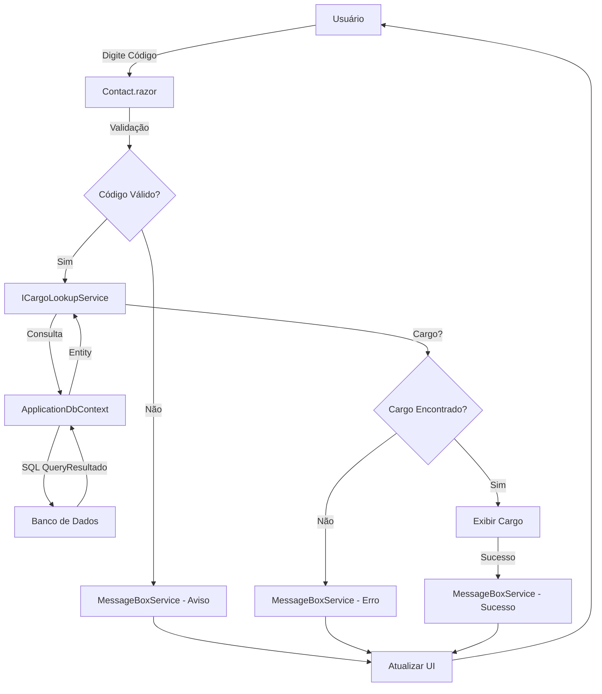

# Documentação: Página de Contato (Contact)

## Visão Geral

A página de contato foi migrada de ASP.NET Web Forms (`Contact.aspx`) para Blazor Híbrido .NET 9, utilizando renderização automática (`@rendermode InteractiveAuto`) para máxima performance e experiência do usuário. A funcionalidade principal permite buscar cargos por código através de um serviço centralizado e reutilizável.

## Arquitetura

### Componentes Principais

- **Contact.razor**: Componente Blazor com interface de usuário responsiva
- **Contact.razor.cs**: Code-behind com lógica de negócio
- **ICargoLookupService**: Interface para busca de cargos
- **CargoLookupService**: Implementação do serviço de busca
- **MessageBoxService**: Serviço reutilizado para exibição de mensagens

### Estrutura de Arquivos

Peers.Moderno/
├── Components/
│   └── Pages/
│       ├── Contact.razor
│       └── Contact.razor.cs
├── Services/
│   ├── Cargos/
│   │   └── Common/
│   │       ├── ICargoLookupService.cs
│   │       └── CargoLookupService.cs
│   └── Common/
│       └── MessageBoxService.cs
├── docs/
│   └── Contact.md
└── appsettings.json

## Funcionalidades

### Busca de Cargo por Código

1. **Entrada**: Campo de texto para inserção do código do cargo
2. **Validação**: Verificação se o código é válido (numérico e não vazio)
3. **Busca**: Consulta ao banco de dados via Entity Framework
4. **Resultado**: Exibição do nome do cargo encontrado ou mensagem de erro
5. **Feedback**: Mensagens de sucesso, erro ou aviso via MessageBoxService

### Estados da Interface

- **Normal**: Campo habilitado, botão disponível
- **Carregando**: Spinner no botão, campo desabilitado
- **Sucesso**: Cargo exibido em card verde
- **Erro**: Mensagem de erro via MessageBoxService

## Integração

### Injeção de Dependência

O componente utiliza injeção de dependência para acessar:

- `ICargoLookupService`: Busca de cargos
- `IMessageBoxService`: Exibição de mensagens

### Configuração

As configurações estão centralizadas em `appsettings.json` na seção `Cargos`:

{
  "Cargos": {
    "MensagemErroCargoNaoEncontrado": "Cargo não encontrado para o código informado.",
    "MensagemErroCodigoInvalido": "Por favor, digite um código válido.",
    "MensagemSucessoCargoEncontrado": "Cargo encontrado com sucesso.",
    "LimiteBusca": 10,
    "EnableCache": true,
    "CacheExpirationMinutes": 15,
    "EnableValidacaoFormato": true
  }
}

## Reutilização

O `ICargoLookupService` foi projetado para ser reutilizado em outras partes do sistema:

- Páginas de cadastro que precisem validar cargos
- Componentes de seleção de cargo
- APIs que necessitem buscar cargos por código
- Relatórios que incluam informações de cargo

## Tratamento de Erros

1. **Código vazio ou nulo**: Mensagem de aviso
2. **Código não numérico**: Retorna null silenciosamente
3. **Cargo não encontrado**: Mensagem de erro
4. **Exceções de banco**: Mensagem de erro técnico
5. **Timeout de conexão**: Tratado pelo Entity Framework

## Performance

- **Renderização Híbrida**: Combina Server-Side Rendering (SSR) e Client-Side Rendering (CSR)
- **Lazy Loading**: Componente carregado apenas quando necessário
- **Async/Await**: Operações de banco não bloqueantes
- **Estado de Loading**: Feedback visual durante operações

## Fluxo de Alto Nível

## Migração de Web Forms

### Antes (Contact.aspx)
html
<asp:Button ID="btnCargo" runat="server" Text="Digite o Codigo" />
<asp:TextBox ID="txtIdCargo" runat="server"></asp:TextBox>
<asp:Label ID="lclCargo" runat="server" Text="Cargo:"></asp:Label>

### Depois (Contact.razor)
html
<InputText @bind-Value="CodigoCargo" class="form-control" />
<button @onclick="BuscarCargo" class="btn btn-primary">Buscar Cargo</button>

### Benefícios da Migração

1. **Performance**: Renderização híbrida mais rápida
2. **Manutenibilidade**: Código mais limpo e organizado
3. **Reutilização**: Serviços centralizados
4. **Testabilidade**: Injeção de dependência facilita testes
5. **Modernidade**: Tecnologia atual do .NET 9
6. **Responsividade**: Interface adaptável a diferentes dispositivos

## Próximos Passos

1. Implementar cache no `CargoLookupService` para melhor performance
2. Adicionar autocomplete para códigos de cargo
3. Implementar histórico de buscas recentes
4. Adicionar validação de permissões de acesso
5. Criar testes unitários para o serviço
6. Implementar logging detalhado para auditoria
