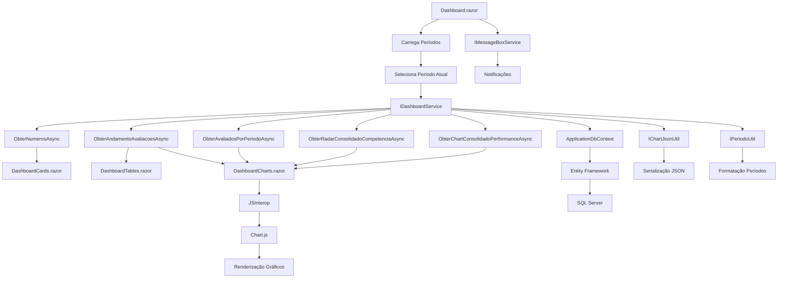

# Dashboard - Sistema de Avaliação

## Visão Geral

O Dashboard é o módulo principal de visualização de dados do Sistema de Avaliação, fornecendo uma visão consolidada das métricas e indicadores de performance das avaliações realizadas na empresa.

## Arquitetura

### Componentes Principais

#### 1. Serviços (Services Layer)

**IDashboardService / DashboardService**
- Serviço principal responsável por toda a lógica de negócio do Dashboard
- Métodos principais:
  - `ObterNumerosAsync()`: Retorna métricas básicas (associados, mentores, etc.)
  - `ObterAndamentoAvaliacoesAsync()`: Dados do andamento das avaliações
  - `ObterAvaliadosPorPeriodoAsync()`: Histórico de avaliados por período
  - `ObterRadarConsolidadoCompetenciaAsync()`: Dados para gráfico radar de competências
  - `ObterChartConsolidadoPerformanceAsync()`: Dados para gráfico de performance

**Utilitários Comuns (Common)**
- `IChartJsonUtil / ChartJsonUtil`: Serialização de dados para gráficos Chart.js
- `IPeriodoUtil / PeriodoUtil`: Manipulação e formatação de períodos

#### 2. Componentes Blazor (UI Layer)

**Dashboard.razor**
- Componente principal com renderização híbrida (`@rendermode InteractiveAuto`)
- Gerencia estado da aplicação e coordena componentes filhos
- Implementa seleção de período e carregamento de dados

**DashboardCards.razor**
- Exibe cards com métricas principais (Associados, Mentores, Avaliados, etc.)
- Recebe dados via parâmetros do componente pai

**DashboardCharts.razor**
- Renderiza gráficos utilizando Chart.js via JSInterop
- Suporta: Pie Chart, Bar Chart, Radar Chart, Line Chart
- Atualização dinâmica baseada em mudanças de dados

**DashboardTables.razor**
- Exibe tabelas de andamento e projetos
- Interface responsiva com scroll para grandes volumes de dados

#### 3. Modelos de Dados

**DashboardModel**
- Modelo principal contendo métricas e listas de dados
- Propriedades: QtdAssociados, QtdMentores, QtdGestores, etc.

**Modelos Auxiliares**
- `DashboardItemModel`: Items de listas (Status, Quantidade)
- `EvolucaoPerformanceModel`: Dados de evolução de performance
- `ResultadoProjetosModel`: Resultados consolidados por projeto

## Fluxo de Funcionamento

## Integração com Outros Módulos

### Dependências
- **Entity Framework Core**: Acesso a dados via `ApplicationDbContext`
- **Chart.js**: Renderização de gráficos no frontend
- **Newtonsoft.Json**: Serialização de dados para JavaScript
- **MessageBoxService**: Sistema de notificações

### Configuração

As configurações do Dashboard estão centralizadas em `appsettings.json`:

"Dashboard": {
  "MaxPeriodosExibidos": 12,
  "CacheExpirationMinutes": 15,
  "EnableRealTimeUpdates": true,
  "ChartAnimationDuration": 1000,
  "RefreshIntervalSeconds": 300
}

## Tecnologias Utilizadas

- **.NET 9**: Framework base
- **Blazor Server**: Renderização híbrida
- **Entity Framework Core**: ORM para acesso a dados
- **Chart.js**: Biblioteca de gráficos
- **Bootstrap**: Framework CSS
- **JSInterop**: Integração JavaScript/C#

## Padrões Implementados

### Injeção de Dependências
Todos os serviços são registrados no container DI em `Program.cs`:

csharp
builder.Services.AddScoped<IDashboardService, DashboardService>();
builder.Services.AddScoped<IChartJsonUtil, ChartJsonUtil>();
builder.Services.AddScoped<IPeriodoUtil, PeriodoUtil>();

### Separação de Responsabilidades
- **Serviços**: Lógica de negócio e acesso a dados
- **Componentes**: Apresentação e interação com usuário
- **Utilitários**: Funcionalidades reutilizáveis
- **Modelos**: Estruturas de dados

### Reutilização de Código
- Utilitários na pasta `Common` podem ser utilizados por outros módulos
- Componentes modulares permitem reutilização em diferentes contextos
- Serviços injetáveis facilitam testes e manutenção

## Performance e Otimizações

### Cache
- Configuração de cache para dados frequentemente acessados
- Expiração configurável via `appsettings.json`

### Renderização Híbrida
- `@rendermode InteractiveAuto` otimiza a experiência do usuário
- Renderização server-side inicial com hidratação client-side

### Lazy Loading
- Componentes carregam dados sob demanda
- Indicadores de loading para melhor UX

## Manutenção e Evolução

### Extensibilidade
- Novos tipos de gráficos podem ser adicionados facilmente
- Serviços podem ser estendidos sem quebrar funcionalidades existentes
- Configurações permitem ajustes sem alteração de código

### Monitoramento
- Logs configurados para debug dos serviços
- Application Insights integrado para telemetria
- Tratamento de erros com notificações ao usuário

## Considerações de Segurança

- Validação de entrada em todos os métodos de serviço
- Autorização baseada em perfis de usuário
- Sanitização de dados antes da serialização JSON
- Proteção contra injeção SQL via Entity Framework

Este documento serve como referência para desenvolvedores que trabalharão com o módulo Dashboard, fornecendo uma visão completa da arquitetura, funcionamento e boas práticas implementadas.
