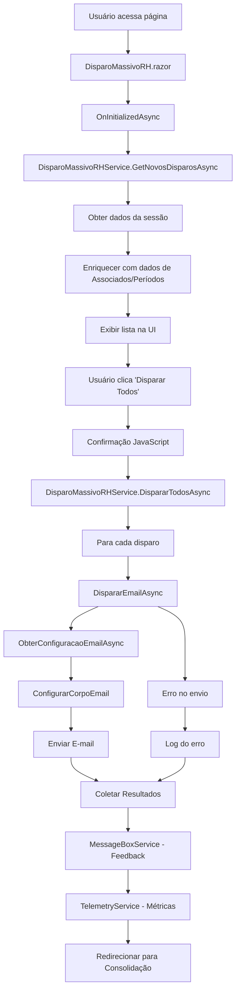

# Disparo Massivo RH - Documentação Técnica

## Visão Geral

O módulo de Disparo Massivo RH foi migrado de Web Forms para Blazor Server com renderização híbrida (.NET 9). Este sistema permite o envio massivo de e-mails para mentores sobre o status de avaliação de seus mentorados.

## Arquitetura

### Componentes Principais

1. **DisparoMassivoRHService**: Serviço principal que gerencia toda a lógica de negócio
2. **DisparoMassivoRH.razor**: Componente Blazor que fornece a interface do usuário
3. **Modelos de Dados**: Estruturas tipadas para transferência de dados
4. **Serviços Comuns**: Reutilização de serviços existentes (MessageBox, Telemetry, etc.)

### Estrutura de Pastas

```text
Services/
  DisparoMassivoRH/
    Common/
      DisparoMassivoRHModel.cs      # Modelos de dados
      IDisparoMassivoRHService.cs   # Interface do serviço
    DisparoMassivoRHService.cs      # Implementação do serviço
Components/
  DisparoMassivoRH/
    DisparoMassivoRH.razor          # Interface do usuário
```

## Funcionalidades

### 1. Carregamento de Disparos
- Obtém lista de considerações da sessão (compatibilidade com sistema legado)
- Filtra apenas itens liberados pelo RH
- Enriquece dados com informações de associados, mentores e períodos

### 2. Disparo de E-mails
- Configuração automática de parâmetros de e-mail por empresa
- Montagem personalizada do corpo do e-mail com substituição de variáveis
- Envio assíncrono com controle de erros individuais
- Telemetria e logging detalhados

### 3. Interface do Usuário
- Renderização híbrida (Server + WebAssembly)
- Feedback visual durante processamento
- Confirmação antes do disparo massivo
- Redirecionamento automático após sucesso

## Modelos de Dados

### DisparoMassivoRHItem
Representa um item de disparo individual:
- `IdConsideracoesMentor`: Identificador único
- `IdAssociado`, `Associado`: Dados do associado avaliado
- `IdMentor`, `Mentor`: Dados do mentor responsável
- `IdPeriodo`, `Periodo`: Período de avaliação

### DisparoEmailResult
Resultado de operações de disparo:
- `Sucesso`: Indica se a operação foi bem-sucedida
- `Mensagem`: Mensagem descritiva do resultado
- `TotalDisparados`: Quantidade de e-mails enviados
- `Erros`: Lista de erros ocorridos

### ConfiguracaoEmail
Configurações de e-mail por empresa:
- Parâmetros SMTP (servidor, porta, SSL)
- Credenciais de autenticação
- Template do e-mail

## Integração com Serviços Existentes

### MessageBoxService
Utilizado para feedback ao usuário:
- Mensagens de sucesso após disparo
- Alertas de erro com detalhes
- Avisos de validação

### TelemetryService
Rastreamento de eventos e métricas:
- Contagem de disparos realizados
- Tempo de processamento
- Erros e exceções

### AssociadosService
Obtenção de dados de associados e mentores:
- Informações pessoais
- Dados de cargo e empresa
- Validação de usuários ativos

## Fluxo de Alto Nível



## Configuração

### Injeção de Dependência

```text
No `Program.cs`:
csharp
builder.Services.AddScoped<IDisparoMassivoRHService, DisparoMassivoRHService>();
```

### Sessão
Configuração necessária para compatibilidade:
csharp
builder.Services.AddSession();
builder.Services.AddHttpContextAccessor();


## Tratamento de Erros

1. **Erros de Validação**: Dados incompletos ou inválidos
2. **Erros de Configuração**: Parâmetros de e-mail ausentes
3. **Erros de Rede**: Falhas na comunicação SMTP
4. **Erros de Sistema**: Exceções não tratadas

Todos os erros são:
- Logados via ILogger
- Rastreados via TelemetryService
- Exibidos ao usuário via MessageBoxService

## Melhorias Futuras

1. **Cache de Configurações**: Reduzir consultas ao banco
2. **Fila de E-mails**: Processamento assíncrono em background
3. **Templates Dinâmicos**: Editor visual de templates
4. **Relatórios**: Dashboard de disparos realizados
5. **Retry Logic**: Reenvio automático em caso de falha

## Considerações de Performance

- Renderização híbrida otimiza carregamento inicial
- Processamento assíncrono evita bloqueio da UI
- Telemetria permite monitoramento de performance
- Logging estruturado facilita troubleshooting

## Segurança

- Validação de permissões (IdPerfil >= 3)
- Sanitização de dados de entrada
- Configurações sensíveis via appsettings/secrets
- Logs não expõem informações sensíveis
