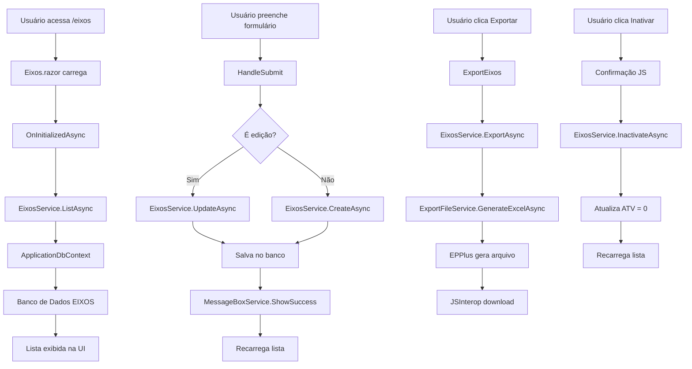

# Documentação - Módulo de Eixos

## Visão Geral

O módulo de Eixos é responsável pelo gerenciamento completo dos eixos de avaliação no sistema. Foi migrado de Web Forms para Blazor Server com renderização híbrida, seguindo os padrões modernos de arquitetura em camadas.

## Arquitetura

### Estrutura de Pastas

```text
Peers.Moderno/
├── Components/
│   ├── Eixos.razor              # Interface Blazor
│   └── Eixos.razor.cs           # Lógica do componente
├── Services/
│   └── Eixos/
│       ├── IEixosService.cs     # Interface do serviço
│       ├── EixosService.cs      # Implementação do serviço
│       └── Common/
│           ├── IExportFileService.cs  # Interface de exportação
│           └── ExportFileService.cs   # Implementação de exportação
├── Models/
│   └── Eixo.cs                  # Modelo da entidade
└── docs/
    └── Eixos.md                 # Esta documentação
```

### Componentes Principais

#### 1. EixosService
- **Responsabilidade**: Lógica de negócio para operações CRUD de eixos
- **Dependências**: ApplicationDbContext, IExportFileService, ITelemetryService
- **Métodos principais**:
  - `ListAsync()`: Lista todos os eixos
  - `GetByIdAsync(int id)`: Obtém eixo por ID
  - `CreateAsync(Eixo eixo)`: Cria novo eixo
  - `UpdateAsync(Eixo eixo)`: Atualiza eixo existente
  - `InactivateAsync(int id)`: Inativa eixo
  - `ExportAsync()`: Exporta eixos para Excel

#### 2. ExportFileService (Common)
- **Responsabilidade**: Geração de arquivos Excel reutilizável
- **Tecnologia**: EPPlus
- **Reutilização**: Pode ser usado por outros módulos
- **Métodos principais**:
  - `GenerateExcelAsync<T>()`: Gera Excel genérico
  - `GenerateExcelWithSheetsAsync()`: Gera Excel com múltiplas abas

#### 3. Componente Blazor (Eixos.razor)
- **Renderização**: InteractiveAuto (Híbrida)
- **Funcionalidades**:
  - Cadastro de novos eixos
  - Edição de eixos existentes
  - Listagem com filtros
  - Inativação de eixos
  - Exportação para Excel
- **Validação**: Data Annotations
- **Feedback**: Integração com IMessageBoxService

## Fluxo de Funcionamento



## Integração com Outros Módulos

### Dependências
- **ApplicationDbContext**: Acesso ao banco de dados
- **ITelemetryService**: Logging e telemetria
- **IMessageBoxService**: Feedback ao usuário
- **IJSRuntime**: Interação com JavaScript (download)

### Reutilização
- **ExportFileService**: Pode ser usado por Competências, Cargos, etc.
- **Padrão de serviços**: Modelo replicável para outros módulos

## Configuração

### appsettings.json
```text
{
  "Eixos": {
    "MaxEixoLength": 500,
    "MaxExportRecords": 10000,
    "ExportTempPath": "temp/exports",
    "AllowedFileExtensions": [".xlsx", ".xls"],
    "MaxFileSizeMB": 10,
    "EnableValidation": true,
    "DefaultTipoAvaliacao": "desempenho",
    "DefaultStatus": 1,
    "CacheExpirationMinutes": 15
  }
}
```

### Injeção de Dependência (Program.cs)

```text
csharp
builder.Services.AddScoped<Services.Eixos.IEixosService, Services.Eixos.EixosService>();
builder.Services.AddScoped<Services.Eixos.Common.IExportFileService, Services.Eixos.Common.ExportFileService>();
```

## Modelo de Dados

### Entidade Eixo

```text
csharp
public class Eixo
{
    public int IdEixo { get; set; }          // Chave primária
    public string Nome { get; set; }         // Nome do eixo (max 500 chars)
    public int ATV { get; set; }             // Status (1=Ativo, 0=Inativo)
    public int? USR { get; set; }            // Usuário que criou/alterou
    public DateTime? DHC { get; set; }       // Data/hora da criação/alteração
    public string? TipoAvaliacao { get; set; } // Tipo de avaliação
}
```

### Mapeamento EF Core
- **Tabela**: EIXOS
- **Coluna Nome**: Mapeada para "Eixo" na tabela
- **Relacionamentos**: Um-para-muitos com Competencias

## Funcionalidades

### 1. Listagem
- Exibe todos os eixos ordenados por ID
- Mostra status (Ativo/Inativo)
- Ações contextuais por linha

### 2. Cadastro/Edição
- Formulário com validação
- Campos: Nome, Status
- Feedback visual durante processamento

### 3. Inativação
- Confirmação via JavaScript
- Soft delete (ATV = 0)
- Não remove fisicamente do banco

### 4. Exportação
- Gera arquivo Excel (.xlsx)
- Download automático via JavaScript
- Nome do arquivo com timestamp

## Padrões Utilizados

### Arquiteturais
- **Repository Pattern**: Via Entity Framework
- **Service Layer**: Separação de responsabilidades
- **Dependency Injection**: Inversão de controle
- **MVVM**: Model-View-ViewModel no Blazor

### Técnicos
- **Async/Await**: Operações assíncronas
- **Data Annotations**: Validação de modelo
- **Partial Classes**: Separação de markup e lógica
- **JSInterop**: Integração JavaScript

## Considerações de Performance

### Otimizações
- Queries assíncronas com EF Core
- Renderização híbrida (Server + WebAssembly)
- Lazy loading de dados
- Telemetria para monitoramento

### Escalabilidade
- Serviços stateless
- Cache configurável
- Paginação (futuro)
- Compressão de exportação (futuro)

## Manutenção e Evolução

### Pontos de Extensão
- Novos formatos de exportação
- Filtros avançados na listagem
- Validações customizadas
- Integração com outros módulos

### Monitoramento
- Application Insights integrado
- Logs estruturados
- Métricas de performance
- Tracking de eventos de negócio

## Migração do Web Forms

### O que foi migrado
- ✅ Interface de usuário (ASPX → Razor)
- ✅ Lógica de negócio (Code-behind → Services)
- ✅ Acesso a dados (ADO.NET → EF Core)
- ✅ Validação (Server controls → Data Annotations)
- ✅ Exportação (Response.Write → JSInterop)
- ✅ Mensagens (UserControl → Service)

### Melhorias implementadas
- Arquitetura em camadas
- Injeção de dependência
- Testes unitários facilitados
- Reutilização de código
- Performance otimizada
- Experiência de usuário moderna
