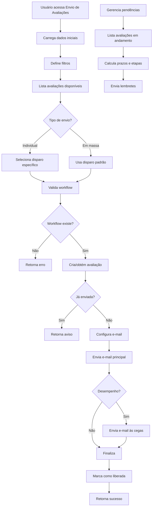

# Envio de Avaliações - Documentação Técnica

## Visão Geral

O módulo de **Envio de Avaliações** foi migrado de Web Forms para Blazor Híbrido (.NET 9) seguindo os princípios de arquitetura limpa, injeção de dependência e separação de responsabilidades. O sistema permite o gerenciamento completo do processo de envio de avaliações de desempenho e liderança.

## Arquitetura

### Componentes Principais

1. **EnvioAvaliacoesService**: Serviço principal que centraliza toda a lógica de negócio
2. **EmailUtils**: Utilitário para envio e formatação de e-mails
3. **WorkflowUtils**: Utilitário para gerenciamento de workflows e prazos
4. **EnvioAvaliacoes.razor**: Componente Blazor com renderização interativa
5. **AvaliacaoModels**: Modelos de domínio e DTOs

### Estrutura de Pastas

```text
Peers.Moderno/
├── Components/
│   ├── EnvioAvaliacoes.razor
│   └── EnvioAvaliacoes.razor.cs
├── Services/
│   ├── Avaliacoes/
│   │   ├── EnvioAvaliacoesService.cs
│   │   └── Common/
│   │       ├── EmailUtils.cs
│   │       └── WorkflowUtils.cs
│   └── Common/
│       └── MessageBoxService.cs
├── Models/
│   └── AvaliacaoModels.cs
└── docs/
    └── EnvioAvaliacoes.md
```

## Funcionalidades

### 1. Listagem de Avaliações
- Filtros por período, projeto, cliente, status e associado
- Exibição hierárquica: projetos → associados
- Configuração individual de disparos por associado

### 2. Envio de Avaliações
- **Envio Individual**: Permite enviar uma avaliação específica
- **Envio em Massa**: Envia todas as avaliações listadas
- **Validações**: Verifica workflows, duplicatas e configurações

### 3. Gerenciamento de Pendências
- Lista avaliações em andamento por etapa
- Redisparo automático de lembretes
- Cálculo de prazos com compensadores

### 4. Tipos de Avaliação
- **Desempenho**: Fluxo completo (Auto → Cegas → Gestor → Feedback → Mentor)
- **Liderança**: Fluxo simplificado (Gestor → Feedback)

## Fluxo de Alto Nível



## Modelos de Dados

### ProjetoModel
Representa um projeto com suas avaliações associadas.

```text
csharp
public class ProjetoModel
{
    public int Id { get; set; }
    public string Nome { get; set; }
    public List<ProjetosAssociadosModel> Associados { get; set; }
    // ... outros campos
}
```

### EnvioAvaliacaoRequest
DTO para requisições de envio de avaliação.

```text
csharp
public class EnvioAvaliacaoRequest
{
    public int IdProjeto { get; set; }
    public int IdAssociado { get; set; }
    public int IdPeriodo { get; set; }
    public string TipoAvaliacao { get; set; }
    public string Escopo { get; set; }
    public int IdGestor { get; set; }
    public int IdPrazo { get; set; }
}
```

## Serviços

### IEnvioAvaliacoesService
Interface principal do serviço de envio de avaliações.

**Métodos principais:**
- `ListarAvaliacoesAsync()`: Lista avaliações baseadas em filtros
- `EnviarAvaliacaoAsync()`: Envia uma avaliação específica
- `EnviarTodasAvaliacoesAsync()`: Envia múltiplas avaliações
- `ListarPendenciasAsync()`: Lista avaliações pendentes
- `RedispararPendenciasAsync()`: Reenvia lembretes de pendências

### IEmailUtils
Utilitário para operações de e-mail.

**Métodos principais:**
- `EnviarEmailAsync()`: Envia e-mail via SMTP
- `ConfigurarCorpoEmail()`: Formata template de e-mail
- `CarregarMascara()`: Carrega template base

### IWorkflowUtils
Utilitário para operações de workflow.

**Métodos principais:**
- `ObterTodosPrazosAtivosAsync()`: Lista prazos ativos
- `ObterWorkflowPorPeriodoAsync()`: Obtém workflow por período
- `ObterEtapa*()`: Constantes de etapas do workflow

## Configuração

### Injeção de Dependência (Program.cs)

```text
csharp
// Avaliacoes Services
builder.Services.AddScoped<IEnvioAvaliacoesService, EnvioAvaliacoesService>();

// Avaliacoes Common Services
builder.Services.AddScoped<IEmailUtils, EmailUtils>();
builder.Services.AddScoped<IWorkflowUtils, WorkflowUtils>();
```

### Configurações de E-mail
As configurações de e-mail são obtidas da tabela `EmailParametro` no banco de dados, incluindo:
- Servidor SMTP
- Porta e SSL
- Credenciais
- Templates de e-mail

## Estados de Avaliação

| Código | Descrição | Próxima Etapa |
|--------|-----------|---------------|
| NI | Não Iniciada | Auto Avaliação |
| AA | Auto Avaliação | Avaliação às Cegas |
| AC | Avaliação às Cegas | Avaliação do Gestor |
| AG | Avaliação do Gestor | Feedback |
| FB | Feedback | Mentoria |
| AM | Avaliação Mentor | Finalizada |
| AFI | Finalizada | - |

## Tratamento de Erros

### Códigos de Retorno
- **OK**: Operação realizada com sucesso
- **Fail**: Falha na criação/processamento
- **NotSend**: Avaliação já enviada anteriormente
- **SendNotEmail**: Avaliação criada, mas erro no envio do e-mail
- **NoWorkflow**: Workflow não configurado para o período

### Logging e Telemetria
O sistema utiliza Application Insights para rastreamento de:
- Exceções e erros
- Métricas de performance
- Eventos de negócio
- Dependências externas (SMTP, banco de dados)

## Segurança

### Autenticação
- Integração com Azure AD via OpenID Connect
- Validação de usuário ativo no sistema
- Controle de sessão

### Autorização
- Verificação de permissões por empresa
- Validação de acesso a projetos e associados
- Auditoria de ações (USR, DHC)

## Performance

### Otimizações Implementadas
- Consultas assíncronas ao banco de dados
- Carregamento lazy de relacionamentos
- Cache de configurações de e-mail
- Processamento em lote para envios massivos

### Monitoramento
- Métricas de tempo de resposta
- Contadores de sucesso/falha
- Alertas para falhas de envio de e-mail

## Manutenção

### Logs Importantes
- Falhas de envio de e-mail
- Workflows não encontrados
- Erros de validação de dados
- Exceções não tratadas

### Pontos de Atenção
- Configuração correta do servidor SMTP
- Validação de templates de e-mail
- Sincronização de workflows com períodos
- Monitoramento de caixa de entrada dos usuários

## Extensibilidade

### Futuras Melhorias
- Integração com serviços de e-mail em nuvem (SendGrid, etc.)
- Notificações push e SMS
- Dashboard de métricas de envio
- IA para otimização de prazos e lembretes
- API REST para integração externa

### Padrões para Extensão
- Implementar interfaces existentes
- Seguir padrão de injeção de dependência
- Manter separação entre Common e específico
- Documentar novas funcionalidades

Este documento serve como referência técnica completa para o módulo de Envio de Avaliações, facilitando manutenção, extensão e onboarding de novos desenvolvedores.
