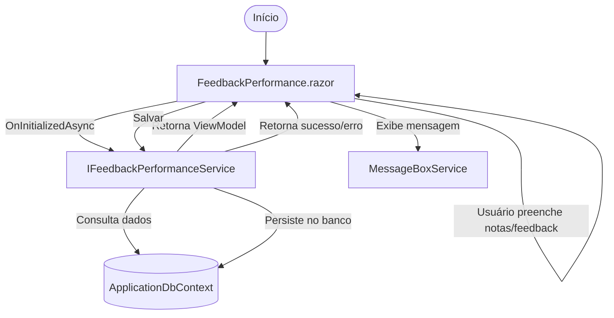

# Feedback de Performance - Documentação de Integração

## Visão Geral

Este módulo implementa o fluxo de Feedback de Performance, migrando a antiga página Web Forms para um componente Blazor moderno, com lógica de negócio centralizada em serviços reutilizáveis e helpers. O objetivo é garantir manutenibilidade, reuso e integração simples com outros módulos do sistema de avaliação.

## Estrutura dos Arquivos

- **Services/Performance/IFeedbackPerformanceService.cs**: Interface e modelos para o serviço de feedback de performance.
- **Services/Performance/FeedbackPerformanceService.cs**: Implementação da lógica de negócio, integração com ApplicationDbContext e TelemetryService.
- **Services/Performance/Common/FeedbackPerformanceHelper.cs**: Helper estático para truncamento de texto, disclaimers e separadores.
- **Services/Common/ComboHelper.cs**: Métodos para combos de notas, abrangências e status.
- **Pages/FeedbackPerformance.razor**: Componente Blazor da interface de feedback de performance.
- **Pages/FeedbackPerformance.razor.cs**: Code-behind para lógica de UI e manipulação de dados.
- **Program.cs**: Registro do serviço no DI container.

## Integração e Funcionamento

1. O componente `FeedbackPerformance.razor` é carregado via rota `/feedback-performance`.
2. Ao inicializar, injeta `IFeedbackPerformanceService` e requisita os dados do feedback de performance para o projeto, associado e período.
3. O serviço consulta o banco via `ApplicationDbContext`, monta o `FeedbackPerformanceViewModel` e retorna para o componente.
4. O usuário pode preencher notas e considerações, que são salvas via método `SaveFeedbackAsync` do serviço.
5. O helper `FeedbackPerformanceHelper` é utilizado para truncar textos, exibir disclaimers e separar abrangências.
6. Combos de notas e abrangências são fornecidos por `ComboHelper`, garantindo padronização.
7. Mensagens de sucesso/erro são exibidas via `IMessageBoxService`.

## Fluxo Mermaid

## Sugestões de Melhorias Futuras

- Implementar navegação real para páginas de competência e finalização.
- Adicionar validação de preenchimento obrigatório das notas antes do salvamento.
- Exibir progresso visual do preenchimento das notas.
- Permitir filtros dinâmicos de projeto, associado e período.
- Integrar com notificações em tempo real para feedbacks pendentes.
- Adicionar testes automatizados para os serviços e helpers.
- Otimizar queries para grandes volumes de dados.
- Internacionalização dos textos da interface.
