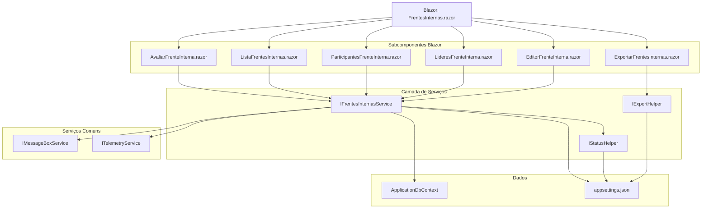

# Documentação: Migração de Frentes Internas (Alocações Internas)

## Visão Geral

Este documento descreve a arquitetura e integração dos serviços e componentes criados para a migração da funcionalidade de "Frentes Internas" (anteriormente "Alocações Internas") do Web Forms para Blazor Híbrido (.NET 9).

## Arquitetura

### Estrutura de Pastas

``text
Services/FrentesInternas/
├── IFrentesInternasService.cs          # Interface principal do serviço
├── FrentesInternasService.cs           # Implementação do serviço principal
└── Common/
    ├── IStatusHelper.cs                # Interface para helpers de status
    ├── StatusHelper.cs                 # Helper para conversão de status
    ├── IExportHelper.cs                # Interface para helpers de exportação
    └── ExportHelper.cs                 # Helper para exportação Excel

Components/FrentesInternas/
├── FrentesInternas.razor               # Componente principal
├── EditorFrenteInterna.razor           # Editor/cadastro de frentes
├── LideresFrenteInterna.razor          # Gerenciamento de líderes
├── ParticipantesFrenteInterna.razor    # Gerenciamento de participantes
├── ListaFrentesInternas.razor          # Listagem de frentes internas
├── AvaliarFrenteInterna.razor          # Avaliação de associados
└── ExportarFrentesInternas.razor       # Exportação de avaliações

Models/
├── FrenteInternaModel.cs               # Modelo principal
├── LiderFrenteInternaModel.cs          # Modelo para líderes
└── ParticipanteFrenteInternaModel.cs   # Modelo para participantes
```

### Serviços Principais

#### IFrentesInternasService

Serviço principal que centraliza toda a lógica de negócio relacionada às frentes internas:

- **ObterFrentesInternas()**: Lista todas as frentes internas
- **ObterFrenteInterna(int id)**: Obtém uma frente específica
- **GerirFrenteInterna(FrenteInterna frente)**: Cria ou atualiza uma frente
- **ObterLideresFrentesInternas()**: Lista líderes de frentes
- **GerirLiderFrenteInterna(LiderFrenteInterna lider)**: Gerencia líderes
- **ObterParticipantesFrentesInternas()**: Lista participantes
- **GerirParticipanteFrenteInterna(ParticipanteFrenteInterna participante)**: Gerencia participantes
- **ObterAvaliacoesAlocacoesInternas()**: Obtém avaliações para exportação

#### StatusHelper (Common)

Helper reutilizável para conversão e manipulação de status:

- **ConvertToStatusText(bool ativo)**: Converte boolean para "Ativo"/"Inativo"
- **ConvertToStatusBool(string status)**: Converte texto para boolean
- **GetStatusOptions()**: Retorna opções para dropdowns

#### ExportHelper (Common)

Helper reutilizável para exportação de dados:

- **ExportarAvaliacoesParaExcel(List<AlocacaoExport> dados)**: Gera arquivo Excel
- **ConfigurarCabecalhos()**: Configura cabeçalhos padrão
- **FormatarDados()**: Aplica formatação aos dados

### Componentes Blazor

#### FrentesInternas.razor (Componente Principal)

Componente orquestrador que utiliza `@rendermode InteractiveAuto` para otimização de performance:

razor
@rendermode InteractiveAuto
@inject IFrentesInternasService FrentesInternasService
@inject IMessageBoxService MessageBoxService
@inject ITelemetryService TelemetryService


#### Subcomponentes Especializados

- **EditorFrenteInterna**: Formulário de cadastro/edição
- **LideresFrenteInterna**: Tabela com gerenciamento de líderes
- **ParticipantesFrenteInterna**: Tabela com gerenciamento de participantes
- **ListaFrentesInternas**: Listagem principal com ações
- **AvaliarFrenteInterna**: Interface de avaliação
- **ExportarFrentesInternas**: Funcionalidade de exportação

### Integração com Serviços Comuns

#### MessageBoxService

Todos os componentes utilizam o serviço centralizado de mensagens:

csharp
@inject IMessageBoxService MessageBoxService

// Uso
MessageBoxService.ShowSuccess("Frente interna cadastrada com sucesso!");
MessageBoxService.ShowError("Erro ao processar solicitação");


#### TelemetryService

Integração com Application Insights para monitoramento:

csharp
@inject ITelemetryService TelemetryService

// Uso
TelemetryService.TrackEvent("FrenteInterna_Criada", new Dictionary<string, string> 
{ 
    { "IdFrente", frente.Id.ToString() },
    { "Usuario", usuarioLogado.Email }
});


### Configuração

#### appsettings.json

```text
"FrentesInternas": {
  "MaxFrenteInternaLength": 500,
  "MaxExportRecords": 50000,
  "MaxImportRecords": 10000,
  "MaxFileSizeMB": 10,
  "AllowedFileExtensions": [".xlsx", ".xls"],
  "ExportTempPath": "temp/exports",
  "ImportTempPath": "temp/imports",
  "EnableValidation": true,
  "EnableCompression": false,
  "CacheExpirationMinutes": 30,
  "DefaultStatus": 1,
  "EnableAutoRedirect": true,
  "MinPerfilEdicao": 3,
  "EnableLiderPermissions": true
}

```
#### Injeção de Dependência (Program.cs)
```text
csharp
// FrentesInternas Services
builder.Services.AddScoped<IFrentesInternasService, FrentesInternasService>();

// FrentesInternas Common Services
builder.Services.AddScoped<IStatusHelper, StatusHelper>();
builder.Services.AddScoped<IExportHelper, ExportHelper>();
```

### Modelos de Dados

#### FrenteInternaModel
```text
csharp
public class FrenteInternaModel
{
    public int IdFrenteInterna { get; set; }
    public string FrenteInterna { get; set; }
    public int TotalLideres { get; set; }
    public string Lideres { get; set; }
    public int ATV { get; set; }
    public bool Ativo => ATV == 1;
}
```

#### LiderFrenteInternaModel
```text
csharp
public class LiderFrenteInternaModel
{
    public int IdLiderFrenteInterna { get; set; }
    public int IdFrenteInterna { get; set; }
    public int IdAssociado { get; set; }
    public string NomeAssociado { get; set; }
    public bool ATV { get; set; }
    public DateTime DHC { get; set; }
    public int USR { get; set; }
}
```

### Fluxo de Alto Nível



### Benefícios da Arquitetura

1. **Modularidade**: Cada componente tem responsabilidade específica
2. **Reutilização**: Helpers em `Common` podem ser usados por outras funcionalidades
3. **Testabilidade**: Interfaces facilitam criação de mocks para testes
4. **Performance**: Blazor Híbrido com renderização otimizada
5. **Manutenibilidade**: Separação clara entre UI, lógica de negócio e dados
6. **Observabilidade**: Integração nativa com telemetria e logs

### Padrões de Uso

#### Criação de Nova Frente Interna

1. Usuário preenche formulário no `EditorFrenteInterna`
2. Componente chama `FrentesInternasService.GerirFrenteInterna()`
3. Serviço valida dados e persiste no banco
4. `MessageBoxService` exibe confirmação
5. `TelemetryService` registra evento
6. Lista é atualizada automaticamente

#### Exportação de Avaliações

1. Usuário clica em exportar no `ExportarFrentesInternas`
2. Componente chama `ExportHelper.ExportarAvaliacoesParaExcel()`
3. Helper obtém dados via `FrentesInternasService`
4. Arquivo Excel é gerado e disponibilizado para download
5. Evento é registrado na telemetria

### Considerações de Migração

- **Compatibilidade**: Mantém compatibilidade com dados existentes
- **Permissões**: Respeita níveis de perfil do usuário logado
- **Performance**: Cache configurável para otimização
- **Escalabilidade**: Preparado para grandes volumes de dados
- **Segurança**: Validação de entrada e controle de acesso integrados

### Próximos Passos

1. Implementar testes unitários para serviços
2. Adicionar testes de integração para componentes
3. Configurar CI/CD para deploy automatizado
4. Implementar cache distribuído para ambientes de produção
5. Adicionar métricas customizadas de performance
