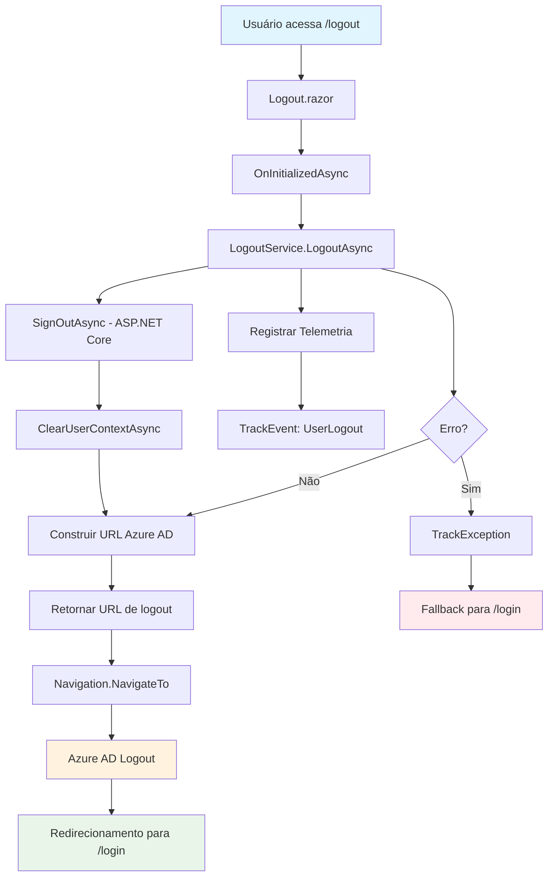

# Logout - Fluxo e Integração

## Visão Geral

O sistema de logout foi migrado de Web Forms para Blazor Híbrido .NET 9, centralizando toda a lógica de sign-out, limpeza de sessão e redirecionamento para o Azure AD em um serviço reutilizável.

## Arquitetura

### Componentes Principais

- **ILogoutService**: Interface que define o contrato para operações de logout
- **LogoutService**: Implementação que centraliza toda a lógica de logout
- **Logout.razor**: Componente Blazor que orquestra o processo de logout

### Localização dos Arquivos

```text
Services/Common/Auth/
├── ILogoutService.cs
└── LogoutService.cs

Components/Pages/
└── Logout.razor
```

## Como Funciona

1. **Acesso à Página**: O usuário acessa `/logout` ou é redirecionado para esta rota
2. **Inicialização**: O componente Blazor chama `LogoutService.LogoutAsync()` no `OnInitializedAsync`
3. **Sign-out Local**: O serviço executa:
   - Sign-out do ASP.NET Core (Cookie e OpenIdConnect)
   - Limpeza da sessão customizada via `IUserContextService`
4. **Construção da URL**: Monta a URL de logout do Azure AD usando configurações do `appsettings.json`
5. **Redirecionamento**: O componente redireciona o usuário para a URL de logout do Azure AD
6. **Retorno**: O Azure AD redireciona de volta para a aplicação conforme configurado

## Integração

### Uso Básico
```text
csharp
@inject ILogoutService LogoutService
@inject NavigationManager Navigation

// Em um método ou evento
var logoutUrl = await LogoutService.LogoutAsync();
Navigation.NavigateTo(logoutUrl, forceLoad: true);
```

### Configuração Necessária

O serviço utiliza as seguintes configurações do `appsettings.json`:

```text
{
  "Authentication": {
    "AzureAd": {
      "TenantId": "your-tenant-id",
      "ADInstance": "https://login.microsoftonline.com/",
      "RedirectUri": "https://localhost:7000/login"
    }
  }
}
```

### Injeção de Dependência

O serviço está registrado no `Program.cs`:

```text
csharp
builder.Services.AddScoped<ILogoutService, LogoutService>();
```

## Reutilização

O `ILogoutService` pode ser reutilizado em:

- **Menus de navegação**: Botões de logout em headers/sidebars
- **Expiração de sessão**: Logout automático quando a sessão expira
- **Componentes de segurança**: Logout forçado em caso de violações
- **APIs**: Endpoints que precisam invalidar sessões

### Exemplo de Uso em Menu
```text
csharp
@inject ILogoutService LogoutService

<button class="btn btn-outline-danger" @onclick="HandleLogout">
    <i class="fas fa-sign-out-alt"></i> Sair
</button>

@code {
    private async Task HandleLogout()
    {
        var logoutUrl = await LogoutService.LogoutAsync();
        Navigation.NavigateTo(logoutUrl, forceLoad: true);
    }
}
```

## Tratamento de Erros

- **Telemetria**: Todos os eventos e erros são registrados via `ITelemetryService`
- **Fallback**: Em caso de erro, redireciona para `/login`
- **Graceful Degradation**: Se o Azure AD não estiver disponível, ainda limpa a sessão local

## Benefícios da Migração

1. **Centralização**: Toda lógica de logout em um local
2. **Reutilização**: Serviço pode ser usado em qualquer parte da aplicação
3. **Testabilidade**: Interface permite fácil criação de mocks para testes
4. **Manutenibilidade**: Separação clara entre lógica de negócio e UI
5. **Performance**: Blazor Híbrido oferece melhor experiência do usuário
6. **Observabilidade**: Telemetria integrada para monitoramento

## Fluxo de Alto Nível



## Considerações de Segurança

- **Limpeza Completa**: Remove tanto cookies do ASP.NET Core quanto sessão customizada
- **Azure AD Integration**: Garante logout completo no provedor de identidade
- **URL Encoding**: URLs são adequadamente codificadas para evitar problemas
- **HTTPS**: Redirecionamentos sempre usam HTTPS em produção

## Monitoramento

Eventos de telemetria registrados:

- `LogoutPageAccessed`: Quando a página de logout é acessada
- `UserLogout`: Quando o logout é executado com sucesso
- Exceções são automaticamente registradas com contexto

## Troubleshooting

### Problemas Comuns

1. **Redirecionamento infinito**: Verificar configuração do `PostLogoutRedirectUri`
2. **Sessão não limpa**: Verificar se `IUserContextService` está funcionando
3. **Azure AD erro**: Verificar configurações de `TenantId` e `ADInstance`

### Logs Úteis

- Application Insights: Eventos de logout e exceções
- ASP.NET Core Logs: Informações de autenticação
- Azure AD Logs: Eventos de logout no provedor
