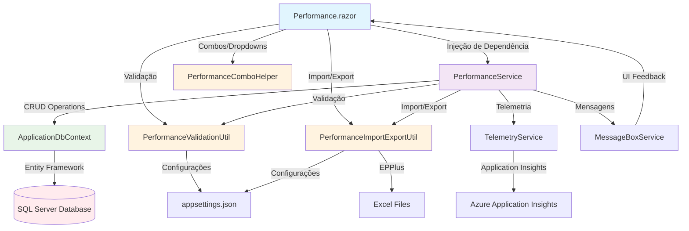

# Módulo Performance - Documentação Técnica

## Visão Geral

O módulo Performance foi projetado para gerenciar as performances dos associados no sistema de avaliação interna da empresa. Este módulo permite o cadastro, edição, importação e exportação de performances, incluindo configurações de notas padrão para diferentes tipos de avaliação (auto-avaliação, avaliação às cegas e avaliação do gestor).

## Arquitetura

### Estrutura de Pastas

```text
Peers.Moderno/
├── Models/
│   └── Performance.cs
├── Services/
│   └── Performance/
│       ├── IPerformanceService.cs
│       ├── PerformanceService.cs
│       └── Common/
│           ├── IPerformanceImportExportUtil.cs
│           ├── PerformanceImportExportUtil.cs
│           ├── IPerformanceValidationUtil.cs
│           ├── PerformanceValidationUtil.cs
│           ├── IPerformanceComboHelper.cs
│           └── PerformanceComboHelper.cs
├── Components/
│   └── Performance/
│       ├── Performance.razor
│       └── Performance.razor.cs
└── docs/
    └── Performance.md
```

### Componentes Principais

#### 1. PerformanceService
- **Responsabilidade**: Lógica principal de negócio para operações CRUD de Performance
- **Métodos principais**:
  - `InserirPerformanceAsync()`: Inserção de nova performance
  - `AlterarPerformanceAsync()`: Alteração de performance existente
  - `ExcluirPerformanceAsync()`: Inativação de performance
  - `ObterPerformanceAsync()`: Busca de performance por ID
  - `ObterListaPerformancesAsync()`: Listagem de performances
  - `ImportarPerformancesAsync()`: Importação via planilha Excel
  - `ExportarPerformancesAsync()`: Exportação para planilha Excel

#### 2. PerformanceImportExportUtil
- **Responsabilidade**: Utilitário para importação e exportação de planilhas Excel
- **Funcionalidades**:
  - Leitura de arquivos Excel (.xlsx, .xls)
  - Validação de estrutura de planilha
  - Geração de arquivos Excel para exportação
  - Tratamento de erros de importação

#### 3. PerformanceValidationUtil
- **Responsabilidade**: Validação de regras de negócio
- **Validações**:
  - Campos obrigatórios
  - Consistência de notas padrão
  - Validação de tipos de avaliação
  - Verificação de duplicatas

#### 4. PerformanceComboHelper
- **Responsabilidade**: Helper para combos e dropdowns
- **Funcionalidades**:
  - Lista de cargos
  - Lista de status (Ativo/Inativo)
  - Lista de abrangências (Individual/Coletivo)
  - Lista de notas de avaliação

## Fluxo de Alto Nível



## Integração com Outros Módulos

### Dependências
- **Cargos**: Para listagem de cargos disponíveis
- **Associados**: Para validação de usuários e permissões
- **Common Services**: Para telemetria, mensagens e contexto de usuário

### Serviços Reutilizados
- `ITelemetryService`: Para rastreamento de eventos e exceções
- `IMessageBoxService`: Para exibição de mensagens ao usuário
- `IUserContextService`: Para contexto do usuário logado

## Configurações

### appsettings.json
```json

{
  "Performance": {
    "MaxPerformanceLength": 500,
    "MaxDescricaoLength": 2000,
    "MaxExportRecords": 50000,
    "MaxImportRecords": 10000,
    "MaxFileSizeMB": 10,
    "AllowedFileExtensions": [".xlsx", ".xls"],
    "ExportTempPath": "temp/exports",
    "ImportTempPath": "temp/imports",
    "EnableValidation": true,
    "DefaultStatus": 1,
    "DefaultAbrangencia": "Individual",
    "ValidationMessages": {
      "CargoObrigatorio": "Selecione o campo Cargo",
      "PerformanceObrigatoria": "Preencha o campo Performance"
    }
  }
}
```

## Funcionalidades Principais

### 1. Cadastro de Performance
- Formulário com campos obrigatórios:
  - Cargo
  - Performance (descrição)
  - Descrição Abaixo do Esperado
  - Descrição Esperado
  - Descrição Acima do Esperado
  - Status (Ativo/Inativo)
  - Abrangência (Individual/Coletivo)

### 2. Configuração de Inputs de Avaliação
- **Auto-avaliação**: Checkbox para habilitar/desabilitar input do usuário
- **Avaliação às Cegas**: Checkbox para habilitar/desabilitar input do usuário
- **Avaliação do Gestor**: Checkbox para habilitar/desabilitar input do usuário
- **Notas Padrão**: Quando input desabilitado, permite definir nota padrão

### 3. Importação/Exportação
- **Exportação**: Gera arquivo Excel com todas as performances
- **Importação**: Permite importar performances via planilha Excel
- **Validação**: Verifica estrutura e dados da planilha
- **Relatório**: Mostra quantidades de registros inseridos, alterados e desconsiderados

### 4. Listagem e Gerenciamento
- Grid com performances cadastradas
- Filtros de busca
- Ações de editar e inativar
- Paginação e ordenação

## Segurança

### Validações de Entrada
- Sanitização de dados de entrada
- Validação de tipos de arquivo para upload
- Limite de tamanho de arquivo
- Validação de estrutura de planilha

### Controle de Acesso
- Verificação de perfil de usuário
- Validação de permissões para operações
- Log de auditoria via Application Insights

## Tratamento de Erros

### Estratégias
- Try-catch em todos os métodos críticos
- Log de exceções via TelemetryService
- Mensagens amigáveis ao usuário via MessageBoxService
- Rollback automático em operações de banco de dados

### Tipos de Erro
- **Validação**: Campos obrigatórios, formatos inválidos
- **Negócio**: Regras de negócio violadas
- **Sistema**: Erros de banco de dados, arquivo não encontrado
- **Importação**: Estrutura de planilha inválida, dados inconsistentes

## Performance e Otimização

### Estratégias Implementadas
- Cache de configurações (15 minutos)
- Paginação de resultados
- Lazy loading de relacionamentos
- Compressão opcional de arquivos de exportação
- Processamento assíncrono de importações grandes

### Métricas Monitoradas
- Tempo de resposta das operações
- Taxa de sucesso de importações
- Uso de memória durante processamento
- Quantidade de registros processados

## Exemplos de Uso

### Injeção de Dependência no Componente

csharp
@inject IPerformanceService PerformanceService
@inject IPerformanceValidationUtil ValidationUtil
@inject IPerformanceComboHelper ComboHelper
@inject IMessageBoxService MessageBox


### Cadastro de Performance
```text
csharp
var performance = new Performance
{
    IdCargo = selectedCargoId,
    PerformanceDescricao = txtPerformance,
    PerformanceAbaixo = txtAbaixo,
    PerformanceEsperado = txtEsperado,
    PerformanceAcima = txtAcima,
    Status = 1,
    Abrangencia = "Individual"
};

var result = await PerformanceService.InserirPerformanceAsync(performance);
if (result.IsSuccess)
{
    MessageBox.ShowSuccess("Performance inserida com sucesso!");
}
```

### Importação de Planilha

```text
csharp
var importResult = await PerformanceService.ImportarPerformancesAsync(fileStream, fileName);
if (importResult.IsSuccess)
{
    MessageBox.ShowInfo($"Importação concluída: {importResult.RegistrosInseridos} inseridos, {importResult.RegistrosAlterados} alterados");
}
```

## Manutenção e Evolução

### Pontos de Extensão
- Novos tipos de avaliação podem ser adicionados via configuração
- Validações customizadas podem ser implementadas no ValidationUtil
- Novos formatos de exportação podem ser adicionados no ImportExportUtil

### Monitoramento
- Logs estruturados via Application Insights
- Métricas de performance e uso
- Alertas para falhas críticas
- Dashboard de monitoramento de importações

### Testes
- Testes unitários para todos os serviços
- Testes de integração para fluxos completos
- Testes de performance para importações grandes
- Testes de UI com bUnit para componentes Blazor

## Considerações Futuras

### Melhorias Planejadas
- Integração com IA para sugestão de descrições
- Versionamento de performances
- Histórico de alterações
- API REST para integração externa
- Processamento em background para importações grandes

### Migração Cloud-Native
- Uso de Azure Blob Storage para arquivos temporários
- Azure Service Bus para processamento assíncrono
- Azure Key Vault para configurações sensíveis
- Containerização com Docker
- Deploy automatizado com Azure DevOps
