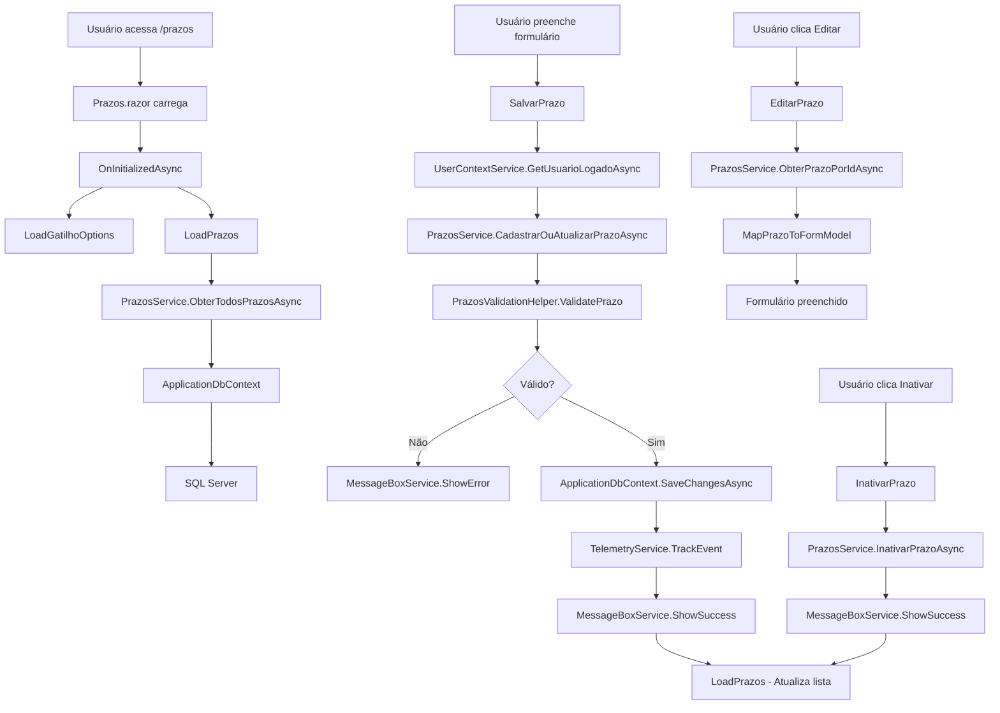

# Migração da Funcionalidade de Prazos

## Visão Geral

Este documento descreve a migração da funcionalidade de gestão de prazos do sistema legado ASP.NET Web Forms para um componente Blazor em ASP.NET Core 9, seguindo os padrões arquiteturais estabelecidos no projeto.

## Arquitetura

### Estrutura de Pastas

```text
Peers.Moderno/
├── Components/
│   └── Pages/
│       ├── Prazos.razor
│       └── Prazos.razor.cs
├── Models/
│   └── Prazo.cs
├── Services/
│   ├── Common/
│   │   └── MessageBoxService.cs (reutilizado)
│   └── Prazos/
│       ├── PrazosService.cs
│       └── Common/
│           └── PrazosValidationHelper.cs
├── Data/
│   └── ApplicationDbContext.cs (atualizado)
├── docs/
│   └── Prazos.md
├── appsettings.json (atualizado)
└── Program.cs (atualizado)
```

### Componentes Principais

#### 1. Modelo de Domínio (`Models/Prazo.cs`)
- Representa a entidade Prazo com todas as propriedades necessárias
- Configurado para uso com Entity Framework Core
- Inclui propriedades calculadas para facilitar uso na UI

#### 2. Serviço Principal (`Services/Prazos/PrazosService.cs`)
- **Interface:** `IPrazosService`
- **Responsabilidades:**
  - Operações CRUD para prazos
  - Validação de regras de negócio
  - Logging e telemetria
  - Mapeamento entre modelos

#### 3. Helper de Validação (`Services/Prazos/Common/PrazosValidationHelper.cs`)
- **Interface:** `IPrazosValidationHelper`
- **Responsabilidades:**
  - Validação de campos obrigatórios
  - Conversão de tipos
  - Geração de opções de gatilho
  - Reutilizável em outras funcionalidades

#### 4. Componente Blazor (`Components/Pages/Prazos.razor`)
- Renderização híbrida com `@rendermode InteractiveAuto`
- Interface responsiva mantendo o layout original
- Binding bidirecional com formulário
- Estados de loading e feedback visual

#### 5. Code-Behind (`Components/Pages/Prazos.razor.cs`)
- Lógica de apresentação separada da UI
- Injeção de dependências
- Gerenciamento de estado do componente

## Funcionalidades Migradas

### 1. Cadastro/Edição de Prazos
- Formulário com todos os campos originais
- Validação client-side e server-side
- Suporte a inserção e atualização
- Feedback visual durante operações

### 2. Listagem de Prazos
- Tabela responsiva com dados dos prazos
- Ações de editar e inativar
- Status visual (Ativo/Inativo)
- Carregamento assíncrono

### 3. Validações
- Campos obrigatórios
- Validação de tipos numéricos
- Regras de negócio específicas
- Mensagens de erro contextuais

### 4. Configurações de Gatilho
- Opções dinâmicas baseadas no tipo
- Hierarquia de dependências entre etapas
- Interface intuitiva para seleção

## Integração com Serviços Existentes

### MessageBoxService
- Reutilização do serviço existente para notificações
- Tipos: Success, Error, Info, Warning
- Integração com UI para feedback visual

### UserContextService
- Obtenção do usuário logado
- Validação de autenticação
- Rastreamento de operações por usuário

### TelemetryService
- Logging de operações
- Métricas de performance
- Rastreamento de erros
- Análise de uso

### Entity Framework Core
- Operações assíncronas
- Mapeamento automático
- Transações implícitas
- Otimização de consultas

## Configurações

### appsettings.json - Seção Prazos

```json
"Prazos": {
  "MaxNomeDisparoLength": 500,
  "MinDuracao": 1,
  "MaxDuracao": 365,
  "MinCompensacao": 0,
  "MaxCompensacao": 90,
  "DefaultStatus": 1,
  "EnableValidation": true,
  "CacheExpirationMinutes": 15,
  "ValidationMessages": {
    "NomeDisparoObrigatorio": "Nome do Disparo é obrigatório",
    "DuracaoInvalida": "Duração deve ser um número entre {min} e {max} dias",
    "SucessoInsercao": "Prazo inserido com sucesso"
  },
  "GatilhoOptions": {
    "AutoAvaliacao": [...],
    "AvaliacaoAsCegas": [...]
  }
}
```

## Injeção de Dependências

### Program.cs - Registros
```text
csharp
// Prazos Services
builder.Services.AddScoped<IPrazosService, PrazosService>();
builder.Services.AddScoped<IPrazosValidationHelper, PrazosValidationHelper>();
```

## Exemplos de Uso

### 1. Cadastrar Novo Prazo
```text
csharp
var formModel = new PrazoFormModel
{
    NomeDisparo = "Avaliação Q1 2024",
    DuracaoAutoAvaliacao = "7",
    CompensacaoAutoAvaliacao = "2"
    // ... outros campos
};

var result = await PrazosService.CadastrarOuAtualizarPrazoAsync(formModel, userId);

if (result.IsSuccess)
{
    MessageBoxService.ShowSuccess(result.Message);
}
```

### 2. Validar Formulário
```text
csharp
var validation = ValidationHelper.ValidatePrazo(formModel);

if (!validation.IsValid)
{
    MessageBoxService.ShowError(validation.ErrorMessage);
    return;
}
```

### 3. Obter Opções de Gatilho
```text
csharp
var opcoes = ValidationHelper.GetGatilhoOptions(TipoGatilho.Feedback);
// Retorna opções específicas para o tipo Feedback
```

## Fluxo de Alto Nível



## Benefícios da Migração

### 1. Arquitetura Moderna
- Separação clara de responsabilidades
- Injeção de dependências
- Testabilidade aprimorada
- Reutilização de código

### 2. Performance
- Renderização híbrida Blazor
- Operações assíncronas
- Carregamento otimizado
- Cache inteligente

### 3. Manutenibilidade
- Código limpo e organizado
- Documentação abrangente
- Padrões consistentes
- Facilidade de extensão

### 4. Experiência do Usuário
- Interface responsiva
- Feedback visual imediato
- Estados de loading
- Validação em tempo real

## Considerações Futuras

### 1. Melhorias Potenciais
- Implementação de cache distribuído
- Validação client-side com FluentValidation
- Implementação de audit trail
- Suporte a bulk operations

### 2. Integrações
- Notificações em tempo real com SignalR
- Exportação para Excel/PDF
- API REST para integração externa
- Webhooks para eventos de prazo

### 3. Monitoramento
- Dashboards de uso
- Alertas de performance
- Métricas de negócio
- Health checks

## Conclusão

A migração da funcionalidade de Prazos foi realizada com sucesso, mantendo toda a funcionalidade original enquanto moderniza a arquitetura e melhora a experiência do usuário. O código está preparado para futuras extensões e mantém os padrões de qualidade estabelecidos no projeto.
