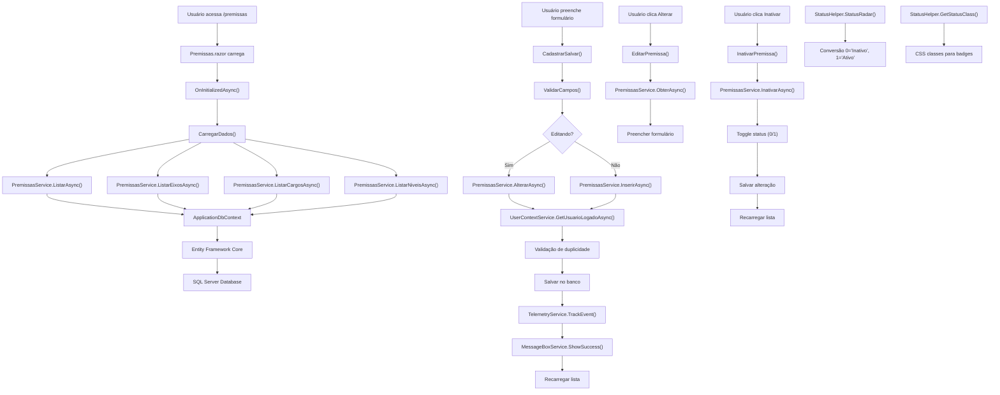

# Migração do Módulo de Premissas - Web Forms para Blazor Híbrido

## Visão Geral

Este documento descreve a migração completa do módulo de Premissas do Radar de Competências, originalmente implementado em Web Forms ASP.NET, para uma arquitetura moderna utilizando Blazor Híbrido (.NET 9), Entity Framework Core e padrões de injeção de dependência.

## Arquitetura da Solução

### Componentes Principais

1. **Modelo de Dados**: `PremissasRadar` - Representa as premissas do radar no banco de dados
2. **Serviço de Negócio**: `PremissasService` - Centraliza toda a lógica CRUD e validações
3. **Interface de Serviço**: `IPremissasService` - Define o contrato para operações de premissas
4. **Helper Utilitário**: `StatusHelper` - Fornece métodos reutilizáveis para manipulação de status
5. **Componente UI**: `Premissas.razor` - Interface de usuário em Blazor com renderização híbrida

### Estrutura de Pastas

```text
Peers.Moderno/
├── Models/
│   └── PremissasRadar.cs
├── Services/
│   └── Premissas/
│       ├── PremissasService.cs
│       └── Common/
│           ├── IPremissasService.cs
│           └── StatusHelper.cs
├── Components/
│   └── Premissas/
│       └── Premissas.razor
└── docs/
    └── premissas-migracao.md
```

## Funcionalidades Implementadas

### 1. Operações CRUD
- **Listar**: Exibição de todas as premissas com relacionamentos (Eixo, Cargo, Nível)
- **Inserir**: Cadastro de novas premissas com validação de duplicidade
- **Alterar**: Edição de premissas existentes
- **Inativar/Ativar**: Toggle do status das premissas

### 2. Combos Auxiliares
- **Eixos**: Lista de eixos ativos ordenados por nome
- **Cargos**: Lista de cargos ativos ordenados por nome
- **Níveis**: Lista de níveis de cargo ativos ordenados por nível

### 3. Validações
- Campos obrigatórios (Eixo, Cargo, Nível, Valores)
- Validação de duplicidade (combinação Eixo + Cargo + Nível)
- Validação de valores numéricos positivos

### 4. Interface de Usuário
- Formulário reativo com binding bidirecional
- Tabela responsiva com filtros
- Indicadores visuais de status
- Feedback visual para operações (loading, mensagens)

## Integração com Serviços Existentes

### Dependências Injetadas

csharp
// No PremissasService
- ApplicationDbContext: Acesso ao banco de dados via EF Core
- ITelemetryService: Logging e telemetria
- IUserContextService: Contexto do usuário logado

// No Componente Blazor
- IPremissasService: Operações de negócio
- IMessageBoxService: Exibição de mensagens
- IJSRuntime: Interoperabilidade com JavaScript


### Configurações

As configurações específicas do módulo estão centralizadas no `appsettings.json` na seção `Premissas`:

```json
{
  "Premissas": {
    "MaxValorRadar": 100,
    "MinValorRadar": 1,
    "EnableValidation": true,
    "ValidationMessages": {
      "EixoObrigatorio": "Selecione o Eixo",
      "CargoObrigatorio": "Selecione o Cargo"
    }
  }
}
```

## Fluxo de Dados



## Benefícios da Migração

### 1. Performance
- **Renderização Híbrida**: Combina Server-Side Rendering (SSR) com interatividade client-side
- **Carregamento Assíncrono**: Operações não bloqueantes com feedback visual
- **Entity Framework Core**: Consultas otimizadas com Include para relacionamentos

### 2. Manutenibilidade
- **Separação de Responsabilidades**: UI, lógica de negócio e acesso a dados separados
- **Injeção de Dependência**: Facilita testes e substituição de implementações
- **Código Reutilizável**: Helpers e serviços podem ser utilizados em outros módulos

### 3. Experiência do Usuário
- **Interface Reativa**: Binding automático entre UI e dados
- **Feedback Visual**: Indicadores de loading e mensagens contextuais
- **Responsividade**: Layout adaptável para diferentes dispositivos

### 4. Observabilidade
- **Telemetria Integrada**: Tracking de eventos e exceções via Application Insights
- **Logging Estruturado**: Logs categorizados por componente e operação
- **Métricas de Performance**: Monitoramento de operações críticas

## Padrões de Reutilização

### StatusHelper
O `StatusHelper` foi projetado para ser reutilizado em outros módulos que trabalham com status ativo/inativo:
```text
csharp
// Uso em outros componentes
var statusText = StatusHelper.StatusRadar(premissa.ATV);
var statusClass = StatusHelper.GetStatusClass(premissa.ATV);
var isActive = StatusHelper.IsAtivo(premissa.ATV);
```

### Serviços Base
O padrão de implementação do `PremissasService` pode ser replicado para outros módulos:
- Injeção de dependências padrão (DbContext, TelemetryService, UserContextService)
- Tratamento de exceções consistente
- Logging de operações
- Validações de negócio

## Considerações de Segurança

1. **Contexto do Usuário**: Todas as operações utilizam o usuário logado via `UserContextService`
2. **Validação Server-Side**: Validações críticas são executadas no servidor
3. **Sanitização de Dados**: Entity Framework Core previne SQL Injection automaticamente
4. **Auditoria**: Todas as operações são logadas com identificação do usuário

## Próximos Passos

1. **Testes de Integração**: Implementar testes automatizados para o serviço
2. **Cache**: Implementar cache para combos auxiliares (Eixos, Cargos, Níveis)
3. **Exportação**: Adicionar funcionalidade de exportação para Excel
4. **Importação**: Implementar importação em lote via arquivo Excel
5. **Histórico**: Adicionar auditoria de alterações nas premissas

## Migração de Outros Módulos

Este módulo serve como template para migração de outras páginas Web Forms:
1. Seguir a mesma estrutura de pastas (Services/[Modulo]/Common/)
2. Reutilizar serviços comuns (MessageBoxService, TelemetryService, UserContextService)
3. Aplicar os mesmos padrões de validação e tratamento de erros
4. Utilizar helpers reutilizáveis quando aplicável
5. Manter configurações centralizadas no appsettings.json
