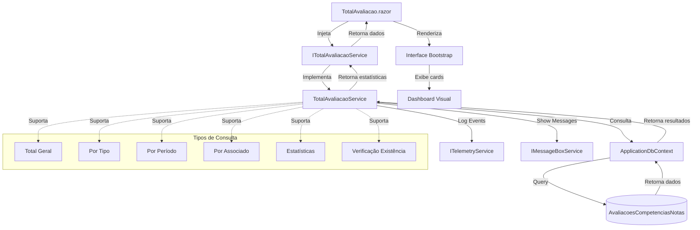

# TotalAvaliacao - Documentação de Integração

Este documento descreve a arquitetura e integração do serviço de totalização de avaliações migrado de Web Forms para Blazor híbrido .NET 9.

## Visão Geral

A página `TotalAvaliacao.aspx` foi completamente migrada para um componente Blazor moderno (`TotalAvaliacao.razor`) com renderização híbrida, seguindo o padrão de arquitetura do sistema com serviços reutilizáveis centralizados em `Services/Common/Avaliacoes`.

## Arquitetura

### Componentes Principais

1. **ITotalAvaliacaoService** - Interface que define os contratos para operações de totalização
2. **TotalAvaliacaoService** - Implementação concreta com acesso ao banco de dados
3. **TotalAvaliacao.razor** - Componente Blazor com renderização híbrida
4. **ApplicationDbContext** - Contexto do Entity Framework para acesso aos dados

### Funcionalidades Implementadas

- **Totalização Geral**: Conta total de avaliações no sistema
- **Totalização por Tipo**: Separa por auto-avaliação, gestor e às cegas
- **Totalização por Período**: Filtra avaliações por intervalo de datas
- **Totalização por Associado**: Conta avaliações de um associado específico
- **Estatísticas Completas**: Dashboard com todos os tipos de avaliação
- **Verificação de Existência**: Valida se existem avaliações no sistema

## Funcionamento

### Fluxo de Dados

1. O componente Blazor `TotalAvaliacao.razor` injeta o serviço `ITotalAvaliacaoService`
2. Ao inicializar (`OnInitializedAsync`), o componente chama `ObterEstatisticasAvaliacoesAsync()`
3. O serviço utiliza o `ApplicationDbContext` para consultar a tabela `AvaliacoesCompetenciasNotas`
4. Eventos de telemetria são registrados via `ITelemetryService` para rastreamento
5. Os dados são retornados e exibidos na interface com cards Bootstrap
6. Tratamento de erros é implementado com retry automático

### Interface do Usuário

- **Design Responsivo**: Utiliza Bootstrap 5 com cards coloridos
- **Estados de Carregamento**: Spinner durante consultas assíncronas
- **Tratamento de Erros**: Mensagens de erro com botão de retry
- **Atualização Manual**: Botão para refresh dos dados
- **Indicadores Visuais**: Ícones FontAwesome para cada tipo de avaliação

## Integração com o Sistema

### Injeção de Dependência
```text
csharp
// Program.cs
builder.Services.AddScoped<ITotalAvaliacaoService, TotalAvaliacaoService>();
```

### Uso em Componentes
```text
razor
@inject Peers.Moderno.Services.Common.Avaliacoes.ITotalAvaliacaoService TotalAvaliacaoService
```

### Configuração de Rota
```text
razor
@page "/total-avaliacao"
@rendermode InteractiveAuto
```

## Reutilização

O serviço `ITotalAvaliacaoService` foi projetado para máxima reutilização:

- **Dashboards**: Pode ser usado em painéis de controle
- **Relatórios**: Integração com sistemas de relatório
- **APIs**: Exposição de dados via Web APIs
- **Outros Componentes**: Qualquer componente que precise de estatísticas de avaliação

## Telemetria e Monitoramento

Todos os métodos do serviço registram eventos de telemetria:

- **Consultas Realizadas**: Tracking de cada tipo de consulta
- **Performance**: Monitoramento de tempo de resposta
- **Erros**: Captura e logging de exceções
- **Uso**: Estatísticas de utilização do componente

## Fluxo de Alto Nível



## Benefícios da Migração

### Técnicos
- **Performance**: Renderização híbrida Server/WebAssembly
- **Manutenibilidade**: Separação clara de responsabilidades
- **Testabilidade**: Serviços injetáveis e interfaces bem definidas
- **Escalabilidade**: Arquitetura preparada para crescimento

### Funcionais
- **UX Moderna**: Interface responsiva e intuitiva
- **Feedback Visual**: Estados de carregamento e erro
- **Acessibilidade**: Componentes semânticos e ARIA labels
- **Responsividade**: Funciona em desktop, tablet e mobile

## Próximos Passos

Para futuras expansões do módulo de avaliações:

1. **Filtros Avançados**: Implementar filtros por data, usuário, projeto
2. **Gráficos**: Adicionar visualizações com Chart.js
3. **Exportação**: Funcionalidade de export para Excel/PDF
4. **Cache**: Implementar cache Redis para consultas frequentes
5. **Real-time**: SignalR para atualizações em tempo real

## Padrões Seguidos

- ✅ Serviços em `Services/Common/` para reutilização
- ✅ Interfaces bem definidas para testabilidade
- ✅ Injeção de dependência configurada no `Program.cs`
- ✅ Telemetria integrada para monitoramento
- ✅ Tratamento de exceções padronizado
- ✅ Documentação completa com fluxo Mermaid
- ✅ Componente Blazor com renderização híbrida
- ✅ Interface moderna com Bootstrap 5
