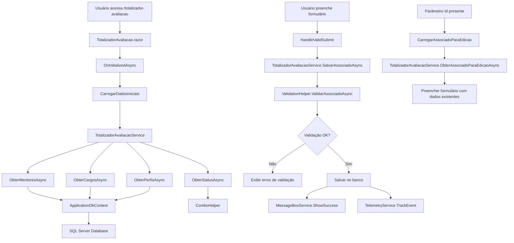

# Totalizador de Avaliação - Migração Web Forms para Blazor

## Visão Geral

Este documento descreve a migração da página `TotalizadorAvaliacao.aspx` de Web Forms para um componente Blazor moderno em .NET 9, utilizando renderização híbrida para máxima performance e experiência de usuário.

## Arquitetura da Solução

### Componentes Principais

1. **TotalizadorAvaliacao.razor**: Componente Blazor principal com renderização híbrida
2. **TotalizadorAvaliacao.razor.cs**: Code-behind com lógica de apresentação
3. **ITotalizadorAvaliacaoService**: Interface do serviço de negócio
4. **TotalizadorAvaliacaoService**: Implementação do serviço de negócio
5. **ValidationHelper**: Helper para validações reutilizáveis
6. **AssociadoFormModel**: Modelo específico para o formulário

### Padrões Arquiteturais Utilizados

- **Dependency Injection**: Todos os serviços são injetados via DI
- **Repository Pattern**: Acesso a dados via Entity Framework Core
- **Service Layer**: Lógica de negócio centralizada em serviços
- **Model-View-ViewModel**: Separação clara entre apresentação e lógica
- **Validation Pattern**: Validações centralizadas e reutilizáveis

## Estrutura de Pastas

```text
Components/
  Pages/
    TotalizadorAvaliacao.razor
    TotalizadorAvaliacao.razor.cs
Services/
  Common/
    ValidationHelper.cs
    ComboHelper.cs
    MessageBoxService.cs
  Associados/
    Common/
      ITotalizadorAvaliacaoService.cs
      TotalizadorAvaliacaoService.cs
Models/
  Associado.cs
  AssociadoFormModel.cs
docs/
  TotalizadorAvaliacao.md
```

## Funcionalidades Implementadas

### 1. Cadastro de Associados
- Formulário completo com todos os campos necessários
- Validação em tempo real
- Feedback visual para o usuário
- Integração com banco de dados via Entity Framework

### 2. Edição de Associados
- Carregamento de dados existentes via parâmetro de query
- Atualização de registros existentes
- Preservação de dados não alterados

### 3. Validações
- Campos obrigatórios
- Validação de formato de e-mail
- Verificação de e-mail duplicado
- Validação de senha (mínimo 6 caracteres)
- Validação de seleções em dropdowns

### 4. Interface de Usuário
- Design responsivo com Bootstrap
- Combos dinâmicos carregados do banco
- Estados de loading e processamento
- Mensagens de erro e sucesso
- Breadcrumbs para navegação

## Integração de Serviços

### TotalizadorAvaliacaoService

Serviço principal que centraliza toda a lógica de negócio:

- **ObterMentoresAsync()**: Carrega lista de mentores ativos
- **ObterCargosAsync()**: Carrega lista de cargos ativos
- **ObterPerfisAsync()**: Carrega lista de perfis ativos
- **ObterStatusAsync()**: Retorna opções de status (Ativo/Inativo)
- **SalvarAssociadoAsync()**: Salva ou atualiza associado
- **ValidarAssociadoAsync()**: Executa validações de negócio
- **ExisteEmailAsync()**: Verifica duplicidade de e-mail

### ValidationHelper

Helper centralizado para validações reutilizáveis:

- **ValidateRequired()**: Validação de campos obrigatórios
- **ValidateEmail()**: Validação de formato de e-mail
- **ValidatePassword()**: Validação de senha
- **ValidateDropdownSelection()**: Validação de seleções
- **ValidateAssociadoForm()**: Validação completa do formulário

### ComboHelper

Helper para criação de combos padronizados:

- **CreateComboFromList()**: Cria combo a partir de lista genérica
- **GetStatusItems()**: Retorna opções de status padrão
- **GetDefaultSelectionItem()**: Item padrão "[Selecionar]"

## Fluxo de Alto Nível



## Benefícios da Migração

### Performance
- **Renderização Híbrida**: Combina Server-Side Rendering com interatividade client-side
- **Lazy Loading**: Componentes carregados sob demanda
- **Caching**: Dados de combos podem ser cacheados
- **Minimal APIs**: Redução de overhead de comunicação

### Manutenibilidade
- **Separação de Responsabilidades**: UI, lógica de negócio e acesso a dados separados
- **Testabilidade**: Serviços podem ser testados independentemente
- **Reutilização**: Helpers e serviços podem ser usados em outras páginas
- **Type Safety**: Tipagem forte em toda a aplicação

### Experiência do Usuário
- **Responsividade**: Interface adaptável a diferentes dispositivos
- **Feedback Visual**: Estados de loading e processamento
- **Validação em Tempo Real**: Erros mostrados imediatamente
- **Navegação Fluida**: SPA-like experience

### Desenvolvimento
- **IntelliSense**: Suporte completo do IDE
- **Debugging**: Ferramentas avançadas de debug
- **Hot Reload**: Alterações refletidas instantaneamente
- **Componentização**: Código organizado em componentes reutilizáveis

## Configuração e Deploy

### Pré-requisitos
- .NET 9 SDK
- SQL Server (LocalDB ou instância completa)
- Visual Studio 2022 ou VS Code

### Configuração do Banco
```json
{
  "ConnectionStrings": {
    "DefaultConnection": "Server=(localdb)\\mssqllocaldb;Database=SistemaAvaliacao;Trusted_Connection=true;MultipleActiveResultSets=true"
  }
}

```
### Registro de Serviços (Program.cs)

```text
csharp
builder.Services.AddScoped<ITotalizadorAvaliacaoService, TotalizadorAvaliacaoService>();
builder.Services.AddScoped<IMessageBoxService, MessageBoxService>();
builder.Services.AddScoped<ITelemetryService, TelemetryService>();
```

## Monitoramento e Telemetria

A aplicação inclui telemetria completa via Application Insights:

- **Eventos de Negócio**: Cadastro, edição, validações
- **Exceções**: Tratamento e logging de erros
- **Performance**: Métricas de tempo de resposta
- **Uso**: Padrões de utilização da aplicação

## Próximos Passos

1. **Testes Automatizados**: Implementar testes unitários e de integração
2. **Otimizações**: Implementar caching e otimizações de performance
3. **Acessibilidade**: Melhorar suporte a leitores de tela
4. **PWA**: Transformar em Progressive Web App
5. **Offline Support**: Suporte a operações offline

## Conclusão

A migração para Blazor representa um avanço significativo em termos de performance, manutenibilidade e experiência do usuário. A arquitetura modular e os padrões implementados facilitam futuras evoluções e manutenções do sistema.
