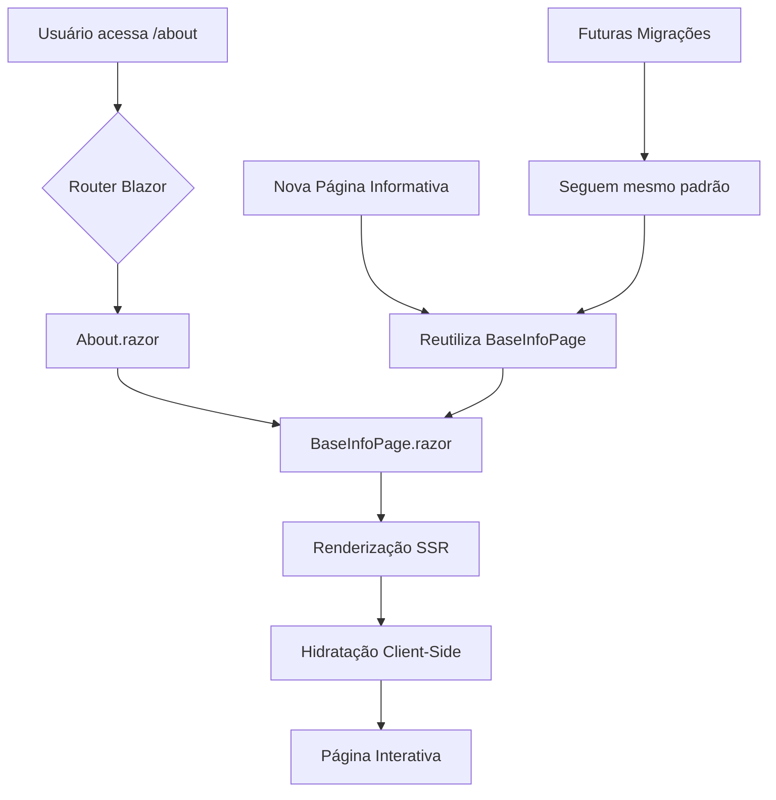

# Migração da Página About: Web Forms para Blazor Híbrido

## Visão Geral

Este documento descreve a migração da página `About.aspx` do Web Forms para um componente Blazor reutilizável no .NET 9, implementando um padrão de arquitetura que facilita futuras migrações de páginas informativas.

## Arquitetura dos Componentes

### BaseInfoPage.razor

Componente base reutilizável para páginas informativas que aceita os seguintes parâmetros:

- **Title**: Título principal da página
- **Subtitle**: Subtítulo opcional da página
- **Content**: Fragmento de conteúdo renderizável (RenderFragment)

### About.razor

Componente específico da página About que:
- Utiliza a rota `/about`
- Implementa renderização híbrida com `@rendermode InteractiveAuto`
- Herda funcionalidades do `BaseInfoPage`
- Mantém o conteúdo original da página Web Forms

## Como Reutilizar o Componente Base

Para criar novas páginas informativas:

1. Crie um novo arquivo `.razor` na pasta `Components/Pages/`
2. Defina a rota com `@page "/sua-rota"`
3. Adicione `@rendermode InteractiveAuto` para performance híbrida
4. Use o componente `BaseInfoPage` passando os parâmetros necessários

### Exemplo:

razor
@page "/help"
@rendermode InteractiveAuto

<BaseInfoPage Title="Ajuda" Subtitle="Central de ajuda do sistema">
    <Content>
        
Conteúdo da página de ajuda...

    </Content>
</BaseInfoPage>

## Integração com o Sistema

### Roteamento

O roteamento é gerenciado pelo componente `App.razor` que utiliza o Router do Blazor para mapear URLs para componentes.

### Renderização Híbrida

O modo `InteractiveAuto` permite:
- Renderização inicial no servidor (SSR) para performance
- Hidratação no cliente para interatividade
- Fallback automático entre modos conforme necessário

## Fluxo de Alto Nível

## Benefícios da Arquitetura

1. **Reutilização**: Componente base elimina duplicação de código
2. **Consistência**: Padrão uniforme para páginas informativas
3. **Manutenibilidade**: Mudanças centralizadas no componente base
4. **Performance**: Renderização híbrida otimizada
5. **Escalabilidade**: Fácil adição de novas páginas seguindo o padrão

## Próximos Passos

- Migrar outras páginas estáticas seguindo este padrão
- Considerar adicionar parâmetros adicionais ao BaseInfoPage conforme necessário
- Implementar temas ou estilos customizáveis no componente base
- Adicionar suporte a breadcrumbs ou navegação contextual
