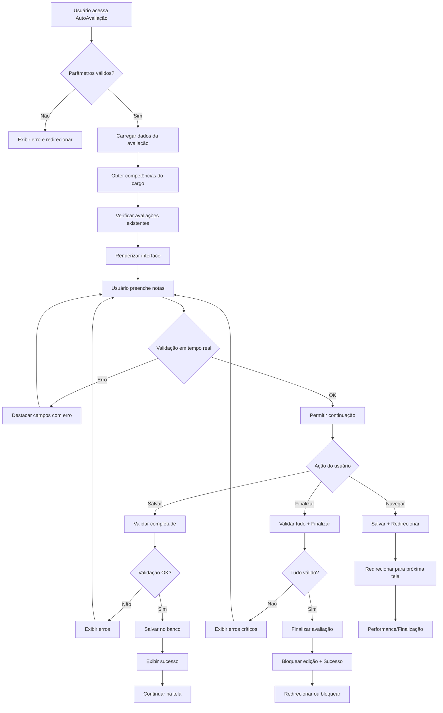

# AutoAvaliação de Competências - Documentação Técnica

## Visão Geral

O módulo de AutoAvaliação de Competências é responsável por permitir que os associados avaliem suas próprias competências dentro de projetos específicos. Este sistema foi migrado de Web Forms para Blazor Server com renderização híbrida, mantendo toda a funcionalidade original enquanto oferece uma experiência moderna e performática.

## Arquitetura

### Estrutura de Pastas

```text
Services/AutoAvaliacao/
├── AutoAvaliacaoService.cs          # Serviço principal de negócio
├── AutoAvaliacaoValidator.cs        # Validações específicas
└── Common/
    ├── IAutoAvaliacaoService.cs     # Interface do serviço principal
    ├── IAutoAvaliacaoValidator.cs   # Interface de validação
    └── AutoAvaliacaoDto.cs          # DTO para transporte de dados

Components/Pages/
├── AutoAvaliacaoCompetencia.razor    # Componente principal da página
└── AutoAvaliacaoCompetencia.razor.cs # Code-behind do componente
```

### Serviços Principais

#### IAutoAvaliacaoService
Interface que define os contratos para operações de autoavaliação:
- `CarregarDadosAvaliacaoAsync()` - Carrega dados iniciais da avaliação
- `ValidarParametrosAsync()` - Valida parâmetros de entrada (projeto, associado, período)
- `ObterCompetenciasAsync()` - Obtém lista de competências para avaliação
- `SalvarAvaliacaoAsync()` - Salva progresso da avaliação
- `FinalizarAvaliacaoAsync()` - Finaliza e bloqueia a avaliação

#### AutoAvaliacaoService
Implementação concreta que:
- Integra com `CompetenciasService` para obter competências
- Utiliza `AvaliacoesService` para persistir dados
- Aplica regras de negócio específicas
- Gerencia fluxo de estados da avaliação

#### IAutoAvaliacaoValidator
Interface para validações:
- `ValidarRespostasAsync()` - Valida consistência das respostas
- `ValidarCompletude()` - Verifica se todas as competências foram avaliadas
- `ValidarRegrasNegocio()` - Aplica regras específicas (ex: nível 2 não pode ser maior que nível 1)

#### AutoAvaliacaoValidator
Implementação das validações com regras como:
- Notas obrigatórias para cada nível
- Consistência entre níveis (nível 2 ≤ nível 1)
- Regra "Não se aplica" (se nível 1 = N/A, então nível 2 = N/A)
- Validação por pilares (cada pilar deve ter ao menos 1 nota mensurável)

### DTO (Data Transfer Object)

#### AutoAvaliacaoDto
Objeto para transporte de dados entre UI e serviços:
```text
csharp
public class AutoAvaliacaoDto
{
    public int IdProjeto { get; set; }
    public int IdAssociado { get; set; }
    public int IdPeriodo { get; set; }
    public string TipoAvaliacao { get; set; }
    public string Escopo { get; set; }
    public List<CompetenciaAvaliacaoDto> Competencias { get; set; }
    public DadosAvaliacaoDto DadosAvaliacao { get; set; }
    public bool PodeEditar { get; set; }
    public bool PodeNavegar { get; set; }
}
```

## Componente Blazor

### AutoAvaliacaoCompetencia.razor
Componente principal que:
- Utiliza `@rendermode InteractiveAuto` para renderização híbrida
- Implementa binding bidirecional com o DTO
- Integra com `MessageBoxService` para feedback ao usuário
- Utiliza `TelemetryService` para monitoramento
- Aplica validações em tempo real

### Funcionalidades Principais
1. **Carregamento de Dados**: Obtém competências, notas e configurações
2. **Validação em Tempo Real**: Valida respostas conforme usuário preenche
3. **Auto-save**: Salva automaticamente a cada 15 minutos (configurável)
4. **Navegação**: Permite navegar entre Competência ↔ Performance ↔ Finalização
5. **Accordions**: Exibe detalhes expandíveis das competências
6. **Responsividade**: Interface adaptável a diferentes dispositivos

## Integração com Serviços Existentes

### Serviços Reutilizados
- **MessageBoxService**: Exibição de mensagens de sucesso/erro
- **TelemetryService**: Monitoramento e métricas
- **ComboHelper**: Geração de opções para selects
- **UserContextService**: Contexto do usuário logado
- **CompetenciasService**: Operações com competências
- **AvaliacoesService**: Persistência de avaliações

### Fluxo de Dados
1. **Entrada**: Parâmetros via QueryString (IdProjeto, IdAssociado, IdPeriodo)
2. **Validação**: Verificação de parâmetros obrigatórios
3. **Carregamento**: Busca de dados via serviços de negócio
4. **Renderização**: Exibição da interface com dados carregados
5. **Interação**: Usuário preenche avaliações
6. **Validação**: Validação em tempo real das respostas
7. **Persistência**: Salvamento automático ou manual
8. **Navegação**: Redirecionamento para próxima etapa

## Configuração

### appsettings.json
Todas as configurações estão centralizadas na seção `AutoAvaliacao`:

```json
{
  "AutoAvaliacao": {
    "AutoSaveIntervalMinutes": 15,
    "MaxCompetenciaLength": 70,
    "ShowVerMaisTexto": true,
    "ValidationMessages": {
      "NotasObrigatorias": "É obrigatório selecionar uma nota para cada nível.",
      "NotasInconsistentes": "A nota do nível 2 não pode ser maior que a nota do nível 1."
    },
    "Features": {
      "EnableAutoSave": true,
      "EnableRealTimeValidation": true
    }
  }
}
```

## Registro de Dependências

### Program.cs
```text
csharp
// AutoAvaliacao Services
builder.Services.AddScoped<IAutoAvaliacaoService, AutoAvaliacaoService>();
builder.Services.AddScoped<IAutoAvaliacaoValidator, AutoAvaliacaoValidator>();
```

## Fluxo de Alto Nível



## Estados da Avaliação

| Estado | Descrição | Ações Permitidas |
|--------|-----------|------------------|
| Não Iniciada | Avaliação ainda não foi iniciada | Iniciar, Visualizar |
| Em Andamento | Avaliação em progresso | Salvar, Finalizar, Navegar |
| Finalizada | Avaliação concluída pelo usuário | Apenas Visualizar |
| Bloqueada | Avaliação em etapa posterior | Apenas Visualizar |

## Validações Implementadas

### Validações de Entrada
- Projeto obrigatório e válido
- Associado obrigatório e válido
- Período obrigatório e válido
- Tipo de avaliação obrigatório
- Escopo obrigatório

### Validações de Negócio
- Todas as competências devem ser avaliadas
- Nota do nível 2 não pode ser maior que nível 1
- Se nível 1 = "Não se aplica", nível 2 deve ser "Não se aplica"
- Cada pilar deve ter ao menos 1 nota mensurável
- Usuário deve ter permissão para avaliar

### Validações de Fluxo
- Avaliação deve estar na etapa correta
- Prazos devem ser respeitados
- Status da avaliação deve permitir edição

## Tratamento de Erros

### Estratégias
1. **Validação Preventiva**: Validação em tempo real durante preenchimento
2. **Feedback Imediato**: Destaque visual de campos com erro
3. **Mensagens Contextuais**: Mensagens específicas para cada tipo de erro
4. **Recuperação Graceful**: Sistema permite correção e continuação
5. **Logging**: Todos os erros são registrados via TelemetryService

### Tipos de Erro
- **Erro de Validação**: Campo obrigatório, formato inválido
- **Erro de Negócio**: Regra de negócio violada
- **Erro de Sistema**: Falha na comunicação, banco indisponível
- **Erro de Permissão**: Usuário sem acesso à funcionalidade

## Performance e Otimizações

### Renderização Híbrida
- Primeira renderização no servidor (SSR)
- Interatividade no cliente (WebAssembly)
- Melhor experiência de carregamento

### Cache e Otimizações
- Cache de competências por cargo
- Lazy loading de dados não críticos
- Debounce em validações em tempo real
- Compressão de dados transferidos

### Monitoramento
- Métricas de performance via Application Insights
- Tracking de eventos de usuário
- Monitoramento de erros e exceções
- Análise de uso e padrões

## Extensibilidade

### Pontos de Extensão
1. **Novos Tipos de Avaliação**: Interface permite adicionar novos tipos
2. **Validações Customizadas**: Sistema de validação extensível
3. **Integrações**: Preparado para integração com IA e outros sistemas
4. **Relatórios**: Dados estruturados permitem novos relatórios

### Futuras Melhorias
- Integração com IA para sugestões automáticas
- Análise preditiva de competências
- Gamificação do processo de avaliação
- Integração com sistemas externos (RH, ERP)

## Considerações de Segurança

### Autenticação e Autorização
- Validação de sessão do usuário
- Verificação de permissões por perfil
- Controle de acesso por projeto/período

### Proteção de Dados
- Validação de entrada contra injection
- Sanitização de dados de saída
- Audit trail de alterações
- Backup automático de dados críticos

## Troubleshooting

### Problemas Comuns

#### "Projeto não encontrado"
- Verificar se projeto existe e está ativo
- Validar permissões do usuário no projeto
- Conferir parâmetros da URL

#### "Competências não carregam"
- Verificar se cargo possui competências parametrizadas
- Validar configuração de tipo de avaliação e escopo
- Conferir logs do CompetenciasService

#### "Erro ao salvar"
- Verificar conectividade com banco de dados
- Validar se avaliação está na etapa correta
- Conferir se usuário tem permissão de edição

### Logs Importantes
- `AutoAvaliacaoService.CarregarDados`: Carregamento inicial
- `AutoAvaliacaoValidator.ValidarRespostas`: Validações
- `AutoAvaliacaoService.SalvarAvaliacao`: Persistência
- `TelemetryService.TrackException`: Erros e exceções

## Conclusão

O módulo de AutoAvaliação de Competências representa uma migração bem-sucedida de Web Forms para Blazor, mantendo toda a funcionalidade original enquanto oferece:

- **Melhor Performance**: Renderização híbrida e otimizações
- **Experiência Moderna**: Interface responsiva e interativa
- **Manutenibilidade**: Código limpo, testável e bem estruturado
- **Extensibilidade**: Arquitetura preparada para futuras evoluções
- **Monitoramento**: Telemetria completa e observabilidade

A arquitetura baseada em serviços e DTOs facilita a manutenção, testes e futuras integrações, enquanto a reutilização de componentes comuns garante consistência em todo o sistema.
