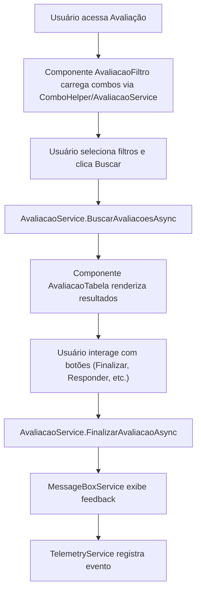

# Migração da Página de Avaliação (Web Forms para Blazor Híbrido .NET 9)

## Visão Geral

Esta documentação detalha a arquitetura, funcionamento e integração dos serviços e componentes envolvidos na migração da página de avaliação do sistema interno da empresa, convertendo de ASP.NET Web Forms para Blazor Híbrido (.NET 9). O objetivo é garantir modularidade, reutilização, testabilidade e facilidade de manutenção, centralizando lógica de negócio e utilitários em serviços injetáveis e compondo a interface via componentes Blazor.

## Estrutura de Pastas e Serviços

- **Services/Avaliacoes/AvaliacaoService.cs**: Serviço principal de negócio para avaliação. Responsável por carregar combos, buscar avaliações, finalizar avaliações e orquestrar integrações com outros serviços e helpers.
- **Services/Avaliacoes/Common/AvaliacaoUtils.cs**: Utilitário com lógica auxiliar para etapas, visibilidade de botões, montagem de rótulos e outras regras de negócio reutilizáveis entre componentes e serviços.
- **Services/Common/ComboHelper.cs**: Centraliza montagem de combos reutilizáveis (projetos, clientes, períodos, status, etc.).
- **Services/Common/MessageBoxService.cs**: Serviço para exibição padronizada de mensagens de feedback ao usuário.
- **Services/Common/TelemetryService.cs**: Serviço para rastreamento de eventos e telemetria do sistema.
- **Services/Common/UserContextService.cs**: Serviço para obtenção e validação do usuário logado e permissões.

## Componentes Blazor

- **Components/Avaliacoes/AvaliacaoFiltro.razor**: Componente de filtros (projeto, cliente, período, status, botão de busca), utiliza ComboHelper e AvaliacaoService.
- **Components/Avaliacoes/AvaliacaoTabela.razor**: Componente de tabela de avaliações, renderiza sub-tabelas (desempenho, liderança) e botões de ação.
- **Components/Avaliacoes/AvaliacaoPage.razor**: Página principal, orquestra os componentes de filtro e tabela, injeta serviços e controla o ciclo de vida da página.

## Integração dos Serviços

- Todos os serviços são registrados no DI container em `Program.cs`.
- Os componentes Blazor injetam os serviços necessários via [@inject] ou [Inject] e utilizam métodos assíncronos para buscar dados e executar ações.
- Mensagens de feedback são exibidas via MessageBoxService.
- Eventos importantes (ex: finalização, busca) são rastreados via TelemetryService.
- O contexto do usuário é obtido e validado via UserContextService.
- Combos são carregados de forma centralizada via ComboHelper.
- Lógicas auxiliares de avaliação são extraídas para AvaliacaoUtils.

## Fluxo de Alto Nível



## Exemplo de Uso dos Serviços em Componentes

```text
razor
@inject Services.Avaliacoes.IAvaliacaoService AvaliacaoService
@inject Services.Common.IMessageBoxService MessageBoxService
@inject Services.Common.ITelemetryService TelemetryService
@inject Services.Common.IUserContextService UserContextService

<!-- Exemplo de chamada de busca -->
@code {
    private async Task BuscarAvaliacoesAsync()
    {
        var usuario = await UserContextService.GetUsuarioLogadoAsync();
        var avaliacoes = await AvaliacaoService.BuscarAvaliacoesAsync(filtros, usuario);
        // ...
    }
}
```

## Benefícios da Nova Arquitetura

- **Reutilização:** Lógica de combos, mensagens, telemetria e contexto de usuário centralizada e reutilizável.
- **Testabilidade:** Serviços desacoplados e injetáveis facilitam testes unitários e de integração.
- **Manutenção:** Separação clara entre UI e lógica de negócio, facilitando evolução e correção de bugs.
- **Performance:** Serviços otimizados e componentes reativos garantem melhor experiência ao usuário.
- **Preparação para IA/Cloud:** Arquitetura preparada para futuras integrações com IA e recursos cloud-native.
