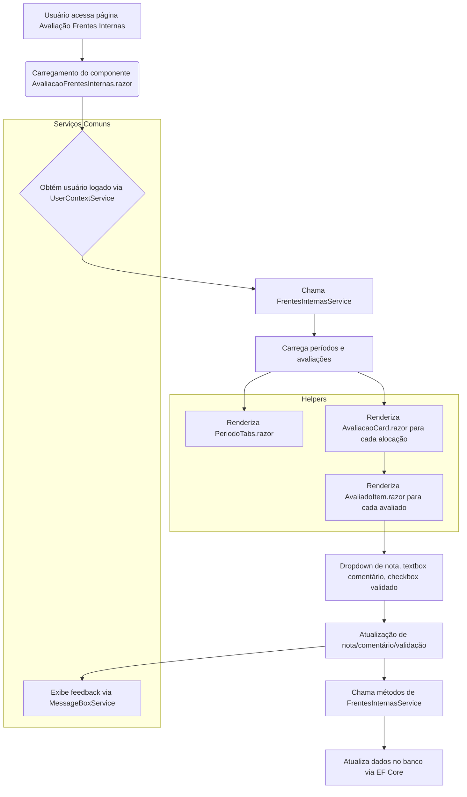

# Documentação: Avaliação de Frentes Internas (Migração Web Forms → Blazor)

## Visão Geral

Este documento descreve a arquitetura, integração e fluxo do novo módulo de Avaliação de Frentes Internas, migrado de Web Forms para Blazor Híbrido (.NET 9). O objetivo é garantir separação de responsabilidades, reutilização de serviços e fácil manutenção/expansão.

## Estrutura de Componentes e Serviços

- **Serviços de Negócio**: Toda a lógica de carregamento de períodos, avaliações, validações e atualizações foi extraída para `Services/FrentesInternas/FrentesInternasService.cs`, exposta via interface `IFrentesInternasService` em `Services/FrentesInternas/Common/IFrentesInternasService.cs`.
- **Modelos de Dados**: Os modelos utilizados na tela (ex: PDIPillsModel, FrentePill, AlocacaoInternaPill, AvaliacaoAlocacaoPill) estão em `Services/FrentesInternas/Common/Models/`.
- **Helpers**: Funções utilitárias para manipulação de listas, status e validações específicas da tela estão em `Services/FrentesInternas/Common/Helpers/FrentesInternasHelper.cs`.
- **Componentes Blazor**:
  - `AvaliacaoFrentesInternas.razor`: componente principal da página.
  - `PeriodoTabs.razor`: renderiza as abas de períodos.
  - `AvaliacaoCard.razor`: renderiza cards de alocação interna.
  - `AvaliadoItem.razor`: exibe cada avaliado, nota, comentário e validação.
- **Serviços Comuns Reutilizados**:
  - `UserContextService`: contexto do usuário logado.
  - `MessageBoxService`: exibição de mensagens.
  - `TelemetryService`: rastreamento de eventos.
  - `ComboHelper`: combos de dropdowns de notas/status.
  - `FormatHelper`: formatação de valores.
  - `VisibilityHelper`: lógica de visibilidade de UI.

## Integração e Injeção de Dependências

Todos os serviços e helpers necessários estão registrados no DI container em `Program.cs`. Os componentes Blazor consomem os serviços via [Inject], garantindo desacoplamento e testabilidade.

## Configuração

As configurações específicas de Frentes Internas estão centralizadas na seção `FrentesInternas` do `appsettings.json`, incluindo limites, permissões, caminhos de exportação/importação e parâmetros de negócio.

## Fluxo de Funcionamento (Mermaid)



## Boas Práticas e Reutilização

- Todos os métodos de negócio são públicos, assíncronos e expostos via interface.
- Modelos e helpers estão desacoplados e prontos para uso em outros fluxos.
- Serviços comuns são sempre reutilizados para combos, mensagens, formatação, visibilidade e rastreamento.
- Configurações centralizadas para fácil manutenção.

## Exemplos de Uso

```text
csharp
@inject IFrentesInternasService FrentesInternasService
@inject IMessageBoxService MessageBoxService

// Carregar períodos e avaliações
var periodos = await FrentesInternasService.CarregarPeriodosAsync();
var avaliacoes = await FrentesInternasService.CarregarAvaliacoesAsync();

// Atualizar nota
await FrentesInternasService.AtualizarNotaAsync(idAvaliacao, novaNota);
MessageBoxService.ShowSuccess("Nota atualizada com sucesso!");
```

## Observações

- Para exportação de dados, utilize sempre o serviço `ExportFileService` já registrado.
- Para combos de dropdown, utilize métodos de `ComboHelper`.
- Para validação de permissões e visibilidade, utilize `VisibilityHelper`.
