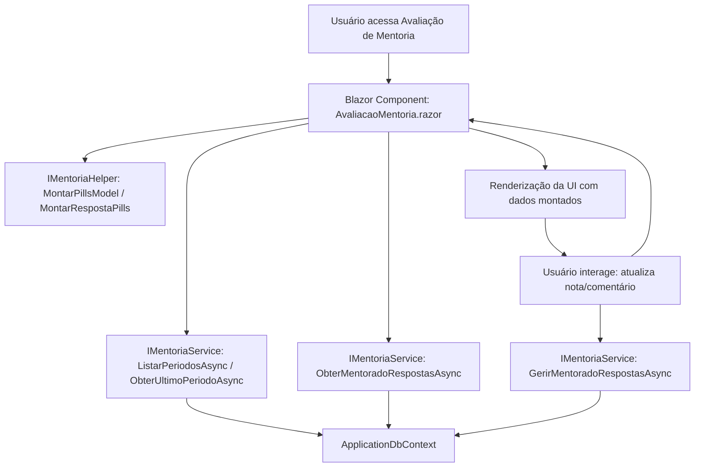

# Documentação: Avaliação de Mentoria

## Visão Geral

Esta documentação descreve a arquitetura, funcionamento e integração dos serviços de Avaliação de Mentoria migrados do Web Forms para o novo padrão Blazor .NET 9. O fluxo foi modularizado para máxima reutilização e desacoplamento, utilizando as pastas `Services/Mentoria` e `Services/Mentoria/Common`.

## Estrutura dos Serviços

- **IMentoriaService**: Interface centralizadora das operações de negócio de mentoria (listar períodos, obter respostas, atualizar notas/comentários).
- **MentoriaService**: Implementação concreta, utiliza o ApplicationDbContext para persistência e consultas.
- **IMentoriaHelper**: Interface para helpers de montagem de modelos de UI e transformação de dados.
- **MentoriaHelper**: Implementação dos helpers, responsável por montar as estruturas de dados para a camada de apresentação.

## Integração e Uso

Os serviços são registrados no DI container em `Program.cs` e podem ser injetados em qualquer componente Blazor ou serviço adicional:

```text
csharp
@inject IMentoriaService MentoriaService
@inject IMentoriaHelper MentoriaHelper
```

Exemplo de uso em componente:
```text
csharp
var periodos = await MentoriaService.ListarPeriodosAsync(1);
var ultimoPeriodo = await MentoriaService.ObterUltimoPeriodoAsync();
var respostas = await MentoriaService.ObterMentoradoRespostasAsync(idMentorado);
var pills = MentoriaHelper.MontarPillsModel(periodos, ultimoPeriodo, idMentorado, idMentor, respostas);
```

## Fluxo do Processo



## Sugestões de Melhorias Futuras

- Implementar cache para consultas de perguntas/notas de mentoria para reduzir queries repetidas.
- Adicionar testes automatizados para os serviços e helpers.
- Expandir os helpers para suportar customização de UI por perfil de usuário.
- Adicionar logs detalhados de auditoria para alterações de notas e comentários.
- Evoluir o fluxo para suportar avaliações em lote e exportação direta para Excel.
- Internacionalização dos textos dos modelos e helpers.
