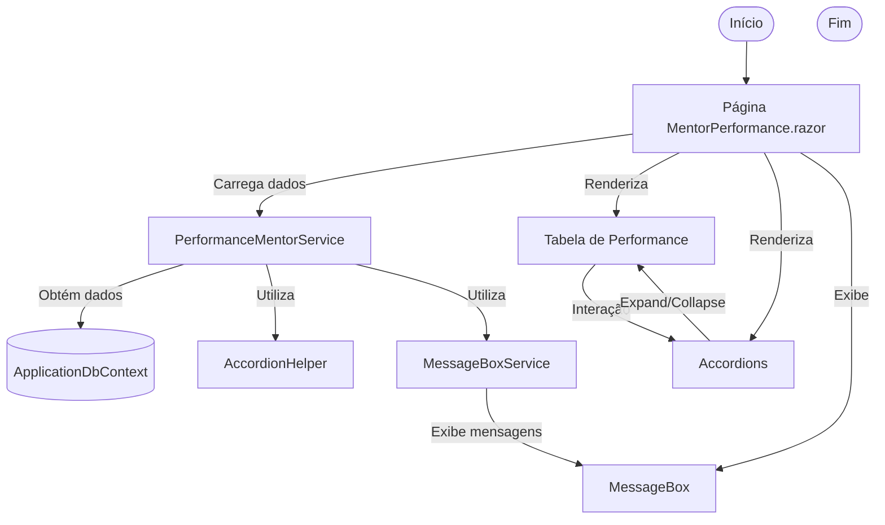

# Documentação: Migração da Página de Avaliação de Performance do Mentor

## Visão Geral

Esta documentação descreve a migração da página de avaliação de performance do mentor do modelo Web Forms para Blazor Híbrido (.NET 9), detalhando a integração dos novos serviços, o fluxo de dados, componentes envolvidos e sugestões de melhorias futuras. O objetivo é garantir máxima reutilização de código, desacoplamento da lógica de negócio e experiência moderna ao usuário.

## Estrutura e Integração dos Serviços

- **Serviço Central:** `Services.Performance.IPerformanceMentorService` e `Services.Performance.PerformanceMentorService`
  - Responsável por toda a lógica de negócio relacionada à avaliação de performance do mentor.
  - Métodos principais: obtenção de dados de performance, notas, abrangências, feedbacks e integração com outros serviços (Projetos, Associados, Notas, etc).
  - Utiliza injeção de dependência para acessar serviços comuns e garantir desacoplamento.

- **Helpers Reutilizáveis:**
  - `Services/Common/AccordionHelper.cs`: Lógica para accordions, truncamento de texto e manipulação de UI reutilizável.
  - `Services/Common/MessageBoxService.cs`: Exibição centralizada de mensagens, alertas e erros.

- **Componentização da UI:**
  - O componente Blazor `Components/Performance/MentorPerformance.razor` consome o serviço de performance mentor e helpers comuns, renderizando a tabela de performance, accordions, botões de ação e message box.

- **Registro no DI:**
  - O serviço de performance mentor foi registrado em `Program.cs`:
    csharp
    builder.Services.AddScoped<Services.Performance.IPerformanceMentorService, Services.Performance.PerformanceMentorService>();
    

## Fluxo do Processo (Mermaid)

## Sugestões de Melhorias Futuras

1. **Integração com IA:** Utilizar Azure OpenAI para análise automática de feedbacks e sugestões de desenvolvimento para mentorados.
2. **Exportação Avançada:** Permitir exportação de relatórios de performance em múltiplos formatos (PDF, Excel, CSV) diretamente da interface Blazor.
3. **Notificações em Tempo Real:** Integrar com SignalR para notificação instantânea de atualizações de avaliação e feedbacks.
4. **Auditoria e Histórico:** Implementar trilha de auditoria completa das alterações nas avaliações, permitindo rastreabilidade e conformidade.
5. **Customização de UI:** Permitir que gestores personalizem colunas, filtros e visualização da tabela de performance.
6. **Acessibilidade:** Garantir que todos os componentes atendam requisitos de acessibilidade (WCAG), incluindo navegação por teclado e leitores de tela.
7. **Testes Automatizados:** Futuramente, adicionar testes automatizados de integração e UI para garantir robustez nas atualizações.

## Considerações Finais

A migração para Blazor Híbrido e a centralização dos serviços comuns garantem maior escalabilidade, facilidade de manutenção e potencial para evolução contínua do sistema de avaliação interna. Todas as funcionalidades atuais foram preservadas e o código está preparado para futuras integrações e melhorias.
