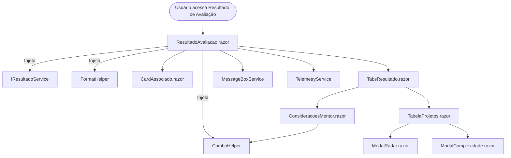

# Documentação Técnica: Página de Resultado de Avaliação (Blazor Híbrido)

## 1. Visão Geral

Esta documentação descreve a estrutura, funcionamento e integração da tela de resultado de avaliação migrada do Web Forms para Blazor Híbrido (.NET 9). O objetivo é garantir alta manutenibilidade, performance e reutilização de código, centralizando helpers e serviços na pasta `Services/Common` e isolando a lógica de negócio em `Services/Resultados`.

## 2. Estrutura de Componentes e Serviços

- **Componentes Blazor** (em `Components/Avaliacao/`):
  - `ResultadoAvaliacao.razor`: Orquestra a exibição da página de resultado, consumindo serviços e compondo os demais componentes.
  - `CardAssociado.razor`: Exibe informações do associado avaliado (foto, nome, cargo, mentor, etc.).
  - `TabelaProjetos.razor`: Renderiza a tabela de projetos e resultados.
  - `TabsResultado.razor`: Controla as abas "Resultados" e "Mentor".
  - `ConsideracoesMentor.razor`: Exibe e permite editar as considerações do mentor.
  - `ModalRadar.razor` e `ModalComplexidade.razor`: Exibem modais para visualização de radar e edição de complexidade.

- **Serviços Reutilizáveis** (em `Services/Common/`):
  - `FormatHelper`: Métodos de formatação (percentuais, decimais, truncamento de texto, etc.).
  - `ComboHelper`: Métodos para combos (tipos de avaliação, escopos, status, notas, abrangências, etc.).
  - `MessageBoxService`: Serviço para exibição de mensagens desacoplado da UI.
  - `TelemetryService`: Serviço para rastreamento de eventos, exceções e métricas.

- **Serviços de Resultado de Avaliação** (em `Services/Resultados/`):
  - `IResultadoService` / `ResultadoService`: Lógica de obtenção, processamento e agregação dos resultados de avaliação.
  - `ResultadoHelper`: Helper para cálculos e transformações específicas dos resultados de avaliação.

## 3. Integração e Fluxo de Dados

- Os componentes Blazor injetam os serviços necessários via DI (Dependency Injection).
- O componente principal (`ResultadoAvaliacao.razor`) solicita os dados ao `IResultadoService`, que utiliza o contexto EF Core para buscar e processar os resultados.
- Os helpers de formatação e combos são utilizados em toda a UI para garantir padronização.
- Mensagens de erro, sucesso ou info são exibidas via `MessageBoxService`.
- Eventos e exceções relevantes são rastreados via `TelemetryService`.

## 4. Diagrama de Fluxo (Mermaid)

## 5. Sugestões de Melhorias Futuras

- **Internacionalização:** Adicionar suporte a múltiplos idiomas nos helpers e componentes.
- **Testes Automatizados:** Implementar testes unitários e de integração para os serviços e componentes principais.
- **Performance:** Avaliar uso de caching para resultados de avaliação pesados.
- **Acessibilidade:** Garantir que todos os componentes estejam em conformidade com padrões de acessibilidade (WCAG).
- **Customização de UI:** Permitir customização de temas e estilos para diferentes empresas ou perfis de usuário.
- **Integração com AI:** Explorar sugestões automáticas de considerações do mentor usando IA, aproveitando a infraestrutura já preparada.
- **Documentação de API:** Gerar documentação OpenAPI para os endpoints de backend que alimentam os serviços.

## 6. Observações de Integração

- Todos os serviços e helpers estão registrados no DI container em `Program.cs`.
- Os componentes Blazor devem sempre consumir serviços via injeção de dependência para garantir testabilidade e desacoplamento.
- Para adicionar novos combos, formatações ou helpers, centralize sempre em `Services/Common`.
- Para lógica de negócio específica de resultado de avaliação, utilize e expanda `Services/Resultados`.

---
