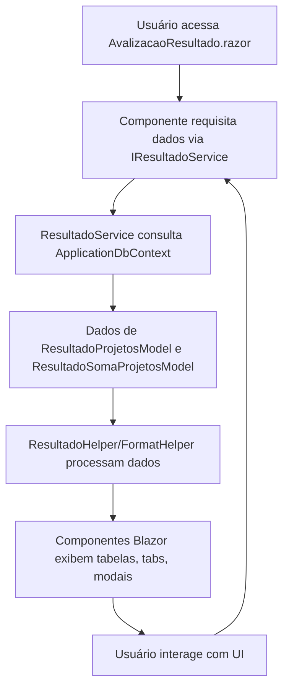

# Documentação: Migração da Página de Resultado de Avaliação

## Visão Geral

Esta documentação descreve a migração da página de resultado de avaliação do sistema legado (Web Forms) para o novo padrão Blazor Híbrido (.NET 9), detalhando a arquitetura, integração dos serviços, fluxo de dados e sugestões de melhorias. O objetivo é garantir que toda a lógica de negócio foi extraída para serviços reutilizáveis, helpers centralizados e componentes Blazor, promovendo manutenibilidade e escalabilidade.

## Estrutura de Integração

- **Serviços Reutilizáveis:**
  - `Services/Resultados/IResultadoService.cs`: Interface para obtenção e processamento dos resultados de avaliação.
  - `Services/Resultados/ResultadoService.cs`: Implementação da lógica de negócio para resultados de avaliação.
  - `Services/Resultados/Common/ResultadoHelper.cs`: Métodos auxiliares para cálculos, truncamento e manipulação de dados de resultado.
  - `Services/Common/FormatHelper.cs`: Métodos de formatação reutilizáveis.
  - `Services/Common/ComboHelper.cs`: Métodos para combos e listas reutilizáveis.

- **Componentes Blazor:**
  - `Components/AvalizacaoResultado.razor`: Componente principal da página de resultado de avaliação.
  - Subcomponentes para tabelas, tabs, modais e controles de mensagens.

- **Configuração:**
  - `appsettings.json`: Centraliza configurações do sistema, strings de conexão, opções de avaliação, etc.

- **Registro de Serviços:**
  - `Program.cs`: Todos os serviços e helpers necessários são registrados para injeção de dependência.

## Fluxo do Processo

## Funcionamento Detalhado

1. O usuário acessa a página de resultado de avaliação, agora implementada como componente Blazor (`AvalizacaoResultado.razor`).
2. O componente requisita os dados de resultado utilizando o serviço injetado `IResultadoService`.
3. O serviço consulta o banco de dados via `ApplicationDbContext`, recuperando as entidades mapeadas (`ResultadoProjetosModel`, `ResultadoSomaProjetosModel`, etc.).
4. Os dados são processados por helpers reutilizáveis (`ResultadoHelper`, `FormatHelper`) para cálculos, formatação e truncamento de textos.
5. Os componentes Blazor exibem as informações em tabelas, tabs e modais, permitindo navegação e interação fluida.
6. Toda a configuração da página e dos serviços é centralizada em `appsettings.json`.
7. Todos os serviços necessários estão registrados em `Program.cs` para injeção de dependência.

## Sugestões de Melhorias

- **Testes Automatizados:** Implementar testes unitários e de integração para os serviços e componentes Blazor.
- **Cache de Resultados:** Adicionar cache para resultados de avaliação que não mudam com frequência, melhorando performance.
- **Paginação e Filtros Avançados:** Permitir paginação e filtros dinâmicos nas tabelas de resultados, facilitando análise de grandes volumes de dados.
- **Internacionalização:** Preparar o sistema para múltiplos idiomas, utilizando recursos de localização do .NET.
- **Monitoramento e Telemetria:** Expandir o uso de Application Insights para rastrear eventos e exceções específicas da página de resultado.
- **Documentação Técnica Expandida:** Adicionar exemplos de uso dos serviços e componentes, facilitando onboarding de novos desenvolvedores.

## Referências

- [Documentação oficial Blazor .NET 9](https://learn.microsoft.com/aspnet/core/blazor/)
- [Entity Framework Core](https://learn.microsoft.com/ef/core/)
- [Application Insights](https://learn.microsoft.com/azure/azure-monitor/app/app-insights-overview)
