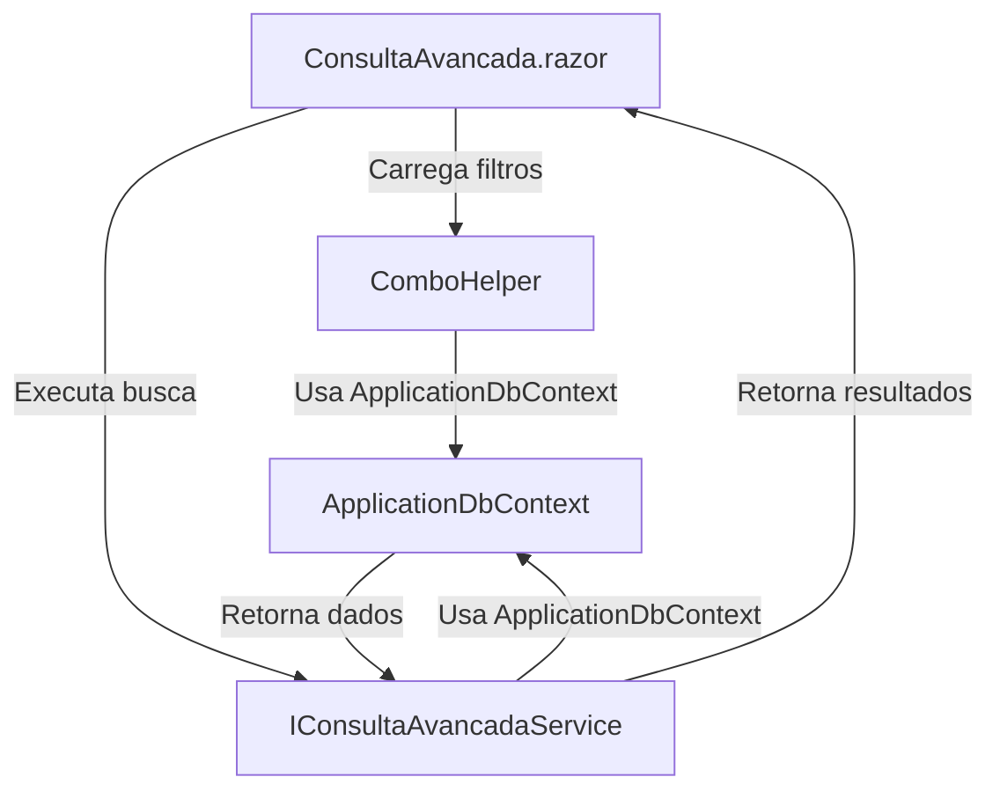

# Consulta Avançada - Migração Web Forms para Blazor Híbrido (.NET 9)

## Visão Geral

A funcionalidade de **Consulta Avançada** foi migrada do modelo antigo Web Forms (`consulta_avancada.aspx`) para um componente Blazor moderno, utilizando renderização automática (híbrida) no .NET 9. O objetivo é proporcionar uma experiência de usuário mais fluida, desacoplamento de responsabilidades e maior reuso de código através de serviços centralizados na pasta `Services/Common`.

## Estrutura e Integração

- **Serviços Reutilizáveis:**
  - Toda a lógica de carregamento de combos (projetos, clientes, profissionais, períodos) e execução da consulta avançada foi centralizada em `Services/Common/ConsultaAvancadaService.cs` e exposta via interface `IConsultaAvancadaService`.
  - O helper `ComboHelper` é utilizado para fornecer listas reutilizáveis de opções para selects em diversas telas do sistema.
- **DbContext:**
  - O arquivo `Data/ApplicationDbContext.cs` foi revisado para garantir o mapeamento correto das entidades necessárias para a consulta avançada, como Projetos, Clientes, Associados, PeriodosAvaliacoes, AvaliacoesEmail, etc.
- **Injeção de Dependência:**
  - Os serviços `IConsultaAvancadaService` e `ComboHelper` estão registrados no `Program.cs` para uso via DI em componentes Blazor.
- **Componente Blazor:**
  - O componente de UI (`ConsultaAvancada.razor`) consome os métodos do serviço para carregar filtros e executar a consulta, exibindo os resultados em tabela responsiva.

## Fluxo do Processo

- **ConsultaAvancada.razor**: Página Blazor responsável pela interface do usuário.
- **ComboHelper**: Fornece listas de opções para os filtros (projetos, clientes, profissionais, períodos).
- **IConsultaAvancadaService**: Executa a lógica de consulta avançada, aplicando os filtros recebidos.
- **ApplicationDbContext**: Camada de acesso a dados via Entity Framework Core.

## Sugestões de Melhorias Futuras

- **Paginação e Ordenação:** Implementar paginação e ordenação nos resultados da consulta para melhor performance e usabilidade em grandes volumes de dados.
- **Filtros Avançados Dinâmicos:** Permitir a configuração dinâmica de filtros, inclusive com múltipla seleção e busca textual nos combos.
- **Exportação de Resultados:** Adicionar funcionalidade de exportação (Excel/CSV) dos resultados diretamente da tela Blazor.
- **Cache de Combos:** Implementar cache para os combos mais estáticos, reduzindo consultas repetidas ao banco.
- **Testes Automatizados:** Criar testes unitários e de integração para os serviços de consulta e helpers.
- **Aprimoramento de UX:** Adicionar feedback visual (spinners, mensagens de erro/sucesso) e responsividade aprimorada para dispositivos móveis.
- **Segurança:** Garantir que os filtros respeitem as permissões do usuário logado, evitando exposição de dados indevidos.
