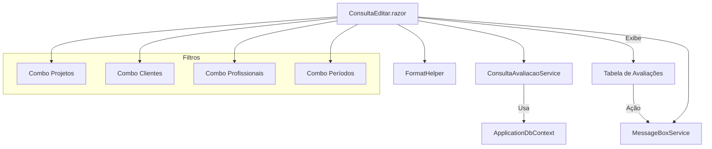

# Documentação: Migração da Tela de Consulta e Edição de Avaliações

## Visão Geral

Esta documentação descreve a arquitetura, funcionamento e integração dos códigos que compõem a nova tela de Consulta e Edição de Avaliações, migrada de Web Forms (`consulta_editar.aspx`) para Blazor (ASP.NET Core 9, modo híbrido). O objetivo é centralizar a lógica de negócio em serviços reutilizáveis, garantir desacoplamento e facilitar a manutenção e evolução do sistema.

## Arquitetura e Integração

A tela foi migrada para um componente Blazor (`ConsultaEditar.razor`), utilizando os seguintes serviços e helpers:

- **Services/Avaliacoes/ConsultaAvaliacaoService.cs**: Serviço responsável por encapsular toda a lógica de consulta e filtro das avaliações, utilizando Entity Framework Core e ApplicationDbContext.
- **Services/Common/ComboHelper.cs**: Helper centralizado para carregamento de combos (projetos, clientes, profissionais, períodos), utilizado em diversas telas.
- **Services/Common/MessageBoxService.cs**: Serviço para exibição de mensagens de sucesso, erro, alerta e informação, integrado à UI Blazor.
- **Services/Common/FormatHelper.cs**: Helper para formatação de datas, percentuais, textos e outros dados exibidos na interface.
- **Data/ApplicationDbContext.cs**: DbContext central, garantindo o mapeamento correto das entidades utilizadas nos filtros e resultados da consulta.

A UI Blazor utiliza injeção de dependência para consumir esses serviços, promovendo reutilização e desacoplamento. O fluxo de dados segue o padrão: filtros → consulta via serviço → exibição em tabela → ações (ex: retroceder avaliação) → feedback ao usuário via MessageBox.

## Fluxo de Processo (Mermaid)

## Estrutura de Pastas e Arquivos

- `Pages/Avaliacoes/ConsultaEditar.razor` e `.razor.cs`: Componente Blazor da tela.
- `Services/Avaliacoes/ConsultaAvaliacaoService.cs`: Serviço de consulta de avaliações.
- `Services/Common/ComboHelper.cs`: Helper para combos reutilizáveis.
- `Services/Common/MessageBoxService.cs`: Serviço de mensagens.
- `Services/Common/FormatHelper.cs`: Helper de formatação.
- `Data/ApplicationDbContext.cs`: DbContext central.
- `docs/consulta_editar.md`: Esta documentação.

## Sugestões de Melhorias Futuras

- **Paginação e Performance:** Implementar paginação e carregamento assíncrono dos resultados para suportar grandes volumes de dados sem impacto na performance da UI.
- **Filtros Avançados:** Adicionar filtros adicionais (por status, fase, etc.) e busca textual para refinar ainda mais os resultados.
- **Exportação:** Permitir exportação dos resultados da consulta para Excel/CSV diretamente da tela.
- **Permissões Dinâmicas:** Integrar controle de permissões mais granular para ações como retroceder avaliação, baseado no perfil do usuário.
- **Testes Automatizados:** Adicionar testes automatizados para os serviços e helpers, garantindo robustez nas futuras evoluções.
- **Aprimoramento de UX:** Melhorar a experiência do usuário com feedback visual mais rico, loading indicators e validação em tempo real dos filtros.

## Considerações Finais

A arquitetura adotada promove desacoplamento, reutilização e facilita a evolução do sistema, alinhando-se às melhores práticas modernas de desenvolvimento .NET e Blazor. A documentação e o fluxo mermaid auxiliam no onboarding e manutenção contínua do sistema.
