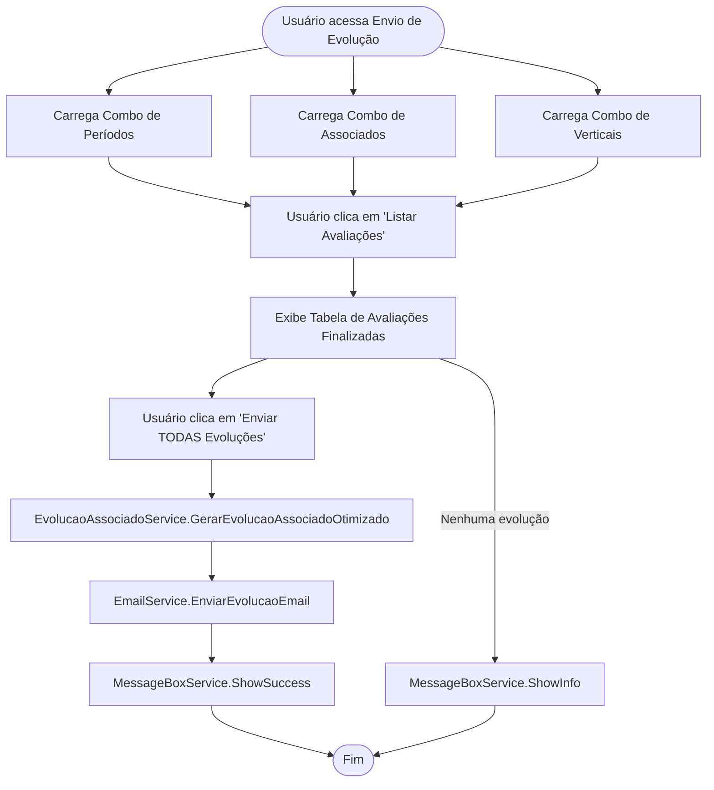

# Documentação: Envio de Evolução (Migração Web Forms → Blazor Híbrido)

## Visão Geral

Esta documentação detalha a arquitetura, integração e funcionamento do novo fluxo de Envio de Evolução, migrado do Web Forms (`envioevolucao.aspx`) para um componente Blazor moderno, utilizando serviços e helpers centralizados para máxima reutilização e desacoplamento.

O objetivo é garantir manutenibilidade, testabilidade e facilidade de evolução, seguindo as melhores práticas de engenharia de software e a padronização de serviços reutilizáveis em `Services/Common`.

---

## Arquitetura e Integração dos Serviços

### 1. Componentização
- **Componente Principal:** `Components/Avaliacoes/EnvioEvolucao.razor`
- **Code-behind:** `EnvioEvolucao.razor.cs`
- **Renderização:** `@rendermode InteractiveAuto` (Blazor Híbrido)

### 2. Serviços Utilizados
- **EvolucaoAssociadoService:** Lógica de negócio para geração e listagem de evoluções.
- **ComboHelper:** Carregamento de combos reutilizáveis (períodos, associados, verticais).
- **MessageBoxService:** Exibição padronizada de mensagens (sucesso, erro, info, warning).
- **EmailService:** Envio de emails parametrizados, utilizando configurações do `appsettings.json`.
- **FormatHelper:** Formatação de textos, datas e exibição na UI.

### 3. Configuração
- **Configurações de email, SMTP, remetente, modelo de email:** Centralizadas em `appsettings.json`.
- **Strings de conexão e parâmetros globais:** Também em `appsettings.json`.

### 4. Data Access
- **DbContext:** `ApplicationDbContext` expõe entidades como `Associado`, `Periodo`, `Vertical`, etc., garantindo compatibilidade e queries modernas.

### 5. Injeção de Dependência
Todos os serviços são registrados no container DI em `Program.cs` e injetados nos componentes conforme necessidade.

---

## Exemplo de Integração e Uso
```text
csharp
@inject IEvolucaoAssociadoService EvolucaoAssociadoService
@inject IComboHelper ComboHelper
@inject IMessageBoxService MessageBoxService
@inject IEmailService EmailService
@inject IFormatHelper FormatHelper

// Uso típico no code-behind:
var periodos = await ComboHelper.GetPeriodosComboAsync(dbContext, empresaId);
var associados = await ComboHelper.GetProfissionaisComboAsync(dbContext, true);
var verticais = await ComboHelper.GetVerticaisComboAsync(dbContext);

var evolucoes = await EvolucaoAssociadoService.ListAssociadosEvolucao(idAssociado, idPeriodo, idVertical);

if (evolucoes.Any())
{
    // Geração e envio de evolução
    await EvolucaoAssociadoService.GerarEvolucaoAssociadoOtimizado(...);
    await EmailService.EnviarEvolucaoEmail(associado, periodo);
    MessageBoxService.ShowSuccess($"Evolução enviada com sucesso para {associado.Nome}.");
}
else
{
    MessageBoxService.ShowInfo("Não há evoluções para enviar.");
}
```

---

## Fluxo do Processo (Mermaid)



---

## Sugestões de Melhorias Futuras

1. **Testes Automatizados:** Implementar testes unitários e de integração para todos os serviços e componentes, garantindo robustez em futuras evoluções.
2. **Paginação e Filtros Avançados:** Adicionar paginação e filtros dinâmicos na tabela de avaliações para melhor escalabilidade e experiência do usuário.
3. **Feedback Visual em Tempo Real:** Integrar loading spinners e feedback visual durante operações longas (ex: envio em massa de emails).
4. **Centralização de Logs:** Integrar logs detalhados de operações críticas (envio de email, geração de evolução) com Application Insights para rastreabilidade.
5. **Internacionalização:** Preparar os textos e mensagens para múltiplos idiomas, facilitando a expansão para outras regiões.
6. **Permissões Granulares:** Refinar o controle de permissões para que apenas usuários autorizados possam executar determinadas ações (ex: envio em massa).
7. **Notificações Push:** Integrar notificações push (SignalR) para informar em tempo real sobre o status de envios e operações.
8. **Documentação Viva:** Automatizar a geração de documentação técnica dos serviços e componentes, mantendo-a sempre atualizada.

---

## Conclusão

A migração do Envio de Evolução para Blazor, com serviços centralizados e documentação detalhada, proporciona uma base sólida para manutenção, evolução e escalabilidade do sistema de avaliação interna da empresa. O fluxo está pronto para ser expandido e melhorado conforme as necessidades futuras do negócio.
