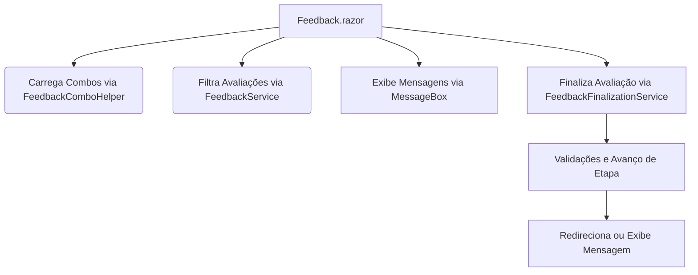

# Documentação Técnica: Módulo de Feedback/Avaliação (Blazor Híbrido .NET 9)

## Visão Geral

O módulo de Feedback/Avaliação foi migrado de Web Forms para Blazor Híbrido .NET 9, com a lógica de negócio extraída para serviços reutilizáveis e injetáveis. A arquitetura foi desenhada para máxima reutilização, testabilidade e desacoplamento, seguindo as melhores práticas modernas de desenvolvimento.

## Estrutura de Pastas

- `Services/Feedback/Common/` - Interfaces e modelos reutilizáveis para Feedback/Avaliação.
- `Services/Feedback/` - Implementações dos serviços de negócio e helpers.
- `Components/Feedback/Feedback.razor` - Componente Blazor da tela de Feedback.
- `Components/Common/MessageBox.razor` - Componente Blazor reutilizável para mensagens.
- `docs/feedback.md` - Esta documentação.

## Principais Serviços e Interfaces

- **IFeedbackService**: Interface principal para operações de feedback/avaliação (listar projetos, clientes, períodos, status, processar avaliações e feedbacks).
- **FeedbackService**: Implementação que delega operações para helpers e repositórios.
- **IFeedbackFinalizationService**: Interface para encapsular a lógica de finalização de avaliações.
- **FeedbackFinalizationService**: Implementação da lógica de finalização, incluindo validações e avanço de etapas.
- **IFeedbackComboHelper**: Interface para helpers de combos reutilizáveis.
- **FeedbackComboHelper**: Implementação que utiliza serviços de clientes, projetos e avaliações para montar listas de seleção.
- **FeedbackModels.cs**: Modelos de dados (DTOs/ViewModels) para toda a estrutura de feedback/avaliação.

## Integração e Fluxo de Uso

- O componente Blazor `Feedback.razor` injeta os serviços `IFeedbackService`, `IFeedbackFinalizationService` e `IMessageBoxService`.
- Os combos de Projetos, Clientes, Períodos e Status são carregados via `FeedbackComboHelper`.
- A filtragem e exibição das avaliações é feita via métodos do `FeedbackService`.
- A finalização de avaliações é feita via `FeedbackFinalizationService`, que executa todas as validações e avança as etapas conforme o fluxo de negócio.
- Mensagens ao usuário são exibidas via `MessageBox.razor` integrado ao `IMessageBoxService`.

## Fluxo do Processo (Mermaid)

## Sugestões de Melhorias Futuras

- Implementar testes automatizados para todos os serviços e helpers.
- Migrar o repositório de dados para um padrão genérico, facilitando manutenção e extensão.
- Adicionar cache para combos de seleção, melhorando performance em grandes bases.
- Evoluir os modelos para suportar internacionalização (i18n) e customização por cliente.
- Integrar logs detalhados de auditoria para todas as operações críticas.
- Adicionar suporte a notificações em tempo real via SignalR para feedbacks e etapas.
