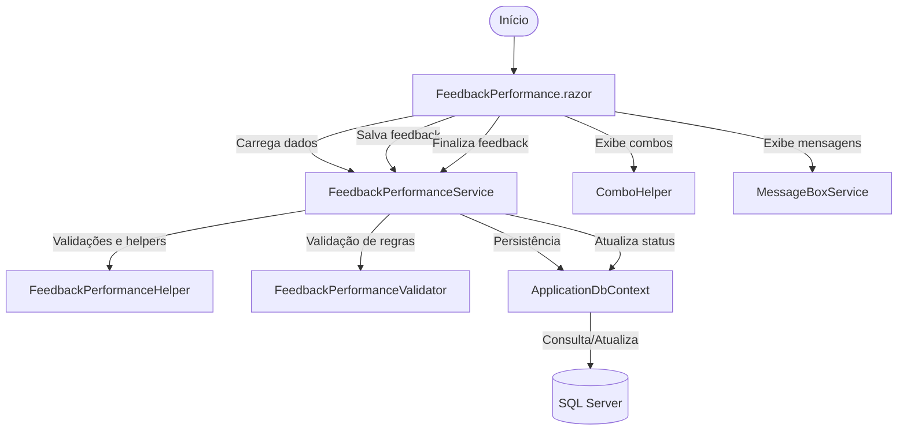

# Documentação: Feedback de Performance (Migração Web Forms para Blazor)

## Visão Geral

Este módulo realiza a migração da página de Feedback de Performance do modelo Web Forms para Blazor Híbrido (.NET 9), modernizando a experiência do usuário e centralizando a lógica de negócio em serviços reutilizáveis. Toda a lógica de obtenção, validação e persistência de avaliações de performance foi extraída para serviços injetáveis, seguindo o padrão de reutilização e separação de responsabilidades.

## Estrutura de Pastas e Serviços

- **Services/FeedbackPerformance/FeedbackPerformanceService.cs**: Serviço principal para orquestração do fluxo de feedback de performance (carregamento, salvamento, finalização).
- **Services/FeedbackPerformance/Common/FeedbackPerformanceHelper.cs**: Métodos utilitários para manipulação de listas, truncamento de texto, organização de abrangências e validações comuns.
- **Services/FeedbackPerformance/Common/FeedbackPerformanceValidator.cs**: Validações de regras de negócio do fluxo de feedback de performance.
- **Services/FeedbackPerformance/Common/ComboHelper.cs**: Métodos utilitários para geração de combos/listas de seleção específicas do feedback de performance.
- **Pages/FeedbackPerformance.razor**: Componente Blazor responsável pela interface do usuário.
- **Pages/FeedbackPerformance.razor.cs**: Code-behind do componente, responsável pelo binding, carregamento e integração com os serviços.

## Registro de Serviços (Dependency Injection)

Os serviços foram registrados no container de DI em `Program.cs`:
```text
csharp
builder.Services.AddScoped<IFeedbackPerformanceService, FeedbackPerformanceService>();
builder.Services.AddScoped<IFeedbackPerformanceHelper, FeedbackPerformanceHelper>();
builder.Services.AddScoped<IFeedbackPerformanceValidator, FeedbackPerformanceValidator>();
```

## Configuração

As configurações específicas do fluxo de feedback de performance estão centralizadas em `appsettings.json` na chave `AutoAvaliacao:FeedbackPerformance`. Exemplos de parâmetros:

- `Enable`: Ativa/desativa o fluxo de feedback de performance.
- `MaxFeedbackLength`: Limite máximo de caracteres do campo de feedback.
- `RequireAllNotas`: Exige o preenchimento de todas as notas antes de finalizar.
- `AutoSaveIntervalSeconds`: Intervalo de auto-save.
- `ShowDisclaimer`: Exibe mensagem de disclaimer.
- `NotasPadrao`: IDs e textos das opções padrão de nota.

## Fluxo de Funcionamento



## Integração com Outras Partes do Sistema

- Utiliza ApplicationDbContext para persistência de dados.
- Reaproveita ComboHelper para geração de listas de seleção.
- Integra-se com MessageBoxService para exibição de mensagens ao usuário.
- Utiliza configurações centralizadas em appsettings.json.

## Sugestões de Melhorias Futuras

- Implementar testes automatizados para os serviços FeedbackPerformance.
- Adicionar logs detalhados de auditoria para rastreabilidade das ações de feedback.
- Permitir customização dinâmica dos campos de feedback via configuração.
- Melhorar a experiência de usuário com feedback visual em tempo real (ex: barra de progresso de auto-save).
- Internacionalizar textos e mensagens para múltiplos idiomas.
- Integrar notificações push para alertar usuários sobre feedback pendente ou salvo.
