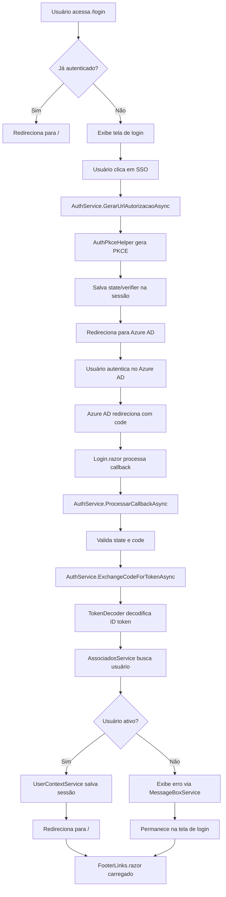

# Migração do Login: Web Forms para Blazor Híbrido .NET 9

## Visão Geral

Este documento descreve a migração completa da funcionalidade de login do sistema de avaliação interna, convertendo de Web Forms (ASP.NET Framework) para Blazor Híbrido (.NET 9). A migração segue o padrão de arquitetura estabelecido, centralizando serviços reutilizáveis em `Services/Common` e criando componentes Blazor modernos.

## Arquitetura da Solução

### Serviços Reutilizáveis Criados

#### 1. AuthPkceHelper (`Services/Common/Auth/AuthPkceHelper.cs`)
- **Propósito**: Helper estático para geração de PKCE (Proof Key for Code Exchange)
- **Funcionalidades**:
  - Geração de Code Verifier
  - Geração de Code Challenge
  - Geração e validação de State
- **Reutilização**: Pode ser usado em qualquer fluxo OAuth2 da aplicação

#### 2. AuthService (`Services/Common/Auth/AuthService.cs`)
- **Propósito**: Serviço principal de autenticação SSO Azure AD
- **Funcionalidades**:
  - Geração de URL de autorização
  - Processamento de callback de autenticação
  - Troca de código por token
  - Validação de usuário no sistema
  - Integração com telemetria e mensagens
- **Dependências**: IConfiguration, IAssociadosService, ITokenDecoder, IMessageBoxService, ITelemetryService

#### 3. FooterLinksService (`Services/Common/FooterLinksService.cs`)
- **Propósito**: Gerenciamento centralizado dos links do rodapé
- **Funcionalidades**:
  - Fornecimento de lista de links configurável
  - Suporte a ordenação e visibilidade
  - Telemetria de carregamento
- **Reutilização**: Pode ser usado em qualquer página que precise do rodapé

### Componentes Blazor Criados

#### 1. FooterLinks (`Components/Shared/FooterLinks.razor`)
- **Propósito**: Componente reutilizável para renderização do rodapé
- **Funcionalidades**:
  - Renderização dinâmica de links
  - Telemetria de cliques
  - Tratamento de erros
  - Suporte a parâmetros de usuário

#### 2. Login (`Components/Pages/Login.razor`)
- **Propósito**: Página principal de login
- **Funcionalidades**:
  - Interface moderna com Blazor InteractiveAuto
  - Integração com AuthService
  - Processamento de callbacks
  - Exibição de mensagens de erro/sucesso
  - Redirecionamento automático

## Fluxo de Autenticação



## Integração com Serviços Existentes

### UserContextService
- Utilizado para gerenciar a sessão do usuário logado
- Integra com o AuthService para salvar dados do usuário após autenticação bem-sucedida

### AssociadosService
- Utilizado para validar se o usuário existe no sistema
- Verifica se o usuário está ativo

### MessageBoxService
- Centraliza todas as mensagens de erro, sucesso e informação
- Integrado ao AuthService para feedback ao usuário

### TelemetryService
- Rastreia eventos de login, erros e cliques em links
- Fornece métricas para monitoramento da aplicação

## Configuração

### appsettings.json
```text
{
  "Authentication": {
    "AzureAd": {
      "TenantId": "your-tenant-id",
      "ClientId": "your-client-id",
      "ClientSecret": "your-client-secret",
      "ADInstance": "https://login.microsoftonline.com/",
      "RedirectUri": "https://localhost:7000/login",
      "Scopes": "openid profile email"
    }
  },
  "AppVersion": "2.0.0"
}
```

### Program.cs
```text
csharp
// Auth Common Services - Login Migration
builder.Services.AddScoped<ITokenDecoder, TokenDecoder>();
builder.Services.AddScoped<IAuthCallbackService, AuthCallbackService>();
builder.Services.AddScoped<IAuthService, AuthService>();

// Footer Services - Login Migration
builder.Services.AddScoped<IFooterLinksService, FooterLinksService>();
```

## Vantagens da Nova Arquitetura

### 1. Reutilização
- Todos os serviços podem ser reutilizados em outras partes da aplicação
- Componentes Blazor são modulares e reutilizáveis

### 2. Testabilidade
- Serviços são injetáveis e facilmente testáveis
- Separação clara de responsabilidades

### 3. Manutenibilidade
- Código organizado em camadas bem definidas
- Configuração centralizada
- Telemetria integrada para monitoramento

### 4. Performance
- Blazor InteractiveAuto otimiza renderização
- Componentes carregam apenas quando necessário

### 5. Modernidade
- Uso de .NET 9 e Blazor
- Padrões modernos de desenvolvimento
- Preparado para AOT compilation

## Próximos Passos

1. **Testes**: Implementar testes unitários para AuthService e FooterLinksService
2. **Logout**: Migrar funcionalidade de logout usando os mesmos padrões
3. **Callback Handler**: Criar endpoint dedicado para callback se necessário
4. **Error Handling**: Implementar páginas de erro personalizadas
5. **Security**: Revisar configurações de segurança e HTTPS

## Considerações de Segurança

- PKCE implementado para proteção contra ataques de interceptação
- State validation para prevenção de CSRF
- Tokens armazenados de forma segura
- Validação de usuário no sistema local
- Sessões com timeout configurável

## Monitoramento e Telemetria

- Eventos de login/logout rastreados
- Erros de autenticação monitorados
- Cliques em links do rodapé rastreados
- Métricas de performance disponíveis via Application Insights
