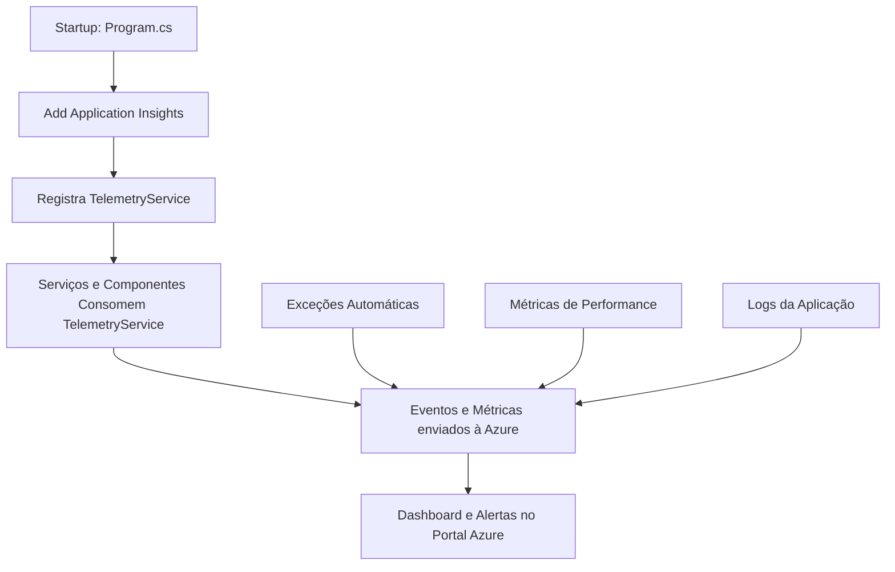

# Observabilidade - Application Insights

## Visão Geral

O sistema de avaliação utiliza o Azure Application Insights para monitoramento, telemetria e observabilidade da aplicação. A implementação foi modernizada para utilizar o padrão de injeção de dependência do ASP.NET Core 9.

## Arquitetura

### TelemetryService

O `TelemetryService` é um serviço reutilizável que encapsula todas as funcionalidades do Application Insights:

- **TrackEvent**: Rastreamento de eventos customizados
- **TrackException**: Captura de exceções com contexto
- **TrackDependency**: Monitoramento de dependências externas
- **TrackPageView**: Rastreamento de visualizações de página
- **TrackMetric**: Envio de métricas customizadas

### Configuração

A configuração do Application Insights está centralizada no `appsettings.json`:

{
  "ApplicationInsights": {
    "ConnectionString": "InstrumentationKey=...;IngestionEndpoint=...;"
  }
}

## Como Utilizar

### Injeção de Dependência

csharp
public class MeuServico
{
    private readonly ITelemetryService _telemetryService;
    
    public MeuServico(ITelemetryService telemetryService)
    {
        _telemetryService = telemetryService;
    }
    
    public void MinhaOperacao()
    {
        _telemetryService.TrackEvent("OperacaoIniciada", 
            new Dictionary<string, string> { ["Usuario"] = "admin" });
    }
}

### Em Componentes Blazor

csharp
@inject ITelemetryService TelemetryService

@code {
    protected override void OnInitialized()
    {
        TelemetryService.TrackPageView("PaginaAvaliacoes");
    }
}

## Fluxo de Integração

## Eventos Recomendados para Rastreamento

- **AvaliacaoIniciada**: Quando uma avaliação é iniciada
- **AvaliacaoFinalizada**: Quando uma avaliação é concluída
- **RelatorioExportado**: Quando um relatório é exportado
- **CompetenciaAvaliada**: Quando uma competência é avaliada
- **ErroValidacao**: Quando ocorrem erros de validação

## Próximos Passos

1. Implementar rastreamento automático em todos os serviços de negócio
2. Configurar alertas inteligentes no Azure
3. Criar dashboards customizados para métricas de negócio
4. Implementar correlation IDs para rastreamento de fluxos completos
