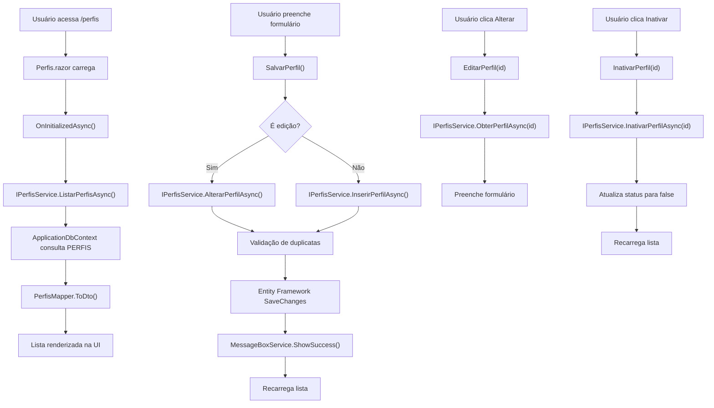

# Migração de Perfis de Acesso - Web Forms para Blazor

## Visão Geral

Este documento descreve a migração da funcionalidade de "Perfis de Acesso" do Web Forms (`Perfis.aspx`) para Blazor Server com renderização híbrida no .NET 9.

## Arquitetura

### Estrutura de Pastas

```text
Services/Perfis/
├── IPerfisService.cs          # Interface do serviço principal
├── PerfisService.cs           # Implementação do serviço
└── Common/
    ├── PerfilDto.cs           # DTOs para transferência de dados
    ├── StatusHelper.cs        # Helper para conversão de status
    └── PerfisMapper.cs        # Mapeamento entre entidades e DTOs

Components/
├── Pages/
│   ├── Perfis.razor           # Componente principal da página
│   └── Perfis.razor.cs        # Code-behind do componente
└── Shared/
    └── MessageBox.razor       # Componente reutilizável para mensagens

Models/
└── Perfil.cs                  # Entidade do Entity Framework
```

### Componentes Principais

#### 1. IPerfisService / PerfisService
- **Responsabilidade**: Encapsula toda a lógica de negócio relacionada aos perfis
- **Operações**: CRUD completo (Listar, Obter, Inserir, Alterar, Inativar)
- **Características**:
  - Métodos assíncronos
  - Integração com telemetria
  - Validação de duplicatas
  - Tratamento de exceções

#### 2. DTOs e Mapeamento
- **PerfilDto**: Objeto de transferência principal
- **PerfilListItemDto**: DTO otimizado para listagem
- **PerfisMapper**: Conversão entre entidades EF e DTOs
- **StatusHelper**: Utilitários para manipulação de status

#### 3. Componentes Blazor
- **Perfis.razor**: Interface de usuário com renderização híbrida
- **Perfis.razor.cs**: Lógica de apresentação e eventos
- **MessageBox.razor**: Componente reutilizável para notificações

## Fluxo de Alto Nível



## Integração com Outros Serviços

### Serviços Utilizados

1. **IMessageBoxService**: Exibição de notificações
2. **ITelemetryService**: Monitoramento e logs
3. **ApplicationDbContext**: Acesso a dados via Entity Framework

### Injeção de Dependência

No `Program.cs`:
csharp
builder.Services.AddScoped<IPerfisService, PerfisService>();


### Configuração do Entity Framework

No `ApplicationDbContext.cs`:

```text
csharp
public DbSet<Perfil> Perfis { get; set; }

modelBuilder.Entity<Perfil>(entity =>
{
    entity.HasKey(e => e.Id);
    entity.ToTable("PERFIS");
    entity.Property(e => e.Id).HasColumnName("IdPerfil");
    entity.Property(e => e.Nome).HasColumnName("Perfil");
});
```

## Funcionalidades Implementadas

### 1. Listagem de Perfis
- Carregamento assíncrono
- Exibição de código, nome e status
- Botões de ação condicionais (Inativar apenas para ativos)

### 2. Cadastro de Perfis
- Formulário reativo com validação
- Verificação de duplicatas
- Feedback visual durante processamento

### 3. Edição de Perfis
- Carregamento de dados existentes
- Modo de edição com botão cancelar
- Validação de duplicatas excluindo o próprio registro

### 4. Inativação de Perfis
- Alteração de status sem exclusão física
- Ocultação do botão para perfis já inativos
- Confirmação visual da operação

## Melhorias Implementadas

### Em relação ao Web Forms original:

1. **Performance**: Renderização híbrida Blazor
2. **UX**: Feedback visual durante operações
3. **Manutenibilidade**: Separação clara de responsabilidades
4. **Testabilidade**: Serviços com interfaces e DI
5. **Monitoramento**: Integração com Application Insights
6. **Reutilização**: Componentes e helpers reutilizáveis

## Considerações Técnicas

### Renderização Híbrida
- `@rendermode InteractiveAuto`: Combina Server e WebAssembly
- Primeira renderização no servidor (SSR)
- Interações subsequentes no cliente (WASM)

### Tratamento de Erros
- Try-catch em todos os métodos críticos
- Logging via ITelemetryService
- Mensagens amigáveis ao usuário

### Validações
- Validação de campos obrigatórios
- Verificação de duplicatas
- Feedback imediato na UI

## Próximos Passos

1. Implementar testes unitários para PerfisService
2. Adicionar paginação para grandes volumes de dados
3. Implementar filtros de busca avançada
4. Considerar cache para melhor performance
5. Adicionar auditoria de alterações

## Dependências

- Microsoft.EntityFrameworkCore
- Microsoft.ApplicationInsights
- Peers.Moderno.Services.Common (MessageBoxService, TelemetryService)
- Peers.Moderno.Data (ApplicationDbContext)
- Peers.Moderno.Models (Perfil)

## Compatibilidade

- .NET 9.0
- Entity Framework Core 9.0
- Blazor Server Side
- SQL Server (via connection string configurada)
