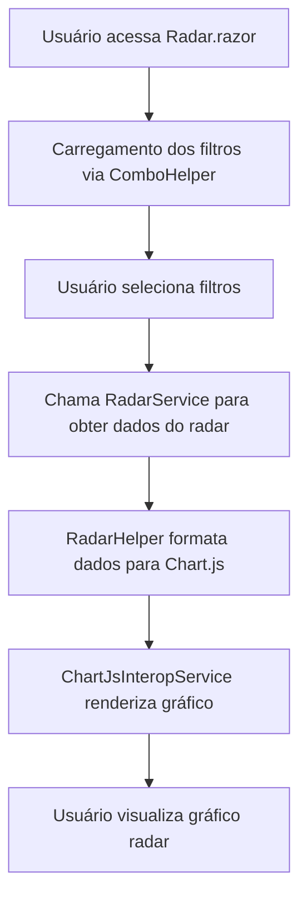

# Radar das Avaliações - Migração e Estrutura Blazor

## Visão Geral

O Radar das Avaliações é uma funcionalidade central do sistema de avaliação interna da empresa, responsável por exibir um gráfico radar com dados de avaliações de competências, autoavaliação e avaliação de gestores. A migração para Blazor .NET 9 visa modernizar a experiência do usuário, garantir escalabilidade, reutilização de código e integração com serviços modernos.

## Estrutura dos Códigos e Integração

- **Serviços Reutilizáveis:**
  - `Services/Common/FormatHelper.cs`: Centraliza métodos de formatação de valores, percentuais, decimais e textos para uso em toda a aplicação Blazor.
  - `Services/Common/ComboHelper.cs`: (já existente) Centraliza métodos de carregamento de combos para filtros reutilizáveis.
- **Serviços Específicos do Radar:**
  - `Services/Radar/RadarService.cs`: Responsável pelo cálculo dos dados do radar, agregando informações de avaliações, premissas e eixos.
  - `Services/Radar/Common/RadarHelper.cs`: Auxilia na transformação dos dados para o formato esperado pelo Chart.js e validação dos filtros.
- **Integração com Chart.js:**
  - `Services/Common/ChartJsInteropService.cs`: Serviço JSInterop para renderização e atualização do gráfico radar via Chart.js.
- **Componente Blazor:**
  - `Pages/Radar.razor`: Implementa a interface de filtros e exibição do gráfico, consumindo os serviços acima.
- **Injeção de Dependência:**
  - Todos os serviços são registrados em `Program.cs` para uso via DI.

## Fluxo de Funcionamento

## Detalhes Técnicos

- O `FormatHelper` é utilizado em toda a aplicação para garantir padronização na exibição de valores, percentuais e textos truncados.
- O serviço `RadarService` encapsula toda a lógica de negócio para cálculo dos pontos do radar, isolando regras de negócio da interface.
- O helper `RadarHelper` converte os dados do serviço para o formato aceito pelo Chart.js, facilitando a integração com o frontend.
- O serviço `ChartJsInteropService` permite a renderização, atualização e destruição de gráficos Chart.js no contexto Blazor, promovendo desacoplamento entre backend e frontend.
- Todos os serviços são injetados via DI, promovendo testabilidade e reutilização.

## Sugestões de Melhorias Futuras

- **Internacionalização:** Adicionar suporte a múltiplos idiomas nos helpers de formatação e textos dos filtros.
- **Exportação de Dados:** Permitir exportação dos dados do radar em formatos como PDF, Excel ou imagem.
- **Acessibilidade:** Garantir que o gráfico e filtros sejam acessíveis via teclado e leitores de tela.
- **Análise com IA:** Integrar serviços de IA para sugerir insights automáticos baseados nos dados do radar.
- **Customização Avançada:** Permitir ao usuário customizar cores, eixos e séries do gráfico radar.
- **Testes Automatizados:** Expandir cobertura de testes unitários e de integração para todos os serviços e componentes.

## Observações

- Toda a lógica de negócio foi extraída dos antigos Web Forms para serviços e helpers reutilizáveis, seguindo o padrão de centralização em `Services/Common`.
- O fluxo de dados é desacoplado, facilitando manutenção e evolução.
- O arquivo foi criado conforme padrão de documentação do projeto, com explicação, fluxo mermaid e sugestões de melhorias.
