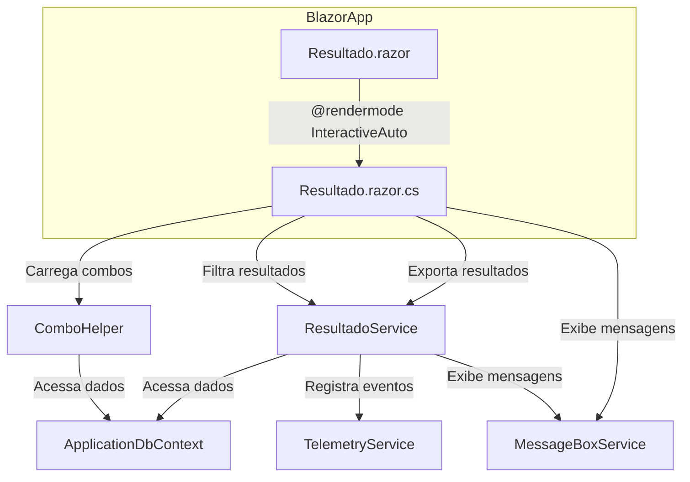

# Documentação: Página de Resultado de Avaliações (Migração Web Forms → Blazor)

## Visão Geral

Esta documentação detalha a migração da página de resultado de avaliações do sistema legado (Web Forms) para o novo padrão Blazor (.NET 9), com foco em arquitetura, integração de serviços reutilizáveis e fluxo de funcionamento. O objetivo é garantir manutenibilidade, reuso e escalabilidade para a listagem, filtro e exportação de resultados de avaliações.

## Estrutura e Integração dos Serviços

### 1. Serviços e Helpers Utilizados

- **Services/Resultados/IResultadoService.cs & ResultadoService.cs**: Centralizam a lógica de negócio para listagem, filtro, exportação e liberação de avaliações e resultados de liderança.
- **Services/Common/ComboHelper.cs**: Fornece métodos reutilizáveis para combos de períodos, projetos e associados, otimizados para uso em Blazor.
- **Services/Common/MessageBoxService.cs**: Serviço para exibição de mensagens de feedback ao usuário (sucesso, erro, info, warning) de forma desacoplada da UI.
- **Services/Common/TelemetryService.cs**: Serviço para registrar eventos relevantes (ex: exportação, filtro, erros) para monitoramento e diagnóstico cloud-native.
- **Data/ApplicationDbContext.cs**: Contexto EF Core que centraliza o acesso a todas as entidades necessárias para a tela de resultado, garantindo persistência e integridade dos dados.

### 2. Fluxo de Funcionamento

A tela de resultado foi migrada para um componente Blazor (Components/Pages/Resultado.razor), com code-behind (Resultado.razor.cs), utilizando renderização híbrida. Toda a lógica de negócio foi extraída para serviços injetáveis, facilitando o reuso e a testabilidade.

- **Filtros e Combos**: Os combos de período, projeto e associado são carregados de forma assíncrona via ComboHelper, permitindo reuso em outras páginas.
- **Listagem de Resultados**: O serviço ResultadoService executa a busca dos resultados filtrados, retornando modelos prontos para exibição na tabela.
- **Exportação**: A exportação de resultados (liderança, desempenho, mentoria) é realizada via métodos do ResultadoService, que utilizam o contexto EF Core e serviços auxiliares para geração dos arquivos.
- **Mensagens e Telemetria**: Todas as operações críticas (filtro, exportação, erros) disparam mensagens para o usuário via MessageBoxService e são registradas para telemetria via TelemetryService.

## Diagrama de Fluxo (Mermaid)

## Sugestões de Melhorias Futuras

- **Otimização de Queries**: Implementar consultas mais performáticas (ex: uso de projections, split queries, cache) para grandes volumes de dados.
- **Paginação e Busca Avançada**: Adicionar paginação server-side e filtros dinâmicos para melhorar a experiência do usuário e escalabilidade.
- **Exportação Assíncrona**: Permitir exportação em background, notificando o usuário quando o arquivo estiver pronto, evitando timeouts em grandes volumes.
- **Integração com IA**: Explorar uso de IA para análise automática dos resultados exportados, sugerindo insights e recomendações para gestores.
- **Testes Automatizados**: Implementar testes automatizados para os serviços de negócio e helpers, garantindo robustez nas futuras evoluções.
- **Componentização Avançada**: Quebrar a tela de resultado em componentes menores e reutilizáveis (ex: tabela, filtros, botões), facilitando manutenção e reuso em outras páginas.
- **Internacionalização**: Preparar os textos e mensagens para múltiplos idiomas, visando expansão internacional.

## Observações

- Toda a lógica de negócio foi extraída para serviços reutilizáveis, seguindo o padrão de centralização em Services/Common e Services/Resultados.
- O ApplicationDbContext foi revisado para garantir compatibilidade total com as entidades utilizadas.
- A documentação e o fluxo visam facilitar o onboarding de novos desenvolvedores e a manutenção evolutiva do sistema.
