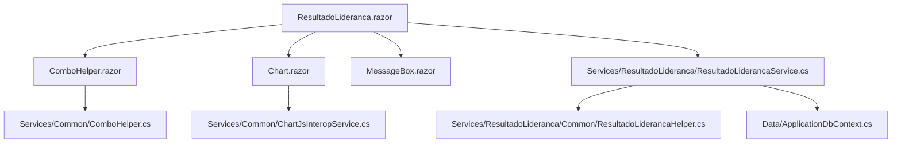

# Documentação Técnica: Tela de Resultado de Avaliação de Liderança

## Visão Geral

Esta documentação descreve a arquitetura, funcionamento e integração dos serviços, helpers e componentes envolvidos na tela de Resultado de Avaliação de Liderança, migrada de Web Forms para Blazor (.NET 9). O objetivo é garantir reuso, desacoplamento e modernização da interface, mantendo compatibilidade com o legado.

## Estrutura de Pastas e Componentes

- **Services/ResultadoLideranca/ResultadoLiderancaService.cs**: Serviço principal de negócio para cálculo e obtenção de resultados de liderança.
- **Services/ResultadoLideranca/Common/ResultadoLiderancaHelper.cs**: Helpers estáticos para formatação, truncamento e geração de dados para gráficos/tabelas.
- **Services/Common/ChartJsInteropService.cs**: Serviço para integração com Chart.js via JSInterop.
- **Pages/ResultadoLideranca.razor**: Componente Blazor da tela de resultado.
- **Pages/Components/ComboHelper.razor**: Componente Blazor reutilizável para combos (dropdowns).
- **Pages/Components/Chart.razor**: Componente Blazor genérico para gráficos.
- **docs/resultado_lideranca.md**: Este arquivo de documentação.

## Funcionamento e Integração

1. **Carregamento da Página**
   - O componente `ResultadoLideranca.razor` é renderizado, injetando os serviços necessários (`IResultadoLiderancaService`, `ChartJsInteropService`, etc).
   - Filtros (líder, ciclo, projetos, etc) são exibidos usando o componente `ComboHelper.razor`, que consome métodos utilitários de `Services/Common/ComboHelper.cs`.

2. **Busca e Exibição de Dados**
   - Ao selecionar filtros, o serviço `ResultadoLiderancaService` é chamado para buscar os dados de resultados, pilares, subcompetências e comentários.
   - Os dados são processados por `ResultadoLiderancaHelper` para formatação e preparação para exibição.

3. **Renderização de Gráficos**
   - Os gráficos (barras, radar) são exibidos usando o componente `Chart.razor`, que utiliza o serviço `ChartJsInteropService` para renderizar os gráficos no frontend via Chart.js.
   - Os dados dos gráficos são passados do backend para o componente, que chama o JSInterop para desenhar o gráfico.

4. **Exibição de Mensagens**
   - Mensagens de sucesso, erro ou informação são exibidas usando o componente `MessageBox.razor`, consumindo `IMessageBoxService`.

## Fluxo do Processo (Mermaid)

## Sugestões de Melhorias Futuras

- Implementar testes automatizados para os serviços e componentes criados, garantindo maior robustez.
- Evoluir o componente `Chart.razor` para suportar mais tipos de gráficos e customizações avançadas.
- Centralizar ainda mais a lógica de validação e formatação em helpers comuns para evitar duplicidade.
- Adicionar suporte a internacionalização (i18n) nos textos dos componentes e mensagens.
- Avaliar a criação de um sistema de permissões mais granular para exibição de dados sensíveis.
- Melhorar a performance de carregamento dos dados utilizando técnicas de lazy loading e paginação.
- Documentar exemplos de uso dos componentes em outros contextos do sistema.
