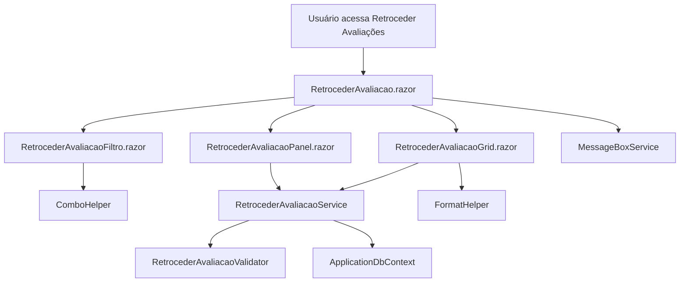

# Documentação: Tela de Retroceder Avaliações

## Visão Geral

A funcionalidade de retroceder avaliações foi migrada do modelo Web Forms para Blazor Server (.NET 9), seguindo arquitetura de serviços reutilizáveis. O fluxo permite filtrar avaliações por projeto, cliente, associado, período e fase, além de retroceder avaliações para etapas anteriores, respeitando regras de negócio e validações específicas.

## Estrutura de Componentes e Serviços

- **Componentes Blazor**
  - `RetrocederAvaliacao.razor`: componente principal da tela
  - `RetrocederAvaliacaoFiltro.razor`: subcomponente para filtros
  - `RetrocederAvaliacaoGrid.razor`: subcomponente para grid/listagem
  - `RetrocederAvaliacaoPanel.razor`: painel de checkboxes e ação de retrocesso

- **Serviços**
  - `Services/Avaliacoes/RetrocederAvaliacaoService.cs`: lógica principal de negócio para retroceder avaliações
  - `Services/Avaliacoes/Common/RetrocederAvaliacaoValidator.cs`: regras de validação de negócio
  - `Services/Common/ComboHelper.cs`: carregamento de combos reutilizáveis
  - `Services/Common/MessageBoxService.cs`: exibição padronizada de mensagens
  - `Services/Common/FormatHelper.cs`: utilitários de formatação

- **Contexto de Dados**
  - `ApplicationDbContext`: entidades relacionadas à avaliação, projetos, clientes, associados, períodos, etc.

## Integração e Injeção de Dependências

Os serviços `RetrocederAvaliacaoService` e `RetrocederAvaliacaoValidator` são registrados no DI container em `Program.cs`:

csharp
builder.Services.AddScoped<IRetrocederAvaliacaoService, RetrocederAvaliacaoService>();
builder.Services.AddScoped<IRetrocederAvaliacaoValidator, RetrocederAvaliacaoValidator>();

Os componentes Blazor consomem esses serviços via [Dependency Injection](https://learn.microsoft.com/aspnet/core/blazor/fundamentals/dependency-injection).

## Fluxo do Processo

- O usuário utiliza filtros (projeto, cliente, associado, período, fase) para buscar avaliações.
- O grid exibe as avaliações filtradas.
- O painel permite selecionar opções de retrocesso (autoavaliação, às cegas) e executar a ação.
- Toda a lógica de negócio e validação é centralizada nos serviços, garantindo reutilização e separação de responsabilidades.

## Sugestões de Melhorias Futuras

- Implementar logs detalhados de auditoria para cada retrocesso realizado.
- Adicionar testes automatizados para os serviços de negócio e validação.
- Permitir exportação dos resultados do filtro para Excel/CSV.
- Adicionar paginação e busca avançada no grid de avaliações.
- Internacionalização dos textos e mensagens para suportar múltiplos idiomas.
- Melhorar a experiência de usuário com feedback visual em tempo real (ex: loading spinners, toast notifications).
- Avaliar uso de CQRS para separar comandos e queries em operações complexas.
